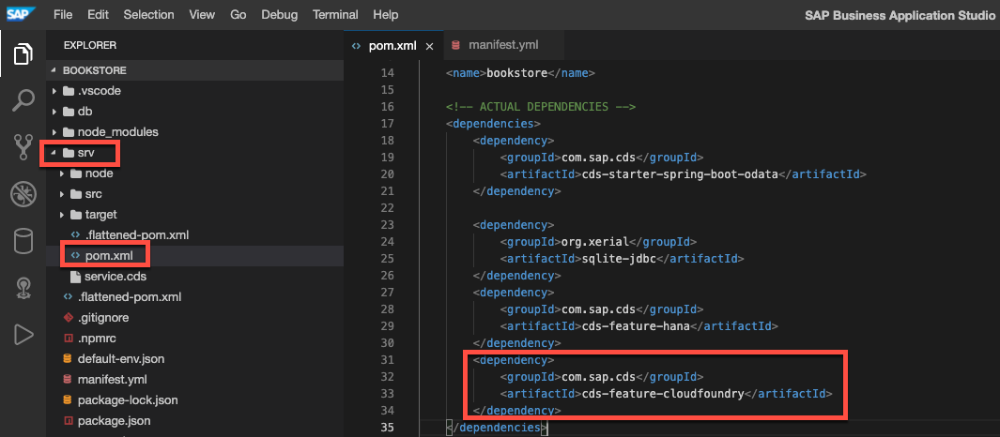
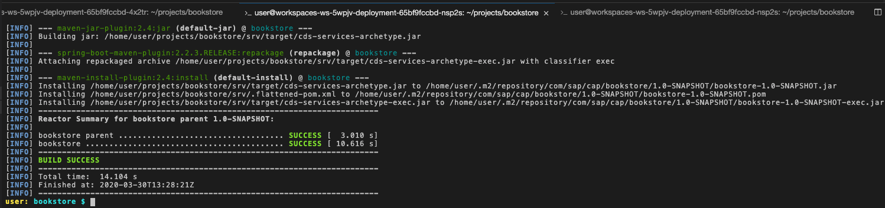
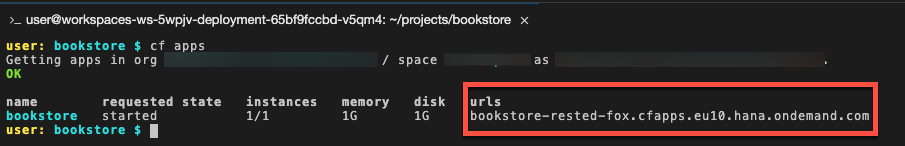

## Details
### You will learn
  - How to create a Cloud Foundry application manifest
  - How to deploy an application to SAP Business Technology Platform Cloud Foundry (SAP BTP) environment

In the previous tutorial you made your application ready to run with SAP HANA. In this tutorial, you'll deploy the application to SAP BTP Cloud Foundry environment and have it running fully in the cloud.

---

[ACCORDION-BEGIN [Step 1: ](Create a Cloud Foundry application manifest)]

When deploying an application to Cloud Foundry, you can use a manifest to describe attributes of the deployed application. The manifest can be used together with the Cloud Foundry CLI command `cf push` to deploy the application.

1. Go to the `~/projects/bookstore` folder and **create a new file** called **`manifest.yml`** and make sure you **Save** the file.

2. Add the following code to the newly created file.

    ```YAML
    ---
    applications:
    - name: bookstore
      path: srv/target/bookstore-exec.jar
      random-route: true
      services:
      - bookstore-hana
    ```

The manifest describes the name of the application and the path where the application archive can be found. Spring Boot applications can be deployed from a single JAR archive, which is what you are making use of here.

The route of the application, meaning the HTTP endpoint where it will be available, will be randomized to prevent clashes with other application routes.

The name of SAP HANA service instance you created in the previous tutorial is used here under the services section (`bookstore-hana`).

[DONE]
[ACCORDION-END]

[ACCORDION-BEGIN [Step 2: ](Enable auto-configuration of SAP HANA database connection)]

Cloud Foundry uses the Open Service Broker API to provide services to applications. When running your application on Cloud Foundry, an environment variable `VCAP_SERVICES` (similar to the content of the `default-env.json`) is available, which contains all required service credentials. CAP Java can automatically read this environment variable and configure your application to use the SAP HANA database.

The described feature is again available as a further plugin in CAP Java. Therefore, you'll need to add an additional Maven dependency to your project. The dependency will bring the ability to read service bindings from Cloud Foundry's `VCAP_SERVICES` environment variable.

1. Open the `pom.xml` file in the `srv` directory.

2. Add the following dependency under the `<dependencies>` tag and make sure you **Save** the file:

    ```XML
        <dependency>
            <groupId>com.sap.cds</groupId>
            <artifactId>cds-feature-cloudfoundry</artifactId>
        </dependency>
    ```

    !

Even with the Cloud Foundry feature enabled, CAP Java ensures that your application can run still run locally with SQLite or SAP HANA auto-configured based on default-env.json. It provides a seamless developer experience in all environments.

In the previous tutorial you added the additional Java system property `-Dspring-boot.run.profiles=cloud` to your application to ensure that the default SQLite configuration from the `application.yaml` does not take effect. When deploying the application to Cloud Foundry this is done automatically for you by the Cloud Foundry Java Buildpack.

[VALIDATE_1]
[ACCORDION-END]


[ACCORDION-BEGIN [Step 3: ](Push the application)]

You are now ready to push your application to the cloud by running the following commands from the terminal in SAP Business Application Studio:

1. Make sure that you are in the root of the bookstore project:

    ```Shell/Bash
    cd ~/projects/bookstore
    ```

2. Build your application once by running:

    ```Shell/Bash
    mvn clean install
    ```

    The log output should be similar to the one below:

    !

3. Push the application to the cloud by running

    ```Shell/Bash
    cf push
    ```

     The manifest will be [automatically picked up](https://cli.cloudfoundry.org/en-US/cf/push.html).


    >Provide the credentials you usually log in to SAP BTP if you are asked to log in.

4. To retrieve the application URL run the following command:

    ```Shell/Bash
    cf app bookstore
    ```

    !


5. Open the application in the browser. The according route can be found under `urls` of the previous step.

[DONE]
[ACCORDION-END]
