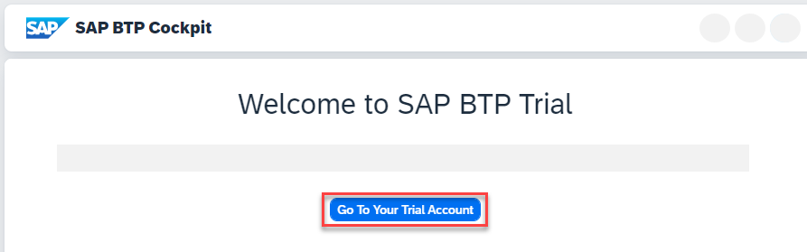
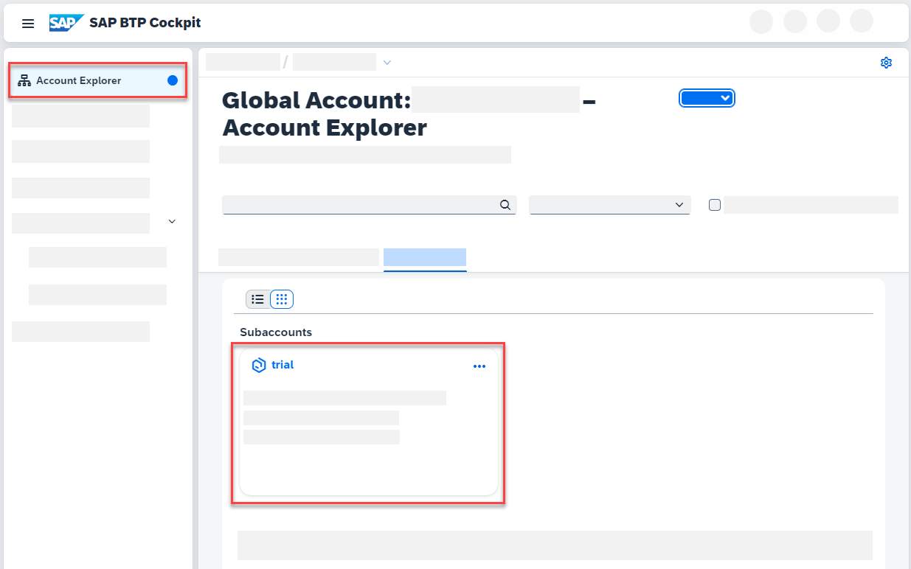
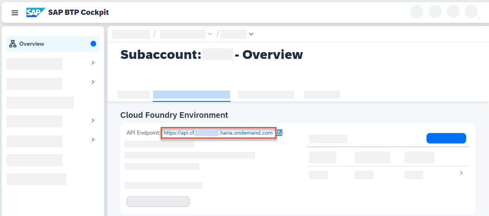

# Deploy CAP Java App to SAP Business Technology Platform

<!-- description --> Deploy the recently built bookstore application to SAP Business Technology Platform using the Cloud Foundry CLI.

## You will learn

- How to prepare project configuration for deployment using `cds add` commands
- How to deploy an application to SAP Business Technology Platform Cloud Foundry (SAP BTP) environment

## Intro

In the previous tutorial you added authentication to your application. In this tutorial, you will deploy the application to SAP BTP, Cloud Foundry environment and have it running fully in the cloud.

---

### Provision an Instance of SAP HANA Cloud

You first need to provision your SAP HANA Cloud instance, which is a prerequisite to later on create a SAP HANA HDI Container to deploy your database artifacts to.

1. Follow the tutorial [Provision an Instance of SAP HANA Cloud](hana-cloud-mission-trial-2). Use `bookstore-db` as the name of your database. Make sure to allow access to your SAP HANA Cloud from all IPs and that instance of the SAP HANA you have created is mapped to your subaccount and space where you working with this tutorial.

### Enhance project configuration for production

1. To prepare the project, execute the following in the root level of your project:

    ```Shell/Bash
    cds add hana,mta,xsuaa,approuter --for production
    ```

    > `--for production` adds all configuration added by this command in the `.cdsrc.json` file into a `requires.[production]` block.

    > `hana` configures deployment for SAP HANA, so a data source of type `hana` is added in the `requires.[production].db` block.

    > `mta` adds the `mta.yaml` file. This file reflects your project configuration.

    > `xsuaa` creates an `xs-security.json` and also the needed configuration in the `mta.yaml` file. An authentication of kind `xsuaa` is added in the `requires.[production].auth` block.

    > `approuter` adds the configuration and needed files for a standalone AppRouter so that the authentication flow works after deployment.

    Learn more about those steps in the [Deploy to Cloud Foundry](https://cap.cloud.sap/docs/guides/deployment/to-cf?impl-variant=java#prepare-for-production) guide in the CAP documentation.

2. (Optional) Following this tutorial strictly, you don't have an own UI yet in your project. To enable the index page with SAP Fiori preview, add the following configuration in the `application.yaml` of your `bookstore` project in VS Code:

    ```yaml
    ---
    spring:
      config.activate.on-profile: cloud
    cds:
      index-page.enabled: true
    ```

    > Setting `cds.index-page.enabled: true` turns on the generated index page and the SAP Fiori preview in `production` mode, just like you've seen in your local application in previous tutorials. These features are designed to assist you during development and should not be used in productive applications.

### Enable application for Cloud Foundry

> When you've followed the previous tutorials, you've already added this dependency and can skip this step.

Cloud Foundry uses the Open Service Broker API to provide services to applications. When running your application on Cloud Foundry, an environment variable `VCAP_SERVICES` is available, which contains all required service credentials. CAP Java can automatically read this environment variable and configure your application to use the SAP HANA database. In addition you want to make sure that your application is secure by default, when you deploy it to the cloud. The required dependencies for these aspects are included in the `cds-starter-cloudfoundry` dependency bundle, which you added in the previous tutorial.

1. Check the `pom.xml` in the `srv` directory (not the `pom.xml` file located in the root project folder) and under the `<dependencies>` that the `cds-starter-cloudfoundry` dependency is there.

    ```xml
    <dependency>
        <groupId>com.sap.cds</groupId>
        <artifactId>cds-starter-cloudfoundry</artifactId>
    </dependency>
    ```

### Update `xs-security.json`

The XSUAA security descriptor (`xs-security.json`) that describes the roles for your application can be generated from your CDS service definitions. It is used to configure your XSUAA service instance and has been generated using the CDS facet `cds add xsuaa` in a previous step.

1. Open the `xs-security.json` file in SAP Business Application Studio and update the file so it looks like that:

    ```JSON
    {
      "xsappname": "bookstore",
      "tenant-mode": "dedicated",
      "scopes": [
        {
          "name": "$XSAPPNAME.Administrators",
          "description": "Administrators"
        }
      ],
      "attributes": [],
      "role-templates": [
        {
          "name": "Administrators",
          "description": "generated",
          "scope-references": [
            "$XSAPPNAME.Administrators"
          ],
          "attribute-references": []
        }
      ],
      "role-collections": [
        {
          "name": "BookStore_Administrators",
          "description": "BookStore Administrators",
          "role-template-references": ["$XSAPPNAME.Administrators"]
        }
      ],
      "oauth2-configuration": {
        "redirect-uris": ["https://*.cfapps.us10-001.hana.ondemand.com/**"]
      }
    }
    ```

    > You added the name of your application in the attribute `xsappname` and declared a role collection to which you can assign users later.

    > The value of the last attribute "oauth2-configuration" depends on the landscape where your account is deployed. Check the API URL returned by the command `cf target` and change data center ID in the value `https://*.cfapps.**us10-001**.hana.ondemand.com/**` accordingly.

### Identify SAP BTP Cloud Foundry endpoint

The Cloud Foundry API endpoint is required so that you can log on to your SAP BTP Cloud Foundry space through Cloud Foundry CLI in the next step.

1. Go to [SAP BTP Trial Cockpit](https://cockpit.hanatrial.ondemand.com/cockpit#/home/trial) and choose **Go To Your Trial Account**.

    <!-- border -->

2. Navigate to your subaccount by hitting the corresponding tile.

    <!-- border -->

3. Copy the **Cloud Foundry API endpoint** value as you will need it in the next step.

    <!-- border -->

### Log into SAP BTP Cloud Foundry environment

1. In SAP Business Application Studio, open a terminal by choosing **Terminal** **&rarr;** **New Terminal** from the main menu.

2. Run the following command to configure which Cloud Foundry environment you want to connect to in the terminal. **Replace** `<CF_API_ENDPOINT>` with the actual value you obtained in the previous step.

    ```Shell/Bash
    cf api <CF_API_ENDPOINT>
    ```

3. Authenticate using your login credentials using the following command in the terminal:

    ```Shell/Bash
    cf login
    ```

### Deploy using cf deploy

SAP provides an application format that respects the single modules and their technologies and keeps those modules in the same lifecycle: [Multitarget Application](https://help.sap.com/docs/BTP/65de2977205c403bbc107264b8eccf4b/d04fc0e2ad894545aebfd7126384307c.html?version=Cloud)

The MBT Build tool uses the `mta.yaml` file that has been created using `cds add mta` before, to build the deployable archive. The MultiApps CF CLI plugin adds the `deploy` command and orchestrates the deployment steps.

1. In the root of your project, execute the following command to build the archive.

    ```Shell/Bash
    mbt build -t gen --mtar mta.mtar
    ```

    > For this you need the MBT Build Tool, which SAP Business Application Studio has already installed.

    The `-t` option defines the target folder of the build result as the `gen` folder of your project. As part of this build implicitly `cds build --production` is executed. This implicit build uses then all the configuration you've added in the step 1.2 when using `--for production`.

2. Deploy the archive using `cf deploy`.

    ```Shell/Bash
    cf deploy gen/mta.mtar
    ```

    > For this you need the MultiApps CF CLI plugin, which SAP Business Application Studio has already installed.

    During deployment all needed service instances are created and the applications as well as database artifacts are deployed.

    > This process takes some minutes. In this one step the archive is uploaded to Cloud Foundry, service instances are created, the applications are staged, and then deployed to their target runtimes.

    > If your deployment fails during deploy of `bookstore-db-deployer`, make sure that your IP address is configured for connections to SAP HANA Cloud. Or allow connections to all IP addresses at your own risk. We recommend to revert that setting after you've completed the tutorial.

3. In the deploy log, find the application URL of `bookstore`:

    ```Shell/Bash
    Application "bookstore" started and available at "[org]-[space]-bookstore.cfapps.[region].hana.ondemand.com"
    ```

    This is the URL of the AppRouter, which enforces the authentication flow.

4. Open this URL in the browser and try out the provided links, for example, `.../catalog/Books`. Application data is fetched from SAP HANA.

5. Open the application in the browser. The according route can be found under `routes` of the previous step.

6. Observe that your application is now secured by requiring authentication on service and entity endpoints. In the following tutorials you will learn how to configure authentication and authorization in the cloud.

---
