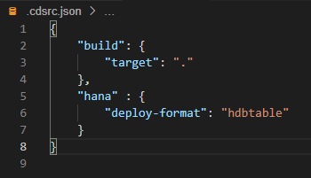

# Use SAP HANA as the Database for a CAP Java Application
<!-- description --> Use SAP HANA in SAP Business Technology Platform as database for your CAP Java application.

## You will learn
  - How to use the CDS CLI to do deployments to SAP HANA
  - How to use SAP HANA for your local running application

## Intro
In the previous tutorial, you have added custom coding to your bookstore application. In this tutorial, you will make the application ready to be deployed to SAP Business Technology Platform (SAP BTP). In order to make our application cloud-ready, you will switch to SAP HANA as our database.

---

### Identify SAP BTP Cloud Foundry endpoint


The Cloud Foundry API endpoint is required so that you can log on to your SAP BTP Cloud Foundry space through Cloud Foundry CLI in the next step.

1. Go to [SAP BTP Trial Cockpit](https://cockpit.hanatrial.ondemand.com/cockpit#/home/trial) and choose **Go To Your Trial Account**.

    <!-- border -->

2. Navigate to your subaccount by hitting the corresponding tile.

    <!-- border -->

3. Copy the **Cloud Foundry API endpoint** value as you will need it in the next step.

    <!-- border -->


### Log into SAP BTP Cloud Foundry environment


First you need to create and initialize an SAP HANA database schema in SAP BTP. As you will deploy your application to SAP BTP, Cloud Foundry Environment, you will also create the SAP HANA service there.

1. In SAP Business Application Studio, open a terminal by choosing **Terminal** **&rarr;** **New Terminal** from the main menu.

2. Run the following command to configure which Cloud Foundry environment you want to connect to in the terminal. **Replace** `<CF_API_ENDPOINT>` with the actual value you obtained in the previous step.

    ```Shell/Bash
    cf api <CF_API_ENDPOINT>
    ```

3. Authenticate using your login credentials using the following command in the terminal:

    ```Shell/Bash
    cf login
    ```


### Provision an Instance of SAP HANA Cloud


You first need to provision your SAP HANA Cloud instance, which is a prerequisite to later on create a SAP HANA HDI Container to deploy your database artifacts to.

1. Follow the tutorial [Provision an Instance of SAP HANA Cloud](hana-cloud-mission-trial-2). Use `bookstore-db` as the name of your database. Make sure to allow access to your SAP HANA Cloud from all IPs and that instance of the SAP HANA you have created is mapped to your subaccount and space where you working with this tutorial.


### Configure application to use SAP HANA locally


Add an additional Maven dependency to your project. The dependency brings the ability to read SAP HANA service bindings and configure the SAP HANA connectivity.

1. Navigate back to the File Explorer by clicking on the corresponding icon.

2. Edit the `pom.xml` in the `srv` directory (not the `pom.xml` file located in the root project folder) and add the following dependency under the `<dependencies>` tag and make sure you **Save** the file:

    ```xml
    <dependency>
        <groupId>com.sap.cds</groupId>
        <artifactId>cds-feature-hana</artifactId>
    </dependency>
    ```

### Deploy database artifacts to SAP HANA


1. Go back to the terminal of SAP Business Application Studio and make sure that you are in the root of the bookstore project:

    ```Shell/Bash
    cd ~/projects/bookstore
    ```

2. Add the following configuration in the file `.cdsrc.json` in the root folder of your `bookstore` project:

    ```JSON
    {
      "hana" : {
        "deploy-format": "hdbtable"
      }
    }
    ```

    <!-- border -->

3. Ensure your SAP HANA Cloud instance is started.

4. Create an SAP HANA service instance and implicitly push all artifacts to the database using:

    ```Shell/Bash
    cds deploy --to hana:bookstore-hana --store-credentials
    ```

    > As an effect, `.hdbtable` and `.hdbview` files are generated in the `(gen/)db/src/gen/` folder.

    > In addition, the command initialized the database schemas inside the SAP HANA HDI container.


### Run application using SAP HANA locally


Aside from initializing the SAP HANA database, the `cds deploy` command created a file with the name `default-env.json` in your `bookstore` root folder. This file contains a set of credentials to connect to the SAP HANA HDI container, that was created by the command. CAP Java is able to automatically pick up the SAP HANA credentials from this file and configure the application running locally to use the SAP HANA HDI container as the database.

When deploying the application to the cloud, Cloud Foundry will provide the credentials as a service binding to the application through the Open Service Broker API. Also in this case, CAP Java will automatically pick up the SAP HANA credentials and configures the application for you as you will see in the next tutorial.


1. Before starting your application, make sure that you stop any running instances in the terminal or debug side panel.

2. Let's test the SAP HANA connectivity. Start your application by running:

    ```Shell/Bash
    mvn spring-boot:run -Dspring-boot.run.profiles=cloud
    ```
    >The Java system property `-Dspring-boot.run.profiles=cloud` ensures that the default configuration using H2 as the database, which is still defined in the `application.yaml`, doesn't get activated.

    You can observe the log line `Registered DataSource 'ds-bookstore-hana'`, which indicate that the SAP HANA configuration was picked up.

3. Open the file `requests.http` and execute one of the requests that create an order, by choosing **Send Request** above it.

4. Restart your application with the same command and browse to the `Orders` entity on the Welcome Page. You can see that the entries are persisted.

Congratulations!

You have successfully deployed your database schema to SAP HANA and connected your application, which is running locally. In the following tutorial, you will run the application on the SAP BTP, Cloud Foundry environment, using the SAP HANA service instance that was created in this tutorial.


---
