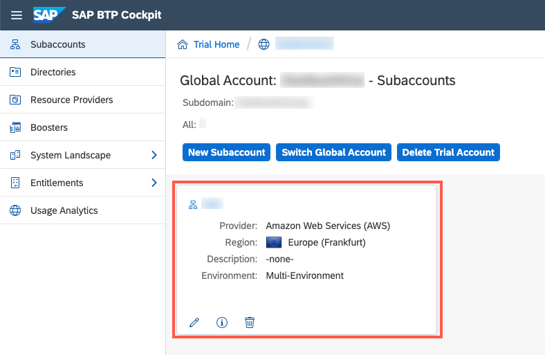
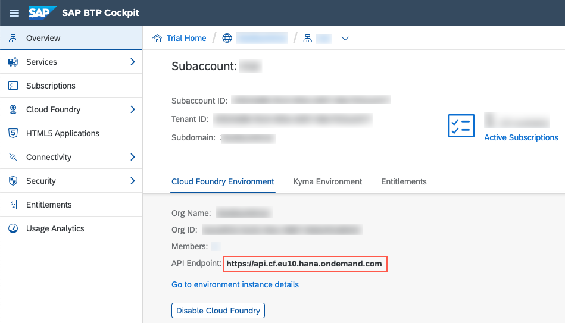

## Details
### You will learn
  - How to use the CDS CLI to do deployments to SAP HANA
  - How to use SAP HANA for your local running application

In the previous tutorial, you have added custom coding to your bookstore application. In this tutorial, you'll make the application ready to be deployed to SAP Business Technology Platform (SAP BTP). In order to make our application cloud-ready, we'll switch to SAP HANA as our database.

---

[ACCORDION-BEGIN [Step 1: ](Identify SAP BTP Cloud Foundry endpoint)]

The Cloud Foundry API endpoint is required so that you can log on to your SAP BTP Cloud Foundry space through Cloud Foundry CLI in the next step.

1. Go to the [SAP BTP Trial Cockpit](https://cockpit.hanatrial.ondemand.com/cockpit#/home/trial) click on **Enter Your Trial Account**.

    !

2. Navigate to your subaccount by hitting the corresponding tile.

    !

3. Copy the **Cloud Foundry API endpoint** value as you'll need it in the next step.

    !

[DONE]
[ACCORDION-END]

[ACCORDION-BEGIN [Step 2: ](Log into SAP BTP Cloud Foundry environment)]

First you need to create and initialize an SAP HANA database schema in SAP BTP. As you'll deploy your application to SAP BTP, Cloud Foundry Environment, you'll also create the SAP HANA service there.

Log into the Cloud Foundry Environment using the Cloud Foundry CLI, as follows.

1. In SAP Business Application Studio, open a terminal by choosing **Terminal** > **New Terminal** from the main menu.

2. Run the following command to configure which Cloud Foundry environment you want to connect to in the terminal. **Replace** `<CF_API_ENDPOINT>` with the actual value you obtained in the previous step.

    ```Shell/Bash
    cf api <CF_API_ENDPOINT>
    ```

3. Authenticate using your login credentials using the following command in the terminal:

    ```Shell/Bash
    cf login
    ```

[DONE]
[ACCORDION-END]

[ACCORDION-BEGIN [Step 3: ](Deploy database artifacts to SAP HANA)]

1. Make sure that you are in the root of the bookstore project:

    ```Shell/Bash
    cd ~/projects/bookstore
    ```

2. Run the following command to install the necessary node packages:

    ```Shell/Bash
    npm install --save-dev @sap/hdi-deploy
    ```

3. Add the following configuration in the file `.cdsrc.json` in the root folder of your `bookstore` project:

    ```JSON
    { "hana" : { "deploy-format": "hdbtable" } }
    ```

4. Create an SAP HANA service instance and implicitly push all artifacts to the database using:

    ```Shell/Bash
    cds deploy --to hana:bookstore-hana
    ```

    > As an effect, `.hdbtable` and `.hdbview` files are generated in the `(gen/)db/src/gen/` folder.

    > In addition, the command initialized the database schemas inside the SAP HANA HDI container.

[DONE]
[ACCORDION-END]


[ACCORDION-BEGIN [Step 4: ](Configure application to use SAP HANA locally)]

Aside from initializing the SAP HANA database, the `cds deploy` command created a file with the name `default-env.json` in your `bookstore` root folder. This file contains a set of credentials to connect to the SAP HANA HDI container, that was created by the command. CAP Java is able to automatically pick up the SAP HANA credentials from this file and configure the application running locally to use the SAP HANA HDI container as the database.

When deploying the application to the cloud, Cloud Foundry will provide the credentials as a service binding to the application through the Open Service Broker API. Also in this case, CAP Java will automatically pick up the SAP HANA credentials and configures the application for you as you'll see in the next tutorial.

The described features are available as a plugin in CAP Java. Therefore, we'll add an additional Maven dependency to your project. The dependency will bring the ability to read SAP HANA service bindings from the default-env.json to automatically configure the SAP HANA connectivity. In addition, it includes the SAP HANA JDBC driver.

1. Navigate back to the **File Explorer** by clicking on the corresponding  icon.

2. Edit the `pom.xml` in the `srv` directory (not the `pom.xml` file located in the root project folder) and add the following dependency under the `<dependencies>` tag and make sure you **Save** the file:

    ```XML
    <dependency>
      <groupId>com.sap.cds</groupId>
      <artifactId>cds-feature-hana</artifactId>
    </dependency>
    ```

      !

3. Before starting your application, make sure that you stop any running instances in the terminal or debug side panel.

4. Make sure that you are in the root of the bookstore project. Therefore, run the following command in the terminal:

    ```Shell/Bash
    cd ~/projects/bookstore
    ```

5. Let's test the SAP HANA connectivity. Start your application by running:

    ```Shell/Bash
    mvn spring-boot:run -Dspring-boot.run.profiles=cloud
    ```
    >The Java system property `-Dspring-boot.run.profiles=cloud` ensures that the default configuration using SQLite as the database, which is still defined in the `application.yaml`, doesn't get activated.

    You can observe the log lines `Loaded default-env.json from directory '/home/user/projects/bookstore'` and `Registered primary 'DataSource' bean definition for connected service 'bookstore-hana'`, which indicate that the SAP HANA configuration was picked up.

    !

6. Try the following example request, which creates an order together with its items through a deep insert. Open a new terminal by choosing **Terminal** > **New Terminal** from the main menu.

7. Create a new order together with items:

    ```Shell/Bash
    curl -X POST http://localhost:8080/odata/v4/OrdersService/Orders \
    -H "Content-Type: application/json" \
    -d '{ "currency_code": "USD", "items": [ { "book_ID": "b7bca6dd-0497-465e-9a5a-56f244174c8c", "amount": 1 } ] }'
    ```

    The expected output should be the created database record similar to the one below:

    ```
    {"@context":"$metadata#Orders(items())/$entity","ID":"67213f57-0b4c-43fc-8ed9-44f87ffb8967","createdAt":"2020-03-30T13:22:37Z","createdBy":"anonymous","modifiedAt":"2020-03-30T13:22:37Z","modifiedBy":"anonymous","total":14.14,"currency_code":"USD","items":[{"ID":"6352853e-f8e0-43b0-9c38-e15eb56a57ae","book_ID":"b7bca6dd-0497-465e-9a5a-56f244174c8c","amount":1,"netAmount":14.14,"parent_ID":"67213f57-0b4c-43fc-8ed9-44f87ffb8967"}]}
    ```

[VALIDATE_1]
[ACCORDION-END]


Congratulations!

You've successfully deployed your database schema to SAP HANA and connected your application, which is running locally. In the following tutorial, you'll run the application on the SAP BTP Cloud Foundry environment, using the SAP HANA service instance that was created in this tutorial.
