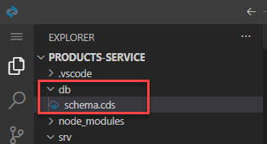
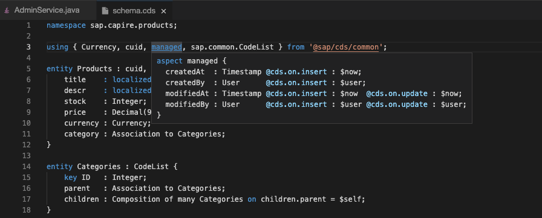
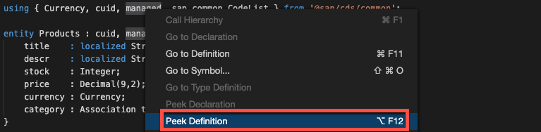
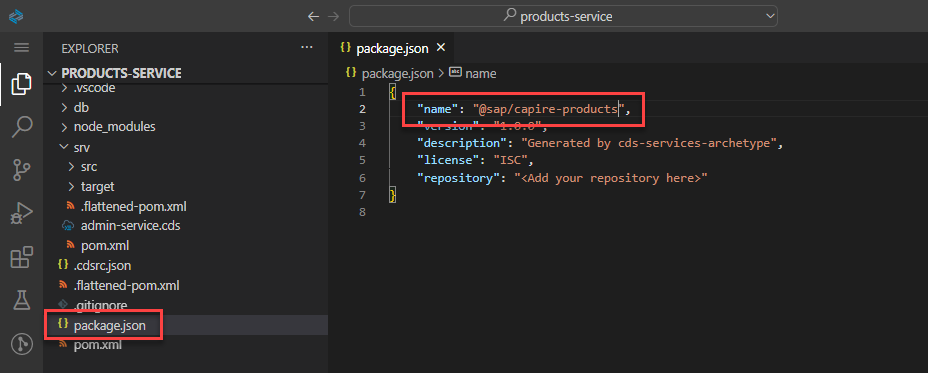

# Create a Reusable Service
<!-- description --> Create a service that will later on be reused in another CAP Java project.

## You will learn
  - How to write an entity definition
  - How to use some generic CAP artefacts like aspects and types
  - What associations and compositions are
  - How to make the project reusable

  The previous tutorial was about quickly setting up a working CAP application and read/write some mock data. This tutorial is about learning how to extend the application to a complete products service.

  You will take advantage of many of the out-of-the-box features provided by the CAP Java SDK such as using H2 as a database for local development. As a result, you will remove your custom handlers written in the first tutorial. In subsequent tutorials you will swap out H2 with the SAP HANA service, when preparing your application for the cloud.

---

### Define the domain model


In the previous tutorial, you defined a service, which defined its own entity. When modeling with CDS the best practice is to separate services from the domain model.

Therefore, you will now define the complete domain model that is used by the products service. The domain model is stored in the `db` folder of your CAP application.

1. Go to your `db` folder and create a file called `schema.cds`.

    <!-- border -->

2. Add the following code to your newly created `schema.cds` file and make sure you **Save** the file:

    ```CDS
    namespace sap.capire.products;

    using { Currency, cuid, managed, sap.common.CodeList } from '@sap/cds/common';

    entity Products : cuid, managed {
        title    : localized String(111);
        descr    : localized String(1111);
        stock    : Integer;
        price    : Decimal(9,2);
        currency : Currency;
        category : Association to Categories;
    }

    entity Categories : CodeList {
        key ID   : Integer;
        parent   : Association to Categories;
        children : Composition of many Categories on children.parent = $self;
    }
    ```


### Understand keywords


As you can see, the domain model defines two entities:

- `Products`
- `Categories`

It also imports various common definitions from the `@sap/cds/common` package (a globally available reuse package):

- `Currency`
- `cuid`
- `managed`
- `CodeList`

In addition, the domain model uses the CDS keywords `localized`, `Association` , and `Composition`.
Let's explain these imports and keywords in more detail:

### The `localized` Keyword

The `localized` keyword can be used to mark elements, which require translation. The ability to store translations for different languages and to store a default fallback translation is automatically handled by CDS for you. You will see this in action in more detail in the next tutorial.

### Associations and Compositions

Associations and compositions can be used to define relationships between entities. They often allow you to define these relationships without explicitly working with foreign keys.

While associations define a rather loose coupling between the entities, compositions define a containment relationship. Compositions can also be thought of as defining deep structures. You can perform `deep inserts` and `upserts` along these structures.

In your domain model, the `Categories` entities define a `parent` and `children` element. This enables a hierarchy of categories. The children of a category are modelled as a composition. A category with all of its children defines a deep nested structure. Deleting a category would automatically delete all of its children. However, the parent of a category is modelled as an association. Deleting a category obviously shouldn't delete its parent.

### The `cuid` and `managed` Aspects

Both `cuid` and `managed` are [aspects](https://cap.cloud.sap/docs/cds/cdl#aspects). Aspects extend an entity with additional elements. The [`cuid`](https://cap.cloud.sap/docs/cds/common#aspect-cuid) aspect adds a `key` element `ID` of type `UUID` to the entity.

The [`managed`](https://cap.cloud.sap/docs/cds/common#aspect-managed) aspect adds four additional elements to the entity. These capture the time of the creation and last update of the entity, and the user, which performed the creation and last update.

### The `CodeList` Aspect and the `Currency` Type

[`CodeLists`](https://cap.cloud.sap/docs/cds/common#aspect-sapcommoncodelist) can be used to store global, translatable definitions based on codes, such as currencies, countries, or languages. Especially for UIs, a `CodeList` can be useful to provide a value help for certain input fields.

The [`Currency`](https://cap.cloud.sap/docs/cds/common#type-currency) definition is a type. It defines an association to a `Currencies` entity. The [`Currencies`](https://cap.cloud.sap/docs/cds/common#entity-sapcommoncurrencies) entity is based on ISO 4217 and uses three-letter alpha codes as keys such as `EUR` or `USD` and provides the possibility to store the corresponding currency symbol such as `€` or `$`.


### Get more information about `@sap/cds/common`


Look at these explained keywords yourself and learn more about it.

1. To jump to the imported definitions directly in your editor, press **`CTRL`**, hover over the keyword, and click. This will open the source file in a separate editor tab.

2. Hold **`CTRL`** and hover over a keyword, then move the hand cursor over the keyword. This opens up you a tiny overlay with the definition of this particular item.

    <!-- border -->

3. A right-click (or use **`F12`**) on the definition opens up the context menu. There you can find, for example, **Peek definition** to get a much bigger overlay.  Not only the definition of this particular item is displayed, you also have the ability to navigate through the whole source file of this definition without opening the file itself.

    <!-- border -->


### Rewrite the `AdminService`


In the first tutorial, you defined a simple service, called `AdminService`, which directly defined the entity `Products`. As you now have defined the `Products` entity in your domain model, the `AdminService` just needs to expose it. In addition, you defined the `Categories` entity, which should also be part of your service.

This can be achieved by using projections. Services expose projections of the entities defined in the domain model. These projections can be used to include (and also exclude) only certain elements of an entity or to rename the entity's elements.

In this example you will use the most simple projection, which exposes the domain model entity without any changes.

1. Go to your `srv` folder and open the `admin-service.cds` file.

2. Replace the content with the following code and make sure you **Save** the file:

    ```CDS
    using { sap.capire.products as db } from '../db/schema';

    service AdminService {
        entity Products   as projection on db.Products;
        entity Categories as projection on db.Categories;
    }
    ```


### Use CAP's generic persistence handling


The CAP Java SDK provides out-of-the-box capabilities to store and retrieve entities from a database. Therefore, no custom coding is required if entities are stored in the database. The entities defined in your `AdminService` will be automatically served via OData and you can just delete the `AdminService.java` file that was created earlier.

1. Delete the `AdminService.java` file in the `handlers` folder.

By default, the CAP Java SDK uses an in-memory H2 database. The content of this database will be lost when the application is stopped.

In case you need a persistent database between application runs you can use a file-based `SQLite` database as described in section [Using Databases](https://cap.cloud.sap/docs/guides/databases) in the CAP documentation.


### Run and test your application


1. Stop your application if it is still running. Now restart your application by running `mvn spring-boot:run` in the terminal and open it in a new tab.

2. You will now create some `Categories` through a HTTP request. Add the following request to the `requests.http` file you have created earlier by pasting the following content:

    ```HTTP
    ### Create Categories

    POST http://localhost:8080/odata/v4/AdminService/Categories
    Content-Type: application/json

    {"ID": 1, "name": "TechEd", "descr": "TechEd related topics", "children": [{"ID": 10, "name": "CAP Java", "descr": "Run on Java"}, {"ID": 11, "name": "CAP Node.js", "descr": "Run on Node.js"}]}
    ```

    Choose `Send Request` which appears over the new request. This request will create multiple, nested categories, at once through a deep insert.

3. Try to query individual categories, for example by adding the following to the end of your app URL:

    **`/odata/v4/AdminService/Categories(10)`**

4. You can also expand the nested structures. Add the following to the end of your app URL:

    - `/odata/v4/AdminService/Categories?$expand=children`
    - `/odata/v4/AdminService/Categories(10)?$expand=parent`
    - `/odata/v4/AdminService/Categories(1)?$expand=children`

5. Make sure to stop your application after testing it by using **`CTRL+C`**.


### Set up for reuse


In the following tutorial, the application will be reused by a bookstore application. The reuse of models can be achieved by publishing NPM modules with the models and defining dependencies to these NPM modules in other applications. There are a two steps we need to perform to prepare the `products-service` application for reuse.

1. The name of the `products-service` reuse module, should be `@sap/capire-products`. Therefore, open the `package.json` file within the `~/projects/products-service` folder and change the value of `name` field from `products-service-cds` to `@sap/capire-products`. If you want to you can also provide a meaningful description in the `description` field.

    <!-- border -->

2. To make it easier to reuse the module, an `index.cds` file can be added to the `products-service`. This ensures a better decoupling from other applications. Create a new file `index.cds` in the `~/projects/products-service` folder and place the following content inside this file, making sure you **Save** the file:

    ```CDS
    using from './db/schema';
    using from './srv/admin-service';
    ```

Congratulations! You have successfully developed the products service application, which is based on a CDS domain model and service definition.

In the next tutorial, you will build a bookstore application, reusing the products service application. You will later extend the bookstore application with custom business logic and deploy it to the cloud, using SAP HANA as the database.

---
