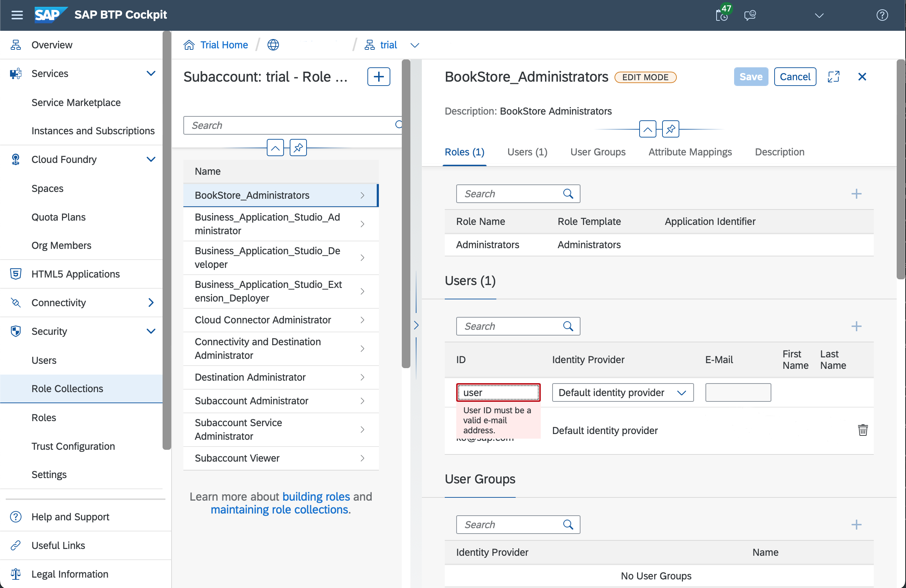

# Configure Authentication and Authorization on SAP BTP
<!-- description --> Set up authentication and authorization on SAP BTP and deploy your secured application there.

## You will learn
  - How to prepare your application for deployment with security enabled
  - How to test authorizations on the applications deployed to SAP BTP, Cloud Foundry
---
Before you deploy your authentication-enabled application you have to create an instance of service **Authorization and Trust Management Service** (XSUAA) and configure it, bind it to your application and provide it with the security descriptor that contains roles and scopes of your application. See section [Protecting Your Application](https://help.sap.com/viewer/65de2977205c403bbc107264b8eccf4b/Cloud/en-US/7c5c565f37c946faa154909004331d57.html) in the SAP BTP documentation for more details.

### Generate security descriptor and update application manifest


The XSUAA security descriptor that describes the roles for your application can be generated from your CDS service definitions. It is used to configure your XSUAA service instance.

1. Open a new terminal window in SAP Business Application Studio from the menu using **Terminal** **&rarr;** **New Terminal** and run the following commands:

    ```Shell/Bash
    cd ~/projects/bookstore
    cds compile srv/ --to xsuaa > xs-security.json
    ```

    > A new file `xs-security.json` will be created.

2. Open the `xs-security.json` file in SAP Business Application Studio and update the file so it looks like that:

    ```JSON
    {
      "xsappname": "bookstore",
      "tenant-mode": "dedicated",
      "scopes": [
        {
          "name": "$XSAPPNAME.Administrators",
          "description": "Administrators"
        }
      ],
      "attributes": [],
      "role-templates": [
        {
          "name": "Administrators",
          "description": "generated",
          "scope-references": [
            "$XSAPPNAME.Administrators"
          ],
          "attribute-references": []
        }
      ],
      "role-collections": [
        {
          "name": "BookStore_Administrators",
          "description": "BookStore Administrators",
          "role-template-references": ["$XSAPPNAME.Administrators"]
        }
      ],
      "oauth2-configuration": {
        "redirect-uris": ["https://*.cfapps.us10-001.hana.ondemand.com/**"]
      }
    }
    ```

    > You added the name of your application in the attribute `xsappname` and declared a role collection to which you can assign users later.

    > The value of the last attribute "oauth2-configuration" depends on the landscape where your account is deployed. Check the API URL returned by the command `cf target` and change data center ID in the value `https://*.cfapps.**us10-001**.hana.ondemand.com/**` accordingly.

4. Open the `manifest.yml` file and add the line `bookstore-xsuaa` under the `services` so that the result looks like this:

    ```YAML
        ---
        applications:
        - name: bookstore
          path: srv/target/bookstore-exec.jar
          random-route: true
          buildpacks:
          - java_buildpack
          env:
            JBP_CONFIG_OPEN_JDK_JRE: '{ jre: { version: 17.+ }}'
            JBP_CONFIG_SPRING_AUTO_RECONFIGURATION: '{enabled: false}'
            SPRING_PROFILES_ACTIVE: cloud
          services:
          - bookstore-hana
          - bookstore-xsuaa
    ```

With this, your application uses this instance of Authorization and Trust Management Service (XSUAA) to manage authentication of users for your application. You will create the instance with that name in the next step.


### Create instance of the Authorization and Trust Management Service


1. You will now create the XSUAA service instance through the CF CLI. Execute the following command in a terminal:

    ```Shell/Bash
    cd ~/projects/bookstore
    cf create-service xsuaa application bookstore-xsuaa -c xs-security.json
    ```

> In case you see an error like "Not logged in". Execute `cf login` and provide your SAP BTP trial account credentials.


### Deploy secured application to SAP BTP


Now, you are ready to deploy the application with the security enabled.

1. Build your CAP Java application by executing `mvn clean install` in the terminal.

2. Deploy your application to SAP BTP using the command `cf push`.

3. When the deployment is complete, open the URL to your application. It can be retrieved by executing the command `cf app bookstore`. You can find the URL under the entry **routes** in the output of the command.


### Set up REST client for testing on SAP BTP


Open your application in the browser. Using the links on the welcome page you can check that you can't access the `Orders` entity or everything under the `AdminService`. You should see a `401` error in case you click on these.

To test the secure endpoints of your application, you need a REST client like [Postman](https://www.postman.com/downloads) that supports OAuth 2.0 authentication with type **Authorization Code**.

> Postman may behave differently, when you use SSO to log in to SAP BTP or a custom identity provider. The following steps assume that you use a Trial account without SSO with the default SAP identity provider.

1. To use the `AdminService`, you need to assign yourself to the role collection `BookStore_Administrators` that was defined in the `xs-security.json` file. To assign this role collection to your user you need to navigate to the **Security** **&rarr;** **Role Collections** section of your SAP BTP subaccount. Select the `BookStore_Administrators` role collection and choose **Edit**. Enter your email address in the **ID** and **E-Mail** field and choose **Save**.

    <!-- border -->

2. Open a new terminal in SAP Business Application Studio. Run the command `cf env bookstore` to obtain the service binding credentials of your application. Look for the `VCAP_SERVICES` variable and the `xsuaa` node inside of its JSON structure.

    > In case you see an error like "Not logged in". Execute `cf login` and provide your SAP BTP trial account credentials.

3. Under the `credentials` node, write down values of the following keys:

    + `url`
    + `clientid`
    + `clientsecret`

    > These values are sensitive and should not be shared with anyone or committed to version control systems. They will change, when the binding to the instance **Authorization and Trust Management Service** changes.

    > You will also need your application URL for the REST client. You can get it with the `cf app bookstore` command.

4. Open Postman and create a new collection for your requests. On the collection level, select the **Authorization** tab and select **OAuth 2.0** for the field **Type**. Make sure that **Add auth data to** is set to **Request Headers**.

5. In the section **Configure New Token**, select **Authorization Code** for field **Grant Type**.

6. In the field **Callback URL**, enter the URL of your bookstore application. Make sure that it is prefixed with `https://`.

7. Enter the client ID and client secret in the fields **Client ID** and **Client Secret**.

8. Fields **Auth URL** and **Access Token URL** should be filled with the URL obtained from the output of the `cf env` command. For the **Auth URL**, add `/oauth/authorize` to the end. For the **Access Token URL**, add `/oauth/token` to the end.

9. Select **Send client credentials in body** for the field **Client Authentication**. The overall configuration should look like this:
<!-- border -->

10. Save your collection. You can now obtain an access token by clicking on the button **Get New Access Token**. You might have to enter the user and password you use to access SAP BTP cockpit. In the following step make sure to select the token, by clicking on `Use Token`.


### Test application on SAP BTP


You will now access your application using the token you have created earlier.

1. Create a new request by right-clicking on the name of your collection and select **Add request** in the menu and give it a name.

2. Enter the URL of your bookstore application and add the suffix `/odata/v4/AdminService/Products`.

3. Select the tab **Authorization** and make sure the type is set to **Inherit auth from parent**.

4. Send the request choosing **Send**.

5. Your request will return all products that are available in the application.

  <!-- border -->

Done! You have learned how to deploy secured applications to SAP BTP, Cloud Foundry and issue requests to backend services deployed there.


---
