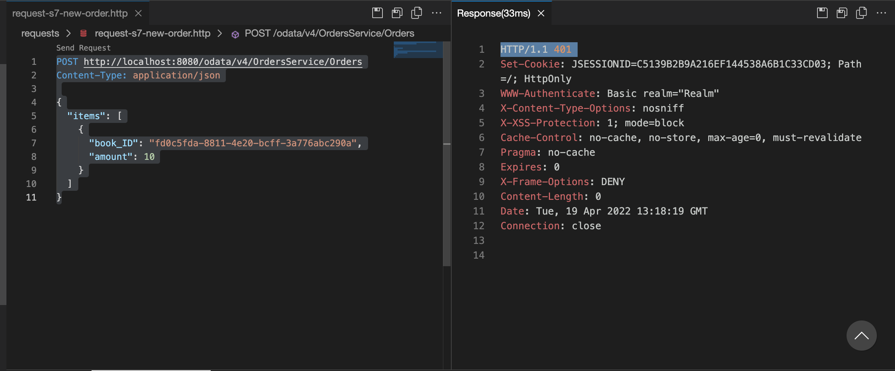
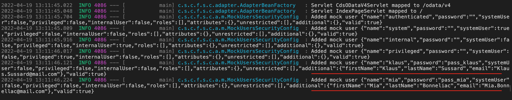

# Add Authentication and Authorization to the Application
<!-- description --> Add authentication and authorization to the application and test it locally with mock users

## You will learn
  - How to add authentication and authorization to the application
  - How to test security aspects with the application running locally
  ---

### Add authentication to the Orders service


In the previous tutorial you have added authentication to your application by adding the `cds-starter-cloudfoundry` dependency, which enabled CAP Java's secure-by-default behaviour based on Spring Security. You will now demonstrate this behaviour using the `OrdersService`. For now, you only require that the user who wants to create the order must be authenticated. CAP provides built-in users that represent common authentication scenarios for local development.

1. Start the application with the command `mvn spring-boot:run`.

2. Open the `requests.http` file and execute the first **Create Order** request by choosing **Send Request** above it.

3. Observe that the response contains status `HTTP/1.1 401 `.

    <!-- border -->

4. To create an order, you need to provide credentials. For local development CAP has built-in mock users. Modify the request like follows:

    ```HTTP
    ### Create Order

    POST http://localhost:8080/odata/v4/OrdersService/Orders
    Content-Type: application/json
    Authorization: Basic authenticated:

    {
      "items": [
        {
          "book_ID": "abed2f7a-c50e-4bc5-89fd-9a00a54b4b16",
          "amount": 2
        }
      ]
    }
    ```

    > Here you have added the `Authorization` HTTP header to the request and provided the credentials for the built-in `authenticated` mock user. This user has an empty password.

5. Execute the request again and see that the order is now created.

6. When choosing entities of the `OrdersService` on the welcome page you will also have to provide credentials now. You can use `authenticated` user and empty password there as well.


### Add mock users to application configuration


Built-in mock users are good for initial local testing, but you may need separate different users for your application to test it further. You will now add some custom mock users to the application:

1. Add the `security` section to the `application.yaml` file under `srv/src/main/resources` as follows:

    ```YAML
    ---
    spring:
      config.activate.on-profile: default
    cds:
      datasource:
        auto-config.enabled: false
      security:
        mock:
          users:
            - name: klaus
              password: pass_klaus
              additional:
                firstName: Klaus
                lastName: Sussard
                email: Klaus.Sussard@mail.com
            - name: mia
              password: pass_mia
              additional:
                firstName: Mia
                lastName: Bonnellac
                email: Mia.Bonnellac@mail.com
    ```

    > Here you defined two users that have no explicit role assignment and will implicitly belong to the `authenticated-user` pseudo-role.

2. Restart your application with the command `mvn spring-boot:run`. In the startup logs you can observe the created mock users with their user names, roles, and passwords. They are added in addition to the built-in mock users.

    <!-- border -->

3. Modify the HTTP request, you have used earlier to include credentials to one of the mock users:

    ```HTTP
    ### Create Order

    POST http://localhost:8080/odata/v4/OrdersService/Orders
    Content-Type: application/json
    Authorization: Basic klaus:pass_klaus

    {
      "items": [
        {
          "book_ID": "abed2f7a-c50e-4bc5-89fd-9a00a54b4b16",
          "amount": 2
        }
      ]
    }
    ```

4. Choose **Send Request** above it and see that a new order is created.

> The payload of the response contains the name of your user in fields `createdBy` and `modifiedBy`, provided by the `managed` aspect that you added to your domain model earlier.


### Add users with roles to the application


You will now add a user role `Administrators` to your application.

1. Add a new mock user to the `application.yaml` file after the existing users as follows:

    ```YAML
    ---
    spring:
      config.activate.on-profile: default
    cds:
      datasource:
        auto-config.enabled: false
      security:
        mock:
          users:
            - name: klaus
              password: pass_klaus
              additional:
                firstName: Klaus
                lastName: Sussard
                email: Klaus.Sussard@mail.com
            - name: mia
              password: pass_mia
              additional:
                firstName: Mia
                lastName: Bonnellac
                email: Mia.Bonnellac@mail.com
            - name: sabine
              password: pass_sabine
              roles:
                - Administrators
              additional:
                firstName: Sabine
                lastName: Autumnpike
                email: Sabine.Autumnpike@mail.com
    ```

    > You used the attribute `roles` to add the `Administrators` role to that user.

2. Add the `annotate` definition at the end of the `services.cds` file in the `srv` directory to make the `AdminService` available only to users with an `Administrators` role:

    ```CDS
    annotate AdminService @(requires: 'Administrators');
    ```

3. Restart your application with the command `mvn spring-boot:run`.

4. Add a new request to the `requests.http` file:

    ```HTTP
    ### Read Products

    GET http://localhost:8080/odata/v4/AdminService/Products
    Accept: application/json
    Authorization: Basic sabine:pass_sabine
    ```

5. Choose **Send Request** above this request and see that you receive the list of products.

6. Remove the `Authorization` header or change the credentials to a different mock user. Observe that the `AdminService` is not available to them.


### Advanced authorizations on the entities


CAP can do more than simple role-based authorizations. To illustrate that, you will implement the following use case:

+ Each authenticated user should be able to view only their orders and order items.
+ Administrator should be able to view all orders of all users.

You can use the `@restrict` annotation to add more sophisticated authorization checks to your services.

1. Modify the service definition for `OrdersService` in the `services.cds`  file in folder `srv` as follows:

    ```CDS
    // Define Orders Service
    service OrdersService {
        @(restrict: [
            { grant: '*', to: 'Administrators' },
            { grant: '*', where: 'createdBy = $user' }
        ])
        entity Orders as projection on db.Orders;

        @(restrict: [
            { grant: '*', to: 'Administrators' },
            { grant: '*', where: 'parent.createdBy = $user' }
        ])
        entity OrderItems as projection on db.OrderItems;
    }
    ```

    > With that you grant administrators access to all orders, while regular users only see the orders that were created by them. As you expose `OrderItems` as a separate entity, you have to add security configuration there as well. We use a path expression across the `parent` association, which points to `Orders`, to limit the items to those belonging to orders that were created by the respective user.

2. Restart your application with the command `mvn spring-boot:run`.

3. Execute an HTTP request to create orders with credentials of one of the mock users you added earlier:

    ```HTTP
    ### Create Order as Mia

    POST http://localhost:8080/odata/v4/OrdersService/Orders
    Content-Type: application/json
    Authorization: Basic mia:pass_mia

    {
      "items": [
        {
          "book_ID": "fd0c5fda-8811-4e20-bcff-3a776abc290a",
          "amount": 10
        }
      ]
    }
    ```

    With separate requests you can see that each user, except administrators only has access to their own orders and items. Execute the following requests by adding them to the `requests.http` file to verify that:

    ```HTTP
    ### Read Orders as Mia

    GET http://localhost:8080/odata/v4/OrdersService/Orders?$expand=items
    Accept: application/json
    Authorization: Basic mia:pass_mia
    ```

    You will see the own orders and items.

    ```HTTP
    ### Read Orders as Klaus

    GET http://localhost:8080/odata/v4/OrdersService/OrderItems
    Accept: application/json
    Authorization: Basic klaus:pass_klaus
    ```

    You will not see any items.

    ```HTTP
    ### Read Orders as Sabine (Administrator)

    GET http://localhost:8080/odata/v4/OrdersService/Orders?$expand=items
    Accept: application/json
    Authorization: Basic sabine:pass_sabine
    ```

    You will see all orders and items.

Congratulations, you have learned how to add basic security to your application and test it locally. You can model your business users and implement authorization requirements.


---
