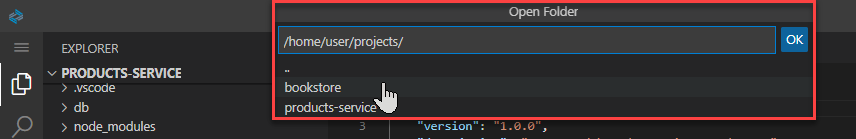
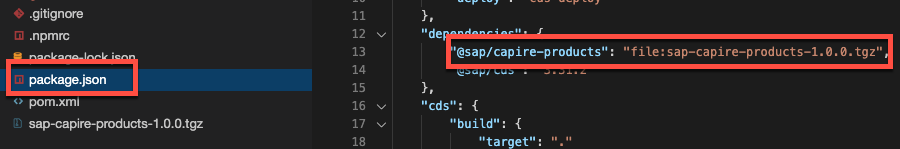
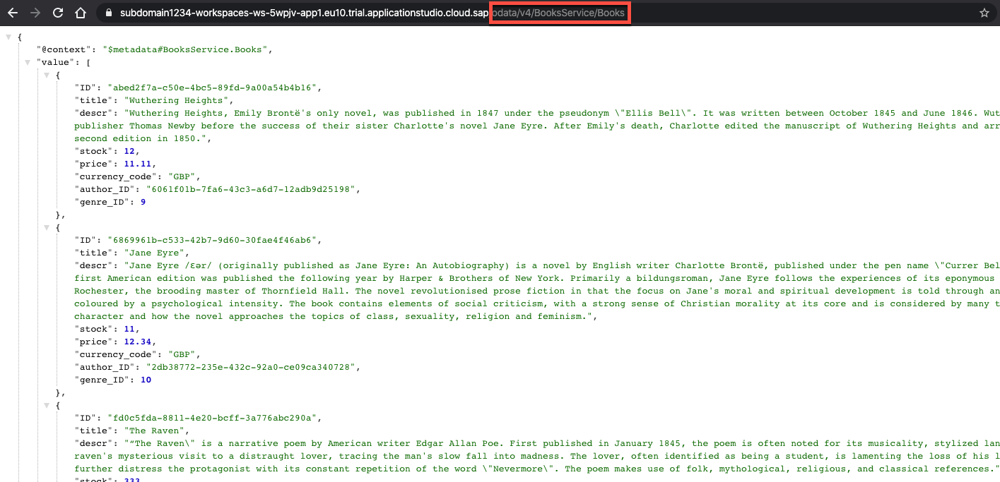

# Reuse a CAP Java Service
<!-- description --> Create a new application and reuse the existing CAP Java service.

## You will learn
- How to reuse a CAP project through NPM packages
- How to load sample data using CSV files
- How to use the localized keyword

## Intro
Now, that your products service is ready to be reused, you will build a bookstore application upon it.

In this tutorial you will create the model and the services of the bookstore application. After that you will initialize the database of your bookstore application with localized example data coming from CSV files.

You will then run your application -- still without any custom coding required -- and see the localization features of CAP in action.

---

### Create bookstore project skeleton

From the products service that you created in the previous tutorial, we just want to reuse the domain and service models. For the bookstore, which you will develop in this tutorial, we need to create and initialize a bookstore project first.

1. From the main menu of SAP Business Application Studio, choose **Terminal** **&rarr;** **New Terminal**.

2. Before adding the `bookstore` project, we need to make sure that you are in the projects folder. Both projects (`products-service` and `bookstore`) should be placed next to each other. Run the following command in the newly created terminal to go back to the projects folder:

    ```Shell/Bash
    cd ~/projects
    ```

3. Now that you are in the correct folder, run the following command:

    ```Shell/Bash
    mvn -B archetype:generate -DarchetypeArtifactId=cds-services-archetype -DarchetypeGroupId=com.sap.cds \
    -DarchetypeVersion=RELEASE -DjdkVersion=17 \
    -DgroupId=com.sap.cap -DartifactId=bookstore
    ```

4. To open the bookstore project in a new workspace go to **File** **&rarr;** **Open Folder**.

5. Choose **bookstore** from the project list and then **OK**.

    <!-- border -->

    > If you see a notification asking if you want to synchronize the `Java classpath/configuration`, choose **Always**.

    > If you have any problem indication for any of the `pom.xml` files yet, don't worry and ignore them for now.


### Install reusable service as npm dependency


As the `product-service` should be reused for the bookstore, you need to add a dependency between those two projects. Reusable models can be published as NPM modules and imported through dependencies in the `package.json` of a project.

> ### Make sure that you have followed all the sub-steps in the previous tutorial [Set up for reuse](https://developers.sap.com/tutorials/cp-cap-java-reusable-service.html#585efa23-03de-4736-98d3-a4e22bf92511) before continuing.

First, we need to simulate a release of the `product-service` module, and consume this release in the bookstore application.

1. From the main menu of SAP Business Application Studio, choose **Terminal** **&rarr;** **New Terminal**. Change into the bookstore directory by executing the following command in the terminal:

    ```Shell/Bash
    cd ~/projects/bookstore
    ```
    > This step is optional if you are already in the right directory.


2. Install the reusable service project as npm dependency:

    ```Shell/Bash
    npm install $(npm pack ../products-service -s)
    ```

    > `npm pack` creates a tarball from the `products-service`, which is then directly used as a dependency in the bookstore application. More about `npm pack`: <https://docs.npmjs.com/cli-commands/pack.html>.

    >You will find a `sap-capire-products-1.0.0.tgz` in the root folder of the bookstore project, which is the tarball file of the `products-service` project.

3. Install all other packages and simplify the overall dependency structure [`npm dedupe`](https://docs.npmjs.com/cli/dedupe):

    ```Shell/Bash
    npm install && npm dedupe
    ```

    If you open the `package.json` of your bookstore project, you will see a dependency to `@sap/capire-products`.

    <!-- border -->


### Define bookstore domain model


Now that you have created your bookstore project, you need to define the domain model.

1. Within the `~/projects/bookstore/db` folder, create a file called `schema.cds`.

2. Add the following code to your newly created `schema.cds` file and make sure you **Save** the file:

    ```CDS
    namespace sap.capire.bookstore;

    using { Currency, cuid, managed }      from '@sap/cds/common';
    using { sap.capire.products.Products } from '@sap/capire-products';

    entity Books as projection on Products; extend Products with {
        // Note: we map Books to Products to allow reusing AdminService as is
        author : Association to Authors;
    }

    entity Authors : cuid {
        firstname : String(111);
        lastname  : String(111);
        books     : Association to many Books on books.author = $self;
    }

    @Capabilities.Updatable: false
    entity Orders : cuid, managed {
        items    : Composition of many OrderItems on items.parent = $self;
        total    : Decimal(9,2) @readonly;
        currency : Currency;
    }

    @Capabilities.Updatable: false
    entity OrderItems : cuid {
        parent    : Association to Orders not null;
        book_ID   : UUID;
        amount    : Integer;
        netAmount : Decimal(9,2) @readonly;
    }
    ```

The domain model defines four entities:

- `Books`

- `Authors`

- `Orders`

- `OrderItems`

Again the `Currency`, `cuid` and `managed` types and aspects are imported, as described in the previous tutorial.

In addition, it imports the `Products` entity, which is reused for the `Books` entity. To establish the relation between books and authors, the `Products` entity is extended with an additional association to `Authors`.

The `total` element of the `Orders` entity and the `netAmount` element of the `OrderItems` entity are annotated with [`@readonly`](https://cap.cloud.sap/docs/guides/providing-services#crud). This means the value of these elements cannot be set by a client. The value is calculated by custom code. You will implement this custom code in a later tutorial. Both of these entities are also annotated with [`@Capabilities.Updatable: false`](https://cap.cloud.sap/docs/guides/providing-services#crud), which means that they cannot be updated, only created and deleted.


### Define bookstore service


You will now define the services, that should expose the entities you have defined in your domain model:

1. Within the `~/projects/bookstore/srv` folder, create a file called **`services.cds`**.

2. Add the following code to the `services.cds` file and make sure you **Save** the file:

    ```CDS
    using { sap.capire.bookstore as db } from '../db/schema';

    // Define Books Service
    service BooksService {
        @readonly entity Books as projection   on db.Books { *, category as genre } excluding { category, createdBy, createdAt, modifiedBy, modifiedAt };
        @readonly entity Authors as projection on db.Authors;
    }

    // Define Orders Service
    service OrdersService {
        entity Orders as projection on db.Orders;
        entity OrderItems as projection on db.OrderItems;
    }

    // Reuse Admin Service
    using { AdminService } from '@sap/capire-products';
    extend service AdminService with {
        entity Authors as projection on db.Authors;
    }
    ```

The `services.cds` file defines three services:

- `BooksService`

- `OrdersService`

- `AdminService`

The `BooksService` is used to provide a read-only view on the `Books` and `Authors` data. Modifications of these entities isn't possible via this service.

The `OrdersService` allows to view, create, and delete orders.

The `AdminService` is reused from the products service. But we've added the `Authors` entity to it. It can be used to create, update, and delete products and authors.

It's considered best practice to define services with a single use-case in mind. For example, the `AdminService` is meant for administrating Products, Authors and Categories, while the `BooksService` is meant for exposing a catalog of books and authors, hiding administrative data such as creation and modification times from the end user.


### Load sample data using CSV files


After defining the domain model and the services that you want to expose, you could already start your application. But first, we'd like to add some sample data to your database. To do so, we'll need to use some CSV files:

1. From your `bookstore` project, right-click the `db` folder and choose **New Folder**. Call the folder `data`.

2. Go to the data folder by running the following command in the terminal:

    ```Shell/Bash
    cd ~/projects/bookstore/db/data
    ```

3. Download CSV data for the Authors entity by running the following command in the terminal:

    ```Shell/Bash
    curl https://raw.githubusercontent.com/SAP-samples/cloud-cap-samples/CAA160-final/bookstore/db/data/sap.capire.bookstore-Authors.csv -O
    ```

4. Download CSV data for the Books entity by running the following command in the terminal:

    ```Shell/Bash
    curl https://raw.githubusercontent.com/SAP-samples/cloud-cap-samples/CAA160-final/bookstore/db/data/sap.capire.bookstore-Books.csv -O
    ```

5. Rename it with the following command:

    ```Shell/Bash
    mv sap.capire.bookstore-Books.csv sap.capire.products-Products.csv
    ```

6. Download translated CSV data for the Books entity by running the following command in the terminal:

    ```Shell/Bash
    curl https://raw.githubusercontent.com/SAP-samples/cloud-cap-samples/CAA160-final/bookstore/db/data/sap.capire.bookstore-Books_texts.csv -O
    ```

7. Rename it with the following command:

    ```Shell/Bash
    mv sap.capire.bookstore-Books_texts.csv sap.capire.products-Products_texts.csv
    ```

8. Download CSV data for the Categories entity by running the following command in the terminal:

    ```Shell/Bash
    curl https://raw.githubusercontent.com/SAP-samples/cloud-cap-samples/CAA160-final/bookstore/db/data/sap.capire.products-Categories.csv -O
    ```

    You should now have 4 CSV files with sample data. The files deliver initial data for the service that we reuse and for one entity that we created in the `bookstore` service:

    + `sap.capire.products-Categories.csv`
    +	`sap.capire.products-Products.csv`
    +	`sap.capire.products-Products_texts.csv`
    +	`sap.capire.bookstore-Authors.csv`

    The name of the CSV has to match the pattern [namespace]-[entity name] exactly otherwise the the application will fail to start.


### Run and test the bookstore application


1. In the terminal, go to the root of the bookstore project:

    ```Shell/Bash
    cd ~/projects/bookstore
    ```

2. Ensure that you have stopped all previously running applications (including the `products-service` application) by using **`CTRL+C`**.
> In case you forgot to stop the `products-service` application and the tab in which it was started is no longer opened you can run `killall mvn` in the terminal to ensure it's terminated.

3. Start the application by running:

    ```Shell/Bash
    mvn spring-boot:run
    ```

4. You will see a pop-up in the SAP Business Application Studio. Choose **Open in a New Tab**.

5. When you open the URL in a new tab, you will see a welcome page. To see the books data click on **Books** directly from the welcome page.

    > Instead of clicking on the Books entry on the welcome page, you could simple add `/odata/v4/BooksService/Books` to the URL.

    <!-- border -->

6. To read the localized German example data, append the query parameter `?sap-locale=de` to the URL. For example, `<APP_URL>/odata/v4/BooksService/Books?sap-locale=de`. Try to switch the language between German (`de`) and English (`en`).

Great Job! You have successfully developed the bookstore application and reused your products service from the previous tutorial.

In the next tutorial you will extend this application with custom code, to calculate the `total` and `netAmount` elements of the `Orders` and `OrderItems` entity. In addition, you will add custom code that will decrease the stock in the Books entity whenever an order is created.

---
