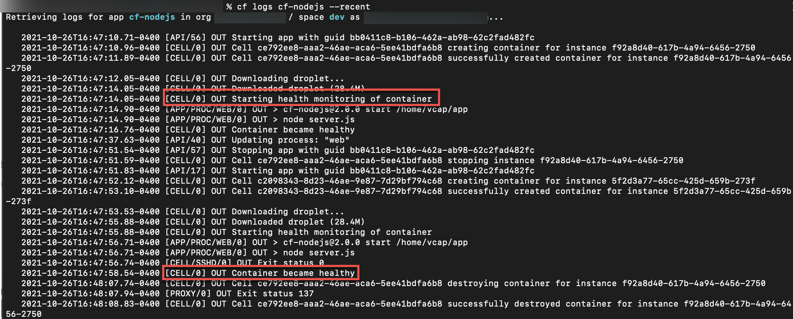

# Application Health Check
<!-- description --> How the Application Health Check works and how you can set it up for your own application

## Prerequisites
- **Groups** [Create Your First App on Cloud Foundry](group.scp-3-first-app)
- **Tutorials** [Install the Cloud Foundry Command Line Interface (CLI)](cp-cf-download-cli)

## You will learn
- How Cloud Foundry monitors your apps
- How to implement health checks using the Cloud Foundry CLI

---

### Overview of App Health Checks


An important requirement for a platform is to ensure that applications remain healthy and in an available state. To this extent, when running applications in the Cloud Foundry Environment, CF is constantly monitoring the state of your applications via Health Checks. There are three types of health checks offered by Cloud Foundry:

- `http` health checks perform a GET request to an endpoint
- `port` health checks make a TCP connection to the port (or ports) configured for the app. This is the default health check type.
- `process` health checks check that a process stays running

For more detailed information about the types of health checks, see [Health Check Types](https://docs.cloudfoundry.org/devguide/deploy-apps/healthchecks.html#types).

When configuring a health check you can supply a type, a timeout, and also a custom endpoint if using a `http` type health check. Supplying each of these is optional, and default values are assigned if not supplied. While the default health checks are useful, they may not be enough for some use cases. Just because you can connect to a port doesn't mean that other parts of your application are healthy and functioning properly. You may get a response from an `http` endpoint, but is it the response you were expecting? Your process may run, but the process it forwards data to may not. For these reasons, and more, it is important to look into implementing more sophisticated health checks.


### The lifecycle of a Health Check


When you first deploy an application in the Cloud Foundry environment, the app's health check is run every 2 seconds until a healthy response is received, or the health check timeout has elapsed. This 2 second interval is not configurable. The timeout value is configurable and any app that does not pass a health check within the configured health check timeout is considered unhealthy. Once an app is considered healthy subsequent health checks run every 30 seconds.

> Slow application startup can cause downtime. For this reason, it is highly recommended that you focus on making your application start and respond to health checks as quickly as possible, potentially continuing the loading of dependencies and establishing connections to external resources after initial application start-up.

If an existing app becomes unhealthy, Cloud Foundry stops the app instance following normal [shutdown](https://docs.cloudfoundry.org/devguide/deploy-apps/app-lifecycle.html#shutdown) procedures. It then deletes the instance, reschedules a new instance, and reports a crash event to the Cloud Controller. For more information you can check out the [health check lifecycle](https://docs.cloudfoundry.org/devguide/deploy-apps/healthchecks.html#healthcheck-lifecycle) documentation from Cloud Foundry.


### Configuring a Health Check for an Existing App


If you are deploying a new application you can configure the health check using the `cf push` command, or by modifying the `manifest.yml` file. When configuring a health check for an existing app you use the `set-health-check` command instead.

The command takes two arguments, as seen here: `cf set-health-check [APP-NAME] [HEALTH-CHECK-TYPE]`

- `APP-NAME` is the name of the app you are targeting
- `HEALTH-CHECK-TYPE` refers to the type of the health check you want to create

You will use this command to set up an `http` health check for your [cf-nodejs](https://github.com/SAP-archive/cf-sample-app-nodejs) application. First, copy and paste this into your terminal, without any adjustments:

```
cf set-health-check cf-nodejs http
```

In the above example the `APP-NAME` and `HEALTH-CHECK-TYPE` arguments have been replaced with the name of your app from the previous tutorial (`cf-nodejs`) and the type of health check (`http`), respectively. The `cf cli` allows you to pass an extra argument to `set-health-check` which defines a custom endpoint for http checks, but for the sake of this tutorial you can use the default configuration. To learn more about custom endpoints, see [Health Check HTTP Endpoints](https://docs.cloudfoundry.org/devguide/deploy-apps/healthchecks.html#health_check_uri).

Once you have configured the health check for your existing app, you will need to restart the app before the changes take effect.


### Validate the health check


To validate that the health check is working you can use the `cf logs` command.

```
cf logs cf-nodejs --recent
```
You should see two log lines of interest, one showing that the health check has started and another stating that the container is healthy. These log messages are outlined below:

<!-- border -->


---
