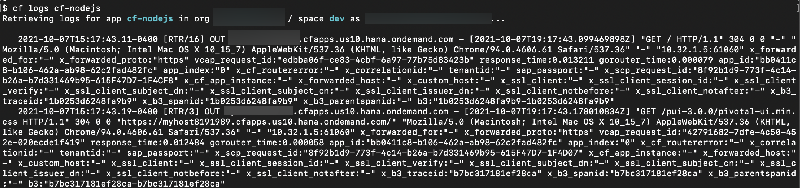
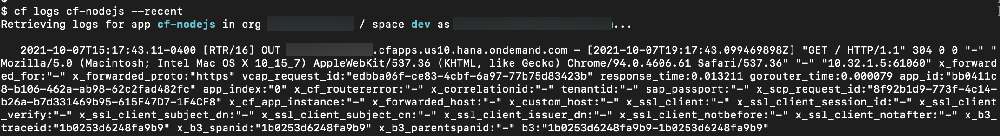
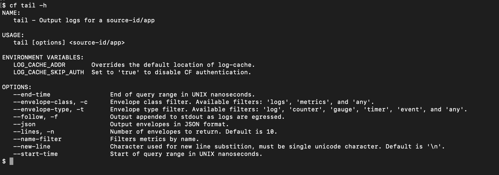
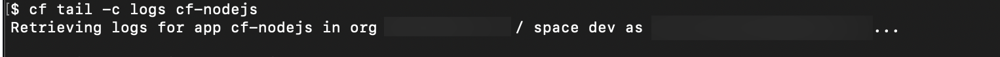
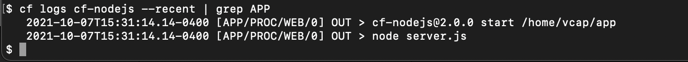

# Overview of Cloud Foundry Application Logs
<!-- description --> Understand what application logs are and the various methods used to view them

## Prerequisites
 - **Tutorial** [Understand the Cloud Foundry Application Lifecycle](cp-cf-understand-application-lifecycle)

## You will learn
  - What application logs are and how they are processed
  - How to view logs using the `cf cli` and log cache plugin
  - How logs are formatted and what log types are supported
  - How logs are ordered

## Intro
This tutorial assumes you have completed the tutorials within the [Understand the Cloud Foundry Application Lifecycle](cp-cf-understand-application-lifecycle) tutorial and you have a working [cf-nodejs](https://github.com/SAP-samples/cf-sample-app-nodejs) application.

---

### Application Logs


**Application logs** are those logs produced by the applications you deploy in Cloud Foundry. The contents of these logs are determined by you as the developer of the application. In order for the application logs to be picked up by the logging system in Cloud Foundry they must be written to `stdout` and/or `stderr`. The logs can then pass through the logging system, and be used by the clients/services that need them. For more information on `stdout` and `stderr`, see this Wikipedia entry on [Standard Streams](https://en.wikipedia.org/wiki/Standard_streams).

The Cloud Foundry Command Line Interface (`cf cli`) provides several options for viewing your logs. To see a real-time stream of the logs from your [cf-nodejs](https://github.com/SAP-samples/cf-sample-app-nodejs) application, run the following in your terminal:

```
cf logs cf-nodejs
```

You can then watch this update in real time by refreshing the application's webpage and observing the output that is produced in the terminal. To exit the stream simply hit `ctrl-c` on your keyboard.

<!-- border -->

If you want to dump the most recent logs from your app to the screen, run:

```
cf logs cf-nodejs --recent
```

<!-- border -->


### Install the log cache plugin


The above commands show only the most recent logs. If you want to look at logs going further back, then the log cache is one possible solution. The **log cache** stores logs and metrics so that you can go back and analyze them at some point in the future. This feature is already enabled by default in SAP BTP Cloud Foundry. The [Log Cache plugin](https://github.com/cloudfoundry/log-cache-cli) makes it simple to access and view the logs and metrics contained within the log cache. There is also an [API](https://github.com/cloudfoundry/log-cache-release/blob/v2.11.11/src/README.md#apis) for those who prefer an alternative option.

> While the log cache is very convenient for development and debugging of applications, it is not a solution for storing logs of production applications.

To install the Log Cache plugin run:

```
cf install-plugin -r CF-Community "log-cache"
```

Once installed this plugin provides three new commands in the `cf cli`:

 1. `cf tail`
 2. `cf log-meta`
 3. `cf query`

To find out more about these commands and the options they provide, refer to their help documentation using the `-h` option for each command.

<!-- border -->

To view logs using the log cache plugin run:

```
cf tail -c logs <app-name>
```
The `-c logs` flag filters the log cache so that only logs are displayed in the output.

<!-- border -->


### Log Format and Log Types


Every log that passes through the Cloud Foundry system consists of four fields:

|  Field                       | Description
|  :-------------              | :-------------
|  Timestamp                   | **`Time assigned by the Loggregator when it received the log data`**
|  Log type (origin code)      | **`The type of log and the instance it originated from`**
|  Channel                     | **`Whether the log was emitted on stdout or stderr`**
|  Message                     | **`The actual content of the log, which may be formatted differently depending on the log type`**


Cloud Foundry supports several different [Log Types](https://docs.cloudfoundry.org/devguide/deploy-apps/streaming-logs.html#types). Application logs, for example, receive a log type of `APP`. Knowing how logs are formatted and the various log types available can help you when troubleshooting your application. As a developer the log type you are most likely to see is `APP` for your application logs. You can filter the output of your logs using `grep`. For example, you can display only those logs with the log type of APP for your `cf-nodejs` app using `cf logs cf-nodejs | grep APP`. You can also combine this with the `--recent` flag above to search through recent logs.

<!-- border -->


### Log Ordering


Due to the nature of Cloud Foundry and the logging system, sometimes logs may not be received in the order they are generated. Most Cloud Foundry setups have more than one instance of each Cloud Foundry component; as logs pass through the system they may be sent to any of these instances, before being sent on to their final destination where they are consumed. This can result in the logs reaching their destination at different times. To help alleviate issues caused by this behavior, logs are given a timestamp when they are created (measured down to the nanosecond.)

When using the `cf logs` command to view logs you may notice different results than when you use the log cache or the [SAP Cloud Logging Service for SAP BTP](https://help.sap.com/docs/cloud-logging?locale=en-US) (an SAP provided service for collecting and viewing logs). This has to do with the temporary nature of the logs viewed with the `cf logs` command. It can only order on the limited logs it currently has, whereas the SAP Application Logging service and the log cache can order logs over a larger period of time, giving you more accurate results.


---
