## Prerequisites
 - **Tutorials:** [Get a Free Trial Account on SAP Cloud Platform](hcp-create-trial-account)
 - Configure entitlement for **Business Rules** in your subaccount. For more information, see [Configure Entitlements and Quotas for Subaccounts](https://help.sap.com/viewer/65de2977205c403bbc107264b8eccf4b/Cloud/en-US/5ba357b4fa1e4de4b9fcc4ae771609da.html)

## Details
### You will learn
  - How to enable Business Rules service
  - How to create a service instance of Business Rules

SAP Cloud Platform Business Rules is an Intelligent Business Process Management service that lets you digitize and automate decision making. You can author and manage your decisions using the **Manage Rules Project** application of business rules service. For more information on SAP Cloud Platform Business Rules, see [SAP Cloud Platform Business Rules](https://help.sap.com/viewer/product/BUSINESS_RULES/Cloud/en-US).

To get started with SAP Cloud Platform Business Rules, you have to create a service instance of business rules. Also, you can create the service key of the business rules service instance, which lets you consume the business rules API from SAP API Business Hub or any REST clients. You will need the service instance and service keys in the tutorials that follow.

[ACCORDION-BEGIN [Step 1: ](Open SAP Cloud Platform cockpit)]

1. In your Web browser, open the [SAP Cloud Platform](https://account.hanatrial.ondemand.com/cockpit) cockpit. If you do not have a trial account, see Prerequisites.

2. Choose **Enter Your Trial Account**.

    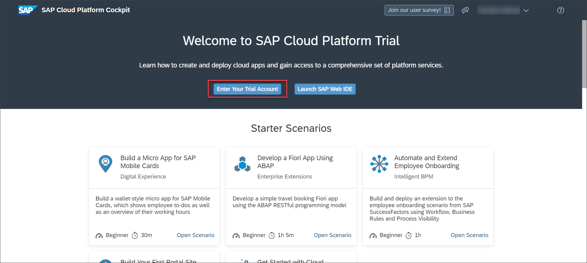

[DONE]
[ACCORDION-END]

[ACCORDION-BEGIN [Step 2: ](Open Business Rules tile)]

1. Choose your subaccount.

    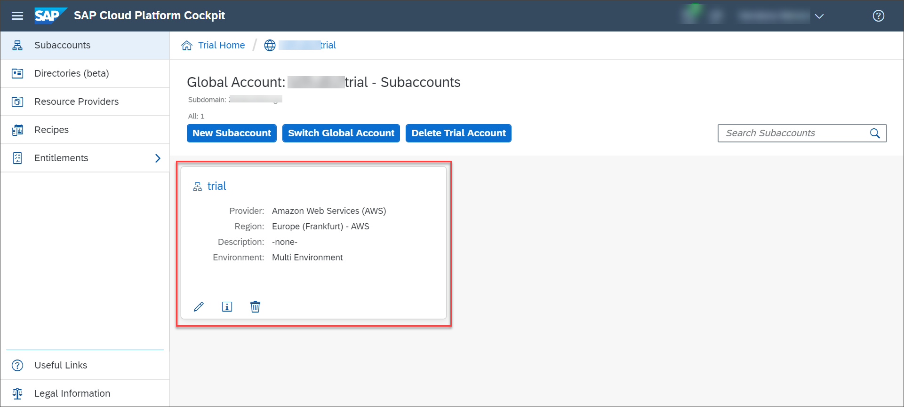

2. Navigate to **Spaces** and then choose your space.

    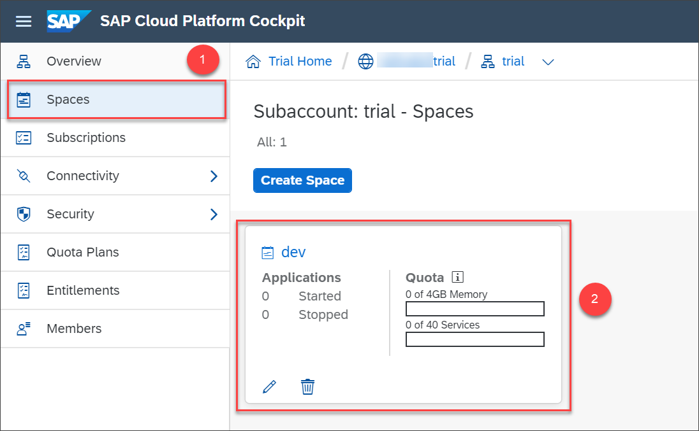   

3. In the navigation area, choose **Services** > **Service Marketplace** , search for business rules and then choose **Business Rules** tile.

    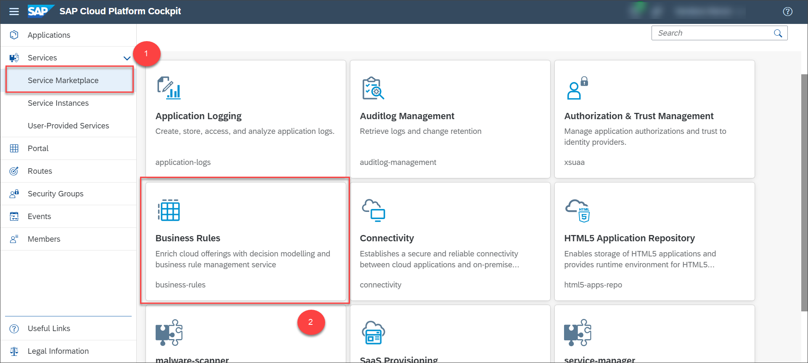

    The following service overview page opens:

    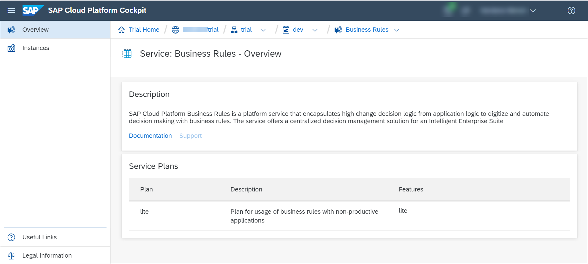

[DONE]
[ACCORDION-END]

[ACCORDION-BEGIN [Step 3: ](Create a service instance)]

1. In the navigation area, choose **Instances** and then choose **New Instance**.

    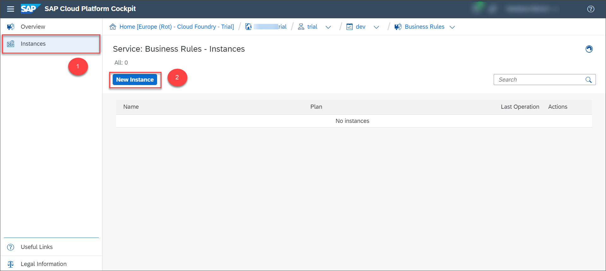

2. Choose the service plan **lite** and choose **Next**.

    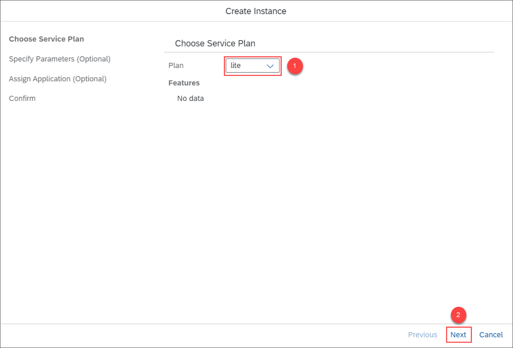

3. No parameters are needed as shown in the following image, so choose **Next**.

    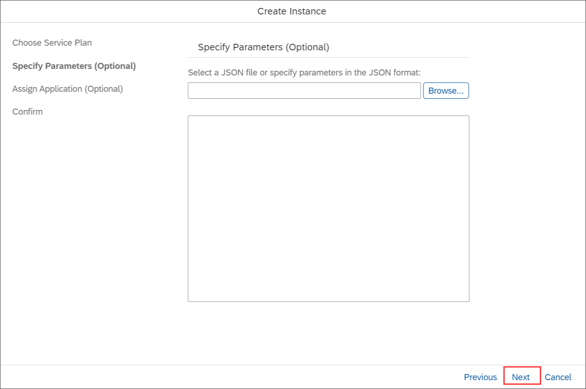

4. In the next screen, choose **Next** as we don't need to bind any application.

    

5. In the **Instance Name** field, provide an **Instance Name** of your choice and then choose **Finish**.

    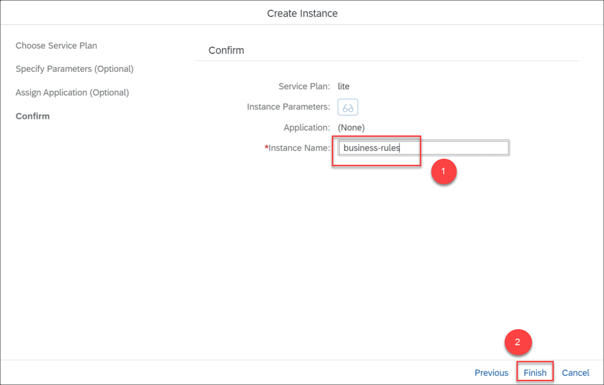

    >Note the service instance name as it is required to access the Manage Rules Project application to author and manage business rules.

    The new instance is displayed in the list and the status present under the **Last Operation** changes to Created.

    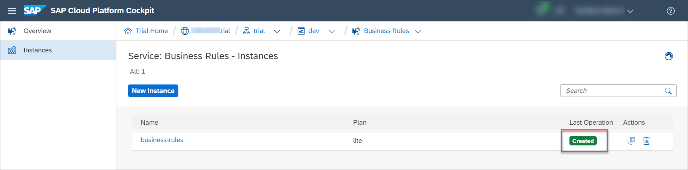

[DONE]
[ACCORDION-END]

[ACCORDION-BEGIN [Step 3: ](Create service key for service instance)]

1. Choose the business rules service instance that you created.

    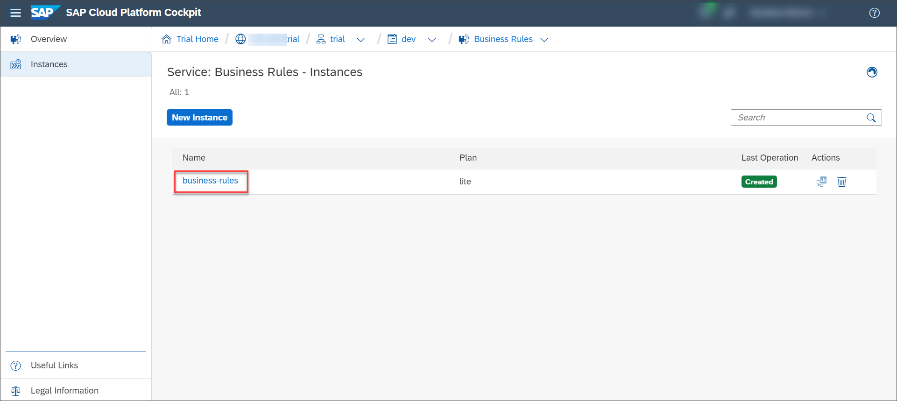

2. In the navigation area, choose **Service Keys** and then choose **Create Service Key**.

    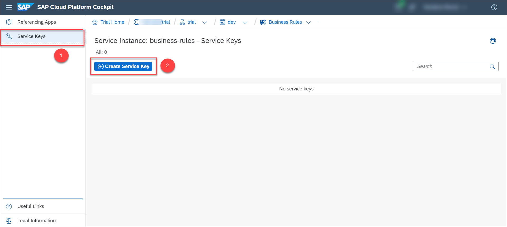

3. Provide a **Name** of your choice and then choose **Save**.

    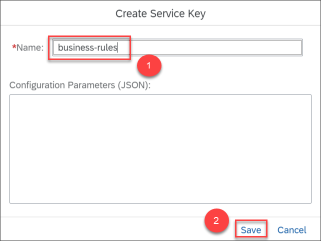

    The service key is generated as shown:  

    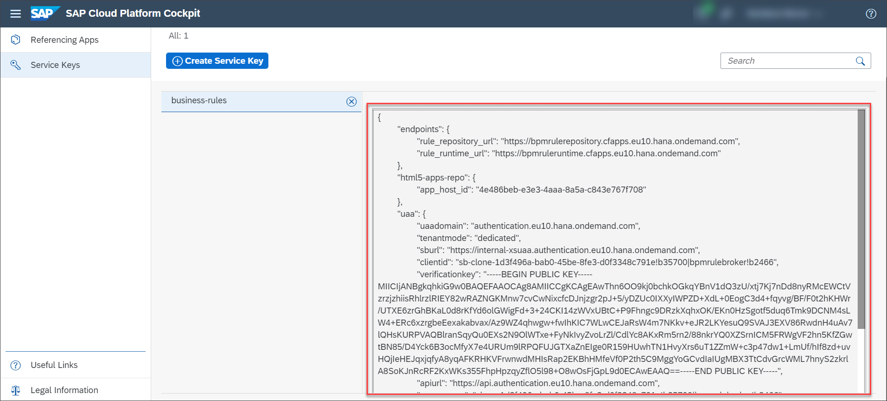

[VALIDATE_1]
[ACCORDION-END]
