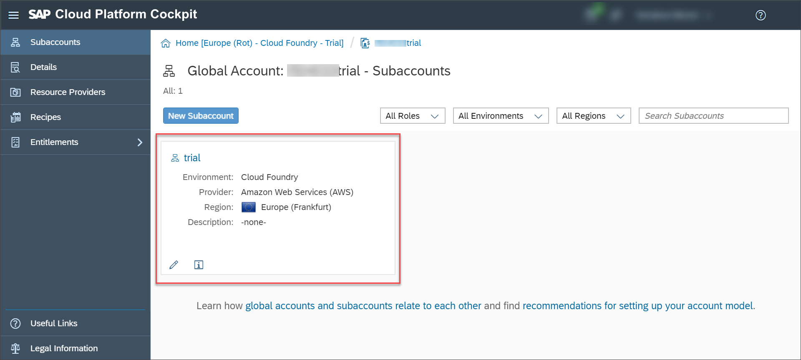
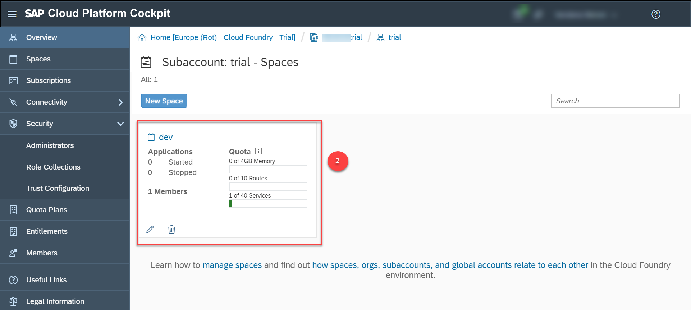
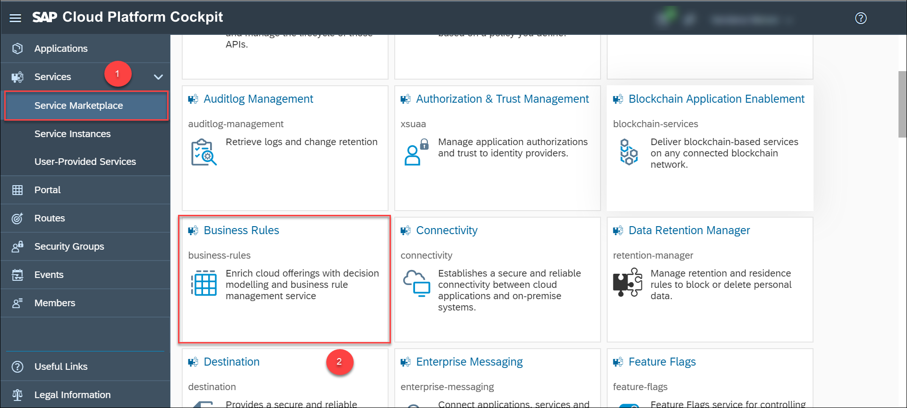
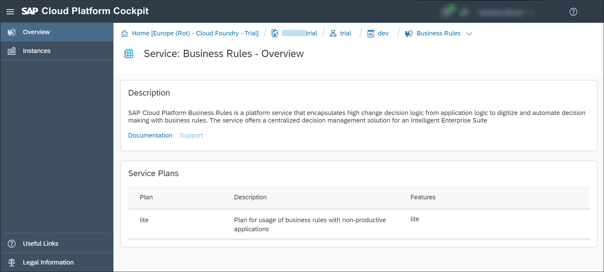
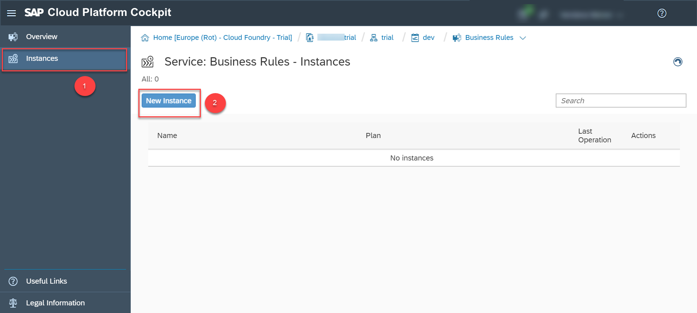
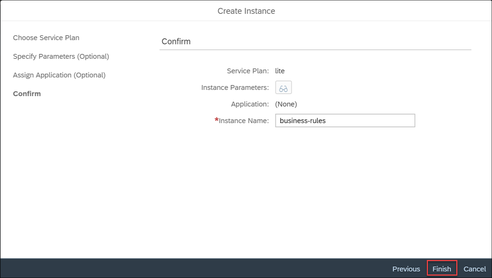
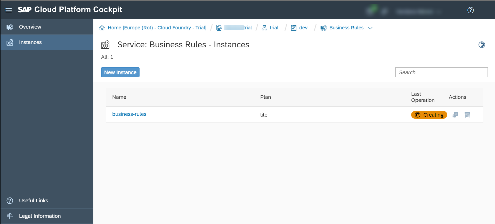
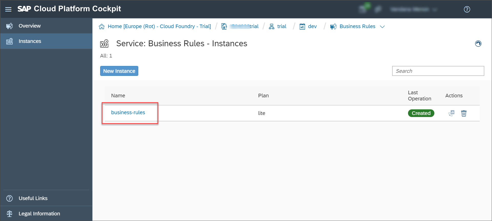
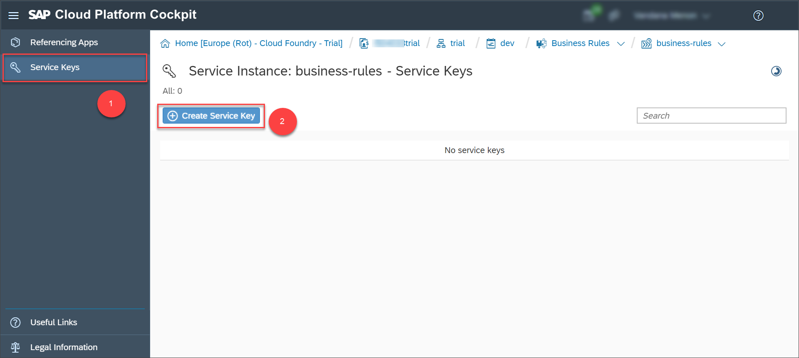
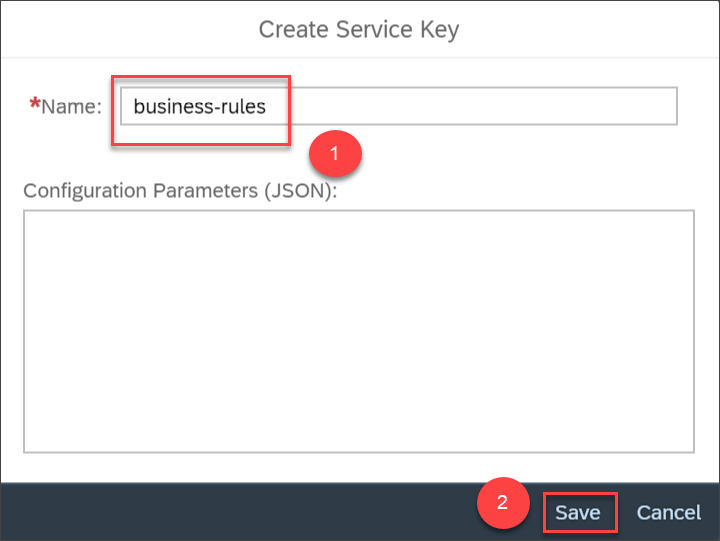

## Details
### You will learn
  - How to enable Business Rules service
  - How to create a service instance of Business Rules

You can create a service instance of business rules to get started with SAP Cloud Platform Business Rules. Also, you can create the service key of the business rules service instance, which lets you consume the business rules API from SAP API Business Hub or any REST clients. You will need the service instance and service keys in the tutorials that follow.

[ACCORDION-BEGIN [Step 1: ](Create SAP Cloud Platform trial account)]

Open [SAP Cloud Platform Cockpit](https://cockpit.hanatrial.ondemand.com) and then create a trial account in the Cloud Foundry environment. For more information, see [Get a Trial Account](https://help.sap.com/viewer/65de2977205c403bbc107264b8eccf4b/Cloud/en-US/42e7e54590424e65969fced1acd47694.html?q=create%20a%20trial).

If you have already created a trial account in the Cloud Foundry environment, perform the following steps:

1. Choose your trial account.

    

2. In the navigation area, choose **Spaces** and then choose your space.

       

[DONE]
[ACCORDION-END]

[ACCORDION-BEGIN [Step 2: ](Create service instance of Business Rules)]

1. In the navigation area, choose **Service Marketplace** and then choose **Business Rules** tile.

    

    The following service overview page opens:

    

2. In the navigation area, choose **Instances** and then choose **New Instance**.

    

3. Keep the default options as is, provide an **Instance Name** of your choice, then choose **Finish**.

    

    You can see the instance creation status in the **Business Rules – Instances** page as shown:

    

    You can see the following status once the service instance is created:

    

[DONE]
[ACCORDION-END]

[ACCORDION-BEGIN [Step 3: ](Create service key of service instance)]

1. Choose the business rules service instance that you created.

    

2. In the navigation area, choose **Service Keys** and then choose **Create Service Key**.

    

3. Provide a **Name** of your choice and then choose **Save**.

    

    The service key is generated as shown:

    

[VALIDATE_1]
[ACCORDION-END]
