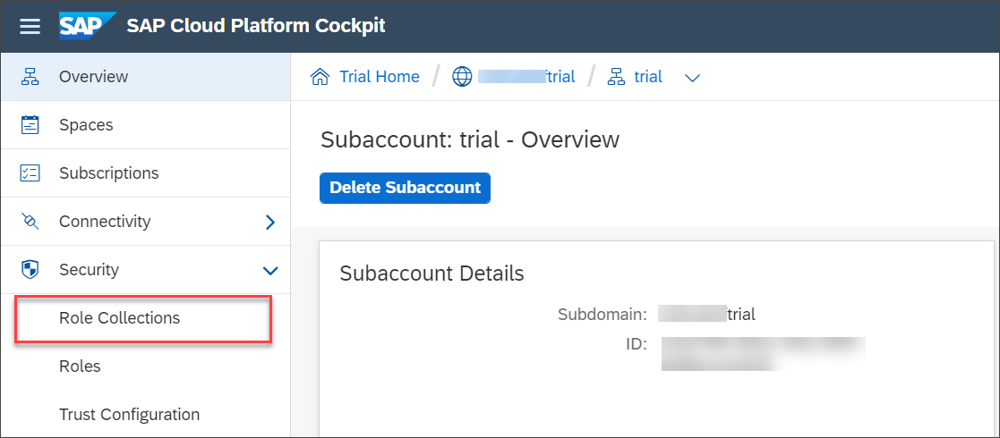
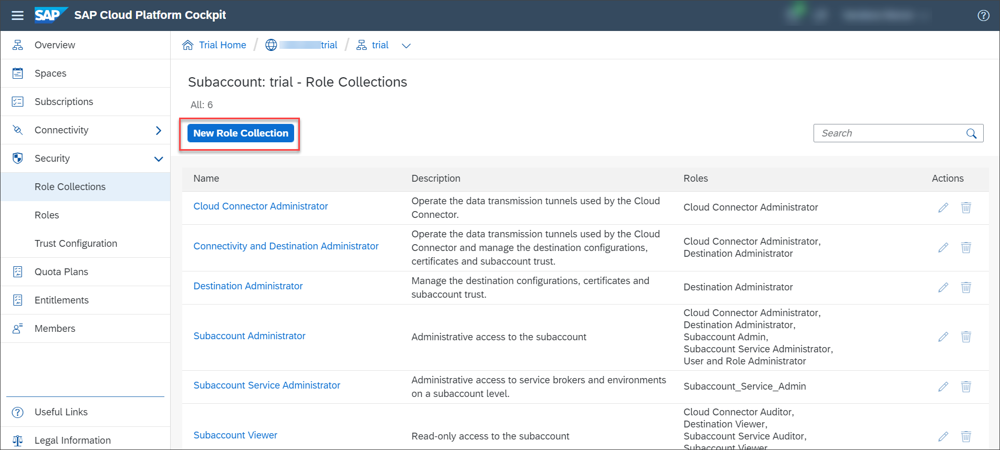
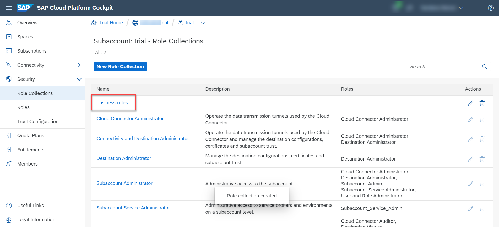
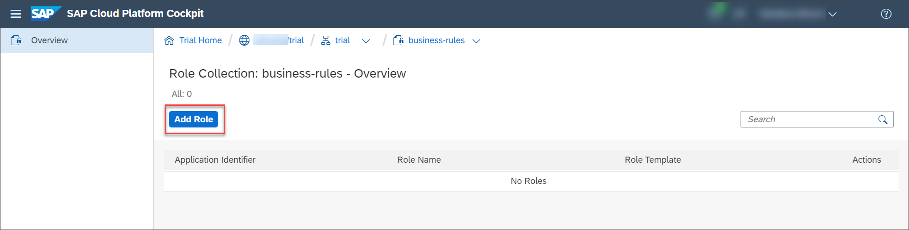
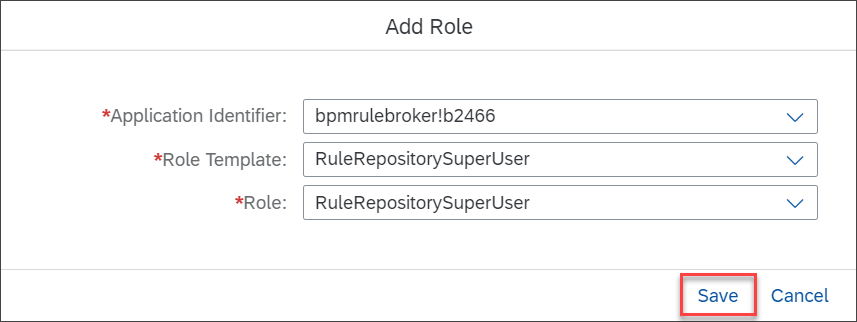
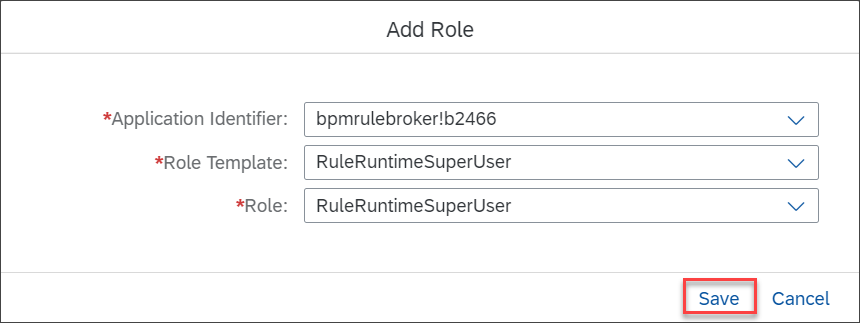
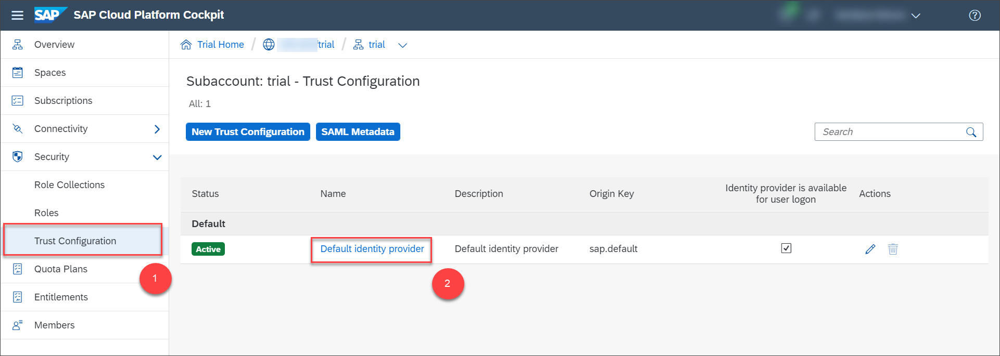
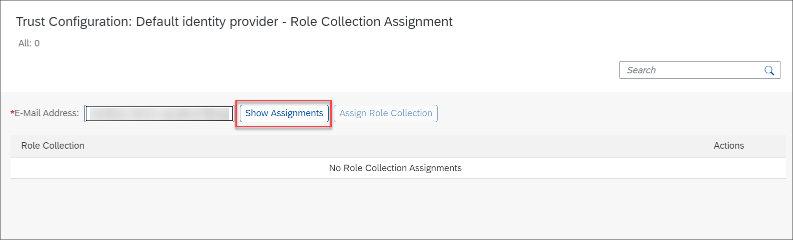
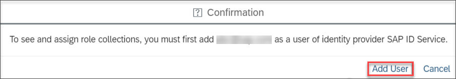
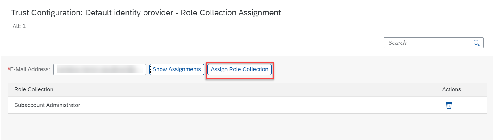

## Details
### You will learn
  - How to create role collections and assign it to a user

Add the roles required to access the **Manage Rule Projects** application to the role collection and assign the role collection to your users.

---

[ACCORDION-BEGIN [Step 1: ](Create a role collection)]

1. In [SAP Cloud Platform](https://cockpit.hanatrial.ondemand.com/cockpit/#/home/trial) cockpit, navigate to your subaccount.

    

2. In the navigation area, under **Security**, choose **Role Collections**.

    

3. Choose **New Role Collection**.

    

4. In the **New Role Collection** window, enter **business-rules** and then choose **Save**.

    

5. Choose **business-rules** role collection to add roles.

    

6. Choose **Add Role**.

    

7. In the **Add Role** window, choose the following values:

    |  Field Name     | Value
    |  :------------- | :-------------
    |  **Application Identifier**           | **`bpmrulebroker!b2466`**
    |  **Role Template**           | **`RuleRepositorySuperUser`**
    |  **Role**           | **`RuleRepositorySuperUser`**

    Choose **Save**.

    

8. Similarly add the role **`RuleRuntimeSuperUser`** to the application identifier **`bpmrulebroker!b2466`** and then choose **Save**.

    

[DONE]
[ACCORDION-END]

[ACCORDION-BEGIN [Step 2: ](Assign role collection)]

1. Navigate to the subaccount using the breadcrumb navigation.

2. In the navigation area, under **Security**, choose **Trust Configuration** and then choose **SAP ID Service**.

    

3. Enter your e-mail address in the **User** input field and then choose **Show Assignments**.

    

    There is no role collection assigned at this point. If a user is not added to the respective identity provider, add the user by selecting **Add User** in the confirmation dialog box.

    

4. Choose **Assign Role Collection**.

    

5. In the **Assign Role Collection** window, choose **`business-rules`** from the dropdown list and then choose **Assign Role Collection**.

    

[VALIDATE_1]
[ACCORDION-END]
