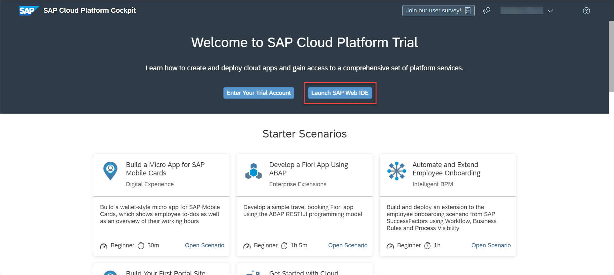

## Details
### You will learn
  -  How to configure a multi-target application to access Manage Rules Project application

The Manage Rules Project application is web-based tool which is used to create projects where you can author and execute business rules. In this tutorial, you will learn how to access Manage Rules Project application by deploying a multi-target application in SAP Web-IDE Full Stack.

---

[ACCORDION-BEGIN [Step 1: ](Download multi-target application file)]

1. Use the following link to access the MTA file from [GitHub](https://).

2. Choose **`cf-businessruleseditor.zip`**.

    

The **`cf-businessruleseditor.zip`** is downloaded to your file system.

[DONE]
[ACCORDION-END]

[ACCORDION-BEGIN [Step 2: ](Import MTA to SAP Web IDE)]

1. Log onto [SAP Cloud Platform Cockpit](http://cockpit.hanatrial.ondemand.com).

2. Scroll down and choose **Launch SAP Web IDE**.

    

3. In SAP Web IDE Full-Stack, open the **Development** perspective.

    

4. Right-click the **Workspace** root folder, then choose **Import > File or Project**.

    

5. In the **Import** dialog, browse for the **`businessruleseditor.zip`** file that you downloaded in your local system.

    

    Upon browsing the file, the other fields automatically get updated.

6. Choose **OK**.

    

7. The MTA file is imported under the **Workspace** folder and the file structure is shown below. Ensure that have chosen **Show Hidden Files** to be able to view the file structure as shown.

    

[DONE]
[ACCORDION-END]


[ACCORDION-BEGIN [Step 3: ](Modify mta.yaml file)]

If you have created a service instance with the name other than **`businessrules`**, you need to perform the following procedure.

1. Right-click the `mta.yaml` file and choose **Open MTA Editor**.

    

2. Under the **Resources** tab, add the name of your business rules service instance as shown:

    

[DONE]
[ACCORDION-END]

[ACCORDION-BEGIN [Step 4: ](Build and deploy project)]

1. Right-click on the **`businessruleseditor`** project and choose **Build > Build**.

    

2. After the build completes, navigate to the **`mta_archives`** > **`businessruleseditor_0.0.1.mtar`** file. Right-click **`businessruleseditor_0.0.1.mtar`** and choose **Deploy** > **Deploy to SAP Cloud Platform**.

    

3. Enter the API endpoint and log onto Cloud Foundry to fetch the environment details.

    

    Choose **Deploy**.

    


[DONE]
[ACCORDION-END]

[ACCORDION-BEGIN [Step 5: ](Access Manage Rules Project Application)]

Open the job console at the end of the deployment process, and search for the application URL. It should appear in the console as follows:

```
Application "`<app name>_appRouter`" started and available at "`<application URL>`"
```


> You can bookmark this link for later use.

[VALIDATE_1]
[ACCORDION-END]
