## Details
### You will learn
  -  How to configure a multi-target application to access Manage Rule Projects application

The **Manage Rule Projects** application is a web-based tool which is used to create projects where you can author and execute business rules. In this tutorial, you will learn how to access **Manage Rule Projects** application by deploying a multi-target application in SAP Web-IDE Full Stack.

---

[ACCORDION-BEGIN [Step 1: ](Download multi-target application file)]

1. Use the following link to access the MTA file from [GitHub](https://github.com/SAP/cloud-businessrules-samples/blob/master/cf-apps/cf-businessruleseditor.zip).

2. Choose **`cf-businessruleseditor.zip`**.

    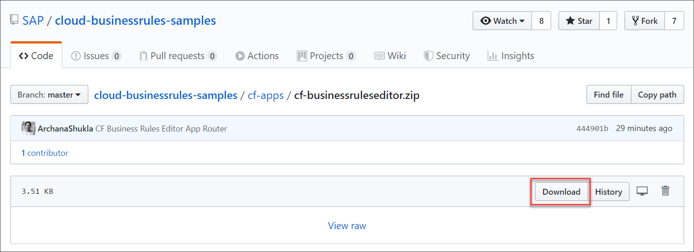

The **`cf-businessruleseditor.zip`** is downloaded to your file system.

[DONE]
[ACCORDION-END]

[ACCORDION-BEGIN [Step 2: ](Import MTA to SAP Web IDE)]

1. Log on to [SAP Cloud Platform Cockpit](http://cockpit.hanatrial.ondemand.com) and choose **Launch SAP Web IDE**.

    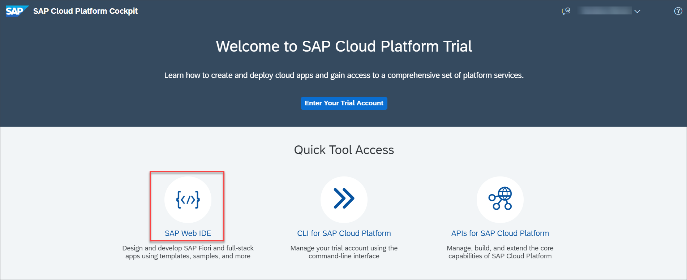

2. In SAP Web IDE Full-Stack, open the **Development** perspective.

    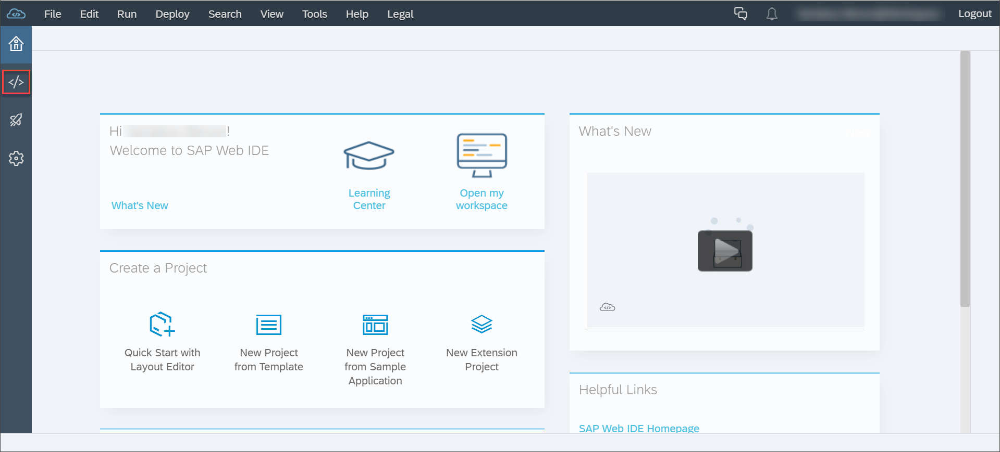

3. Right-click the **Workspace** root folder, then choose **Import > File or Project**.

    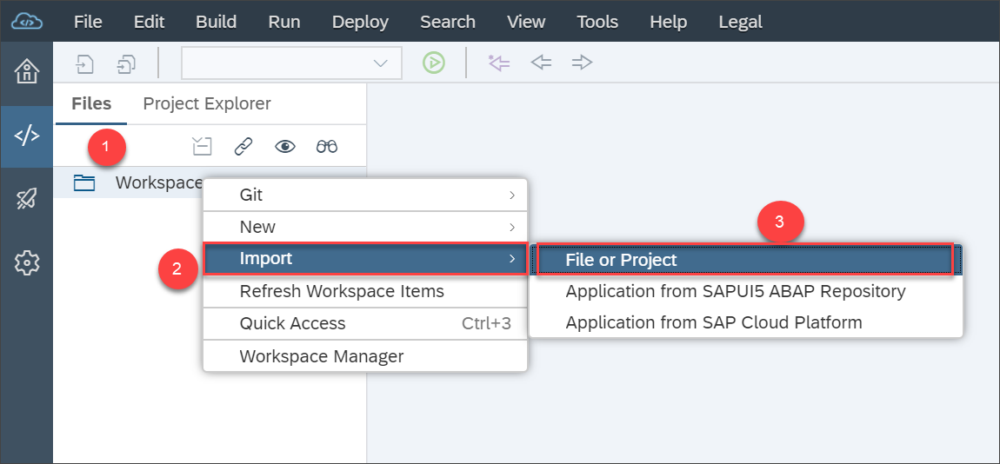

4. In the **Import** dialog, browse for the **`businessruleseditor.zip`** file that you downloaded in your local system.

    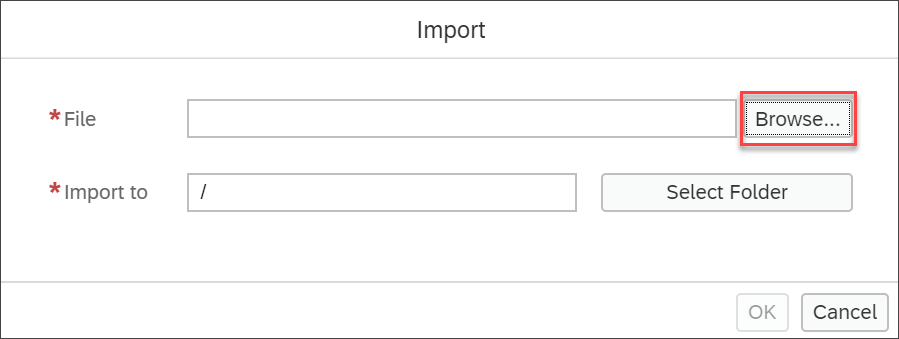

    Upon browsing the file, the other fields automatically get updated.

5. Choose **OK**.

    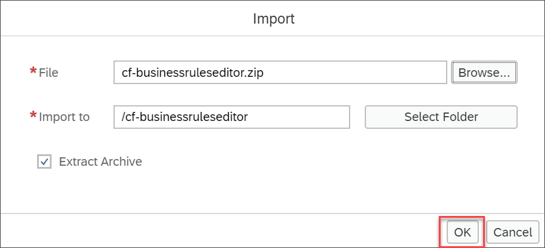

6. The MTA file is imported under the **Workspace** folder and the file structure is shown below. Ensure that have chosen **Show Hidden Files** to be able to view the file structure as shown.

    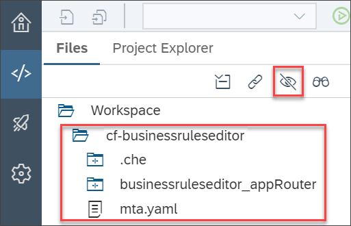

[DONE]
[ACCORDION-END]


[ACCORDION-BEGIN [Step 3: ](Modify mta.yaml file (optional))]

If you have created a service instance with the name other than **`business-rules`**, you need to change the name of the service instance in the `mta.yaml` file. Ensure that you provide the name of the service instance created during [Create a Service Instance of SAP Cloud Platform Business Rules](cp-cf-businessrules03-setup-mrp).

1. Right-click the `mta.yaml` file and choose **Open MTA Editor**.

    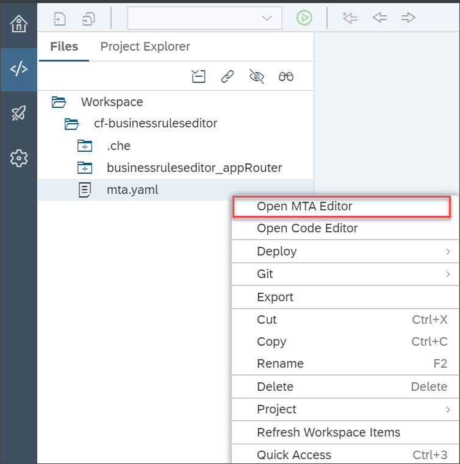

2. Under the **Resources** tab, add the name of your business rules service instance in the field as shown:

    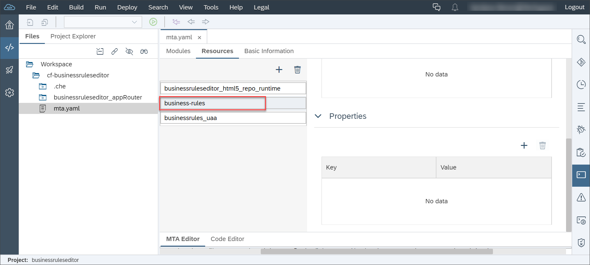

    Alternatively, you can also edit the `mta.yaml` file in the **Code Editor**. Open the file in the **Code Editor**, and change the name of your service instance in the `requires` section of the `approuter` module, and the `resources` module.

      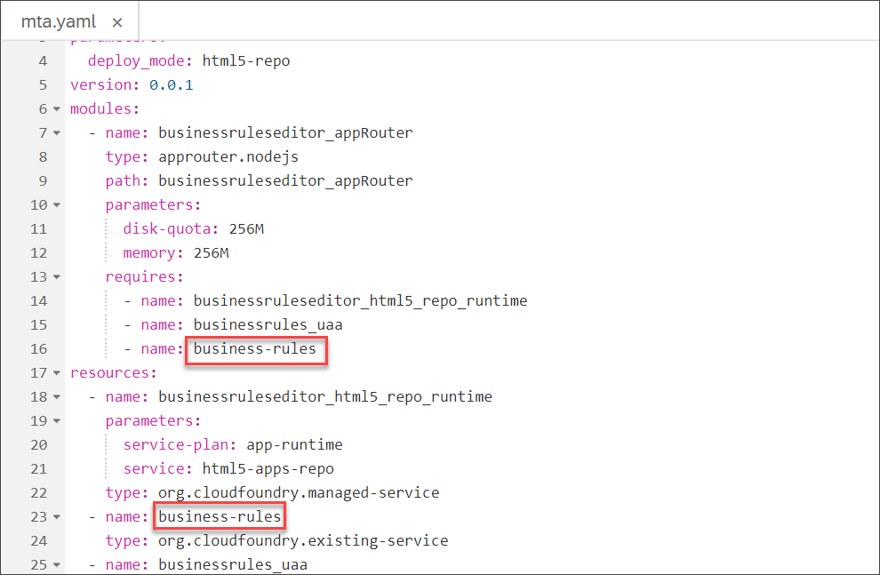

[DONE]
[ACCORDION-END]

[ACCORDION-BEGIN [Step 4: ](Build and deploy project)]

1. Right-click on the **`cf-businessruleseditor`** project and choose **Build > Build with Cloud MTA Build Tool (recommended)**.

    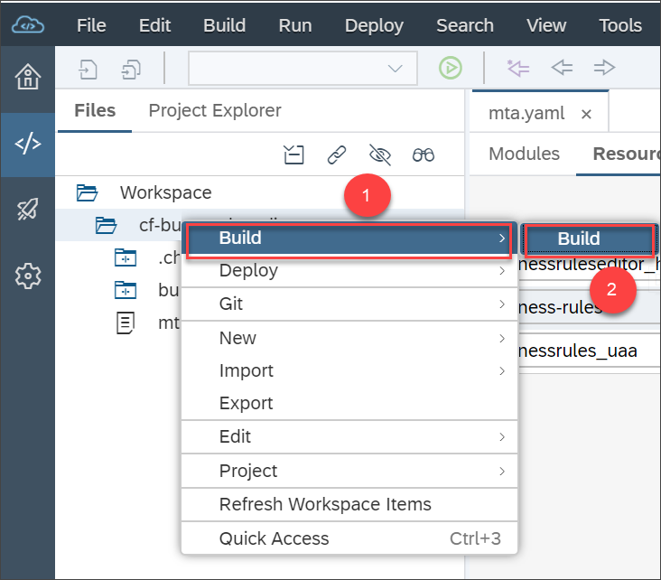

2. After the build completes, navigate to the **`mta_archives`** > **`businessruleseditor_0.0.1.mtar`** file. Right-click **`businessruleseditor_0.0.1.mtar`** and choose **Deploy** > **Deploy to SAP Cloud Platform**.

    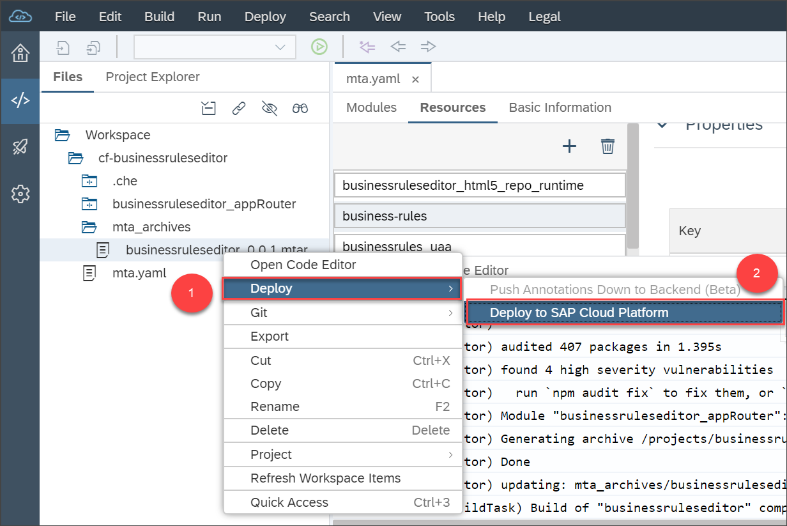

3. Enter the API endpoint and log onto Cloud Foundry to fetch the environment details.

    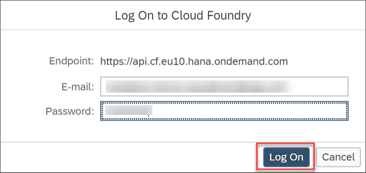

    Choose **Deploy**.

    


[DONE]
[ACCORDION-END]

[ACCORDION-BEGIN [Step 5: ](Access Manage Rule Projects Application)]

Open the job console at the end of the deployment process, and search for the application URL. It should appear in the console as follows:

```
Application "`<app name>_appRouter`" started and available at "`<application URL>`"
```

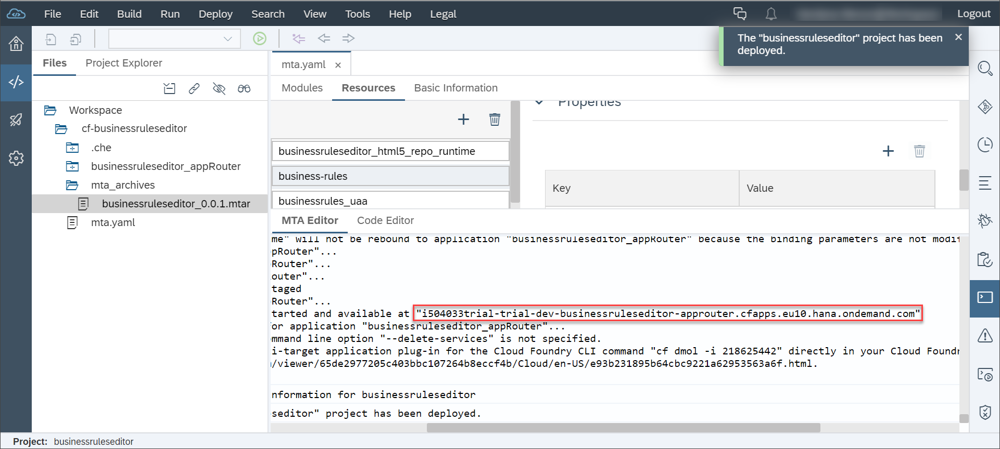

Use this URL to access the **Manage Rule Projects** application. The next set of tutorials guide you on using this application to author and execute business rules.

>You can bookmark this link for later use.

[VALIDATE_1]
[ACCORDION-END]
