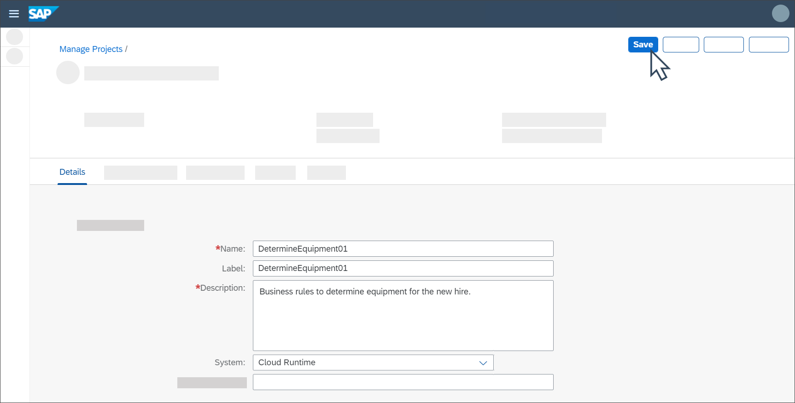

## Prerequisites
 - Ensure that you setup the **Workflow Management** service to access the **Manage Rule Projects** application. For more information, see [Set Up Workflow Management in Cloud Cockpit](cp-starter-ibpm-employeeonboarding-1-setup).

## Details
### You will learn
  - How to create a project to author rules

Business Rules is a capability of SAP Workflow Management service that lets you digitize and automate decision making. You can author and manage your decisions using the **Manage Rule Projects** application of business rules service.

A project is used to configure and manage the entities of business rules. Entities of business rules include data objects, rules, rule sets, and rule services. You can create projects in the **Manage Rule Projects** application, which can be accessed from the **Workflow Management** home screen. For more information, see [Business Rules](https://help.sap.com/viewer/product/BUSINESS_RULES/Cloud/en-US).

[ACCORDION-BEGIN [Step 1: ](Open Manage Rules Project application)]

1. Log on to **Workflow Management** home screen, and choose **Manage Rule Projects** application tile.

    

2. In the **Manage Projects** screen, choose +.

    

[DONE]
[ACCORDION-END]

[ACCORDION-BEGIN [Step 2: ](Enter details of the project)]

Enter the following details of the project:

|  Field Name     | Value
|  :------------- | :-------------
|  Name           | **`DetermineEquipment01`**
|  Label           | **`DetermineEquipment01`**
|  Description    | **`Business rules to determine equipment for the new hire.`**
|  System            | **`Cloud Runtime`**
|  Expression Language    | **`2.0`**

**Label** and **Description** are a mandatory fields. **Description** field does not support special characters.

[DONE]
[ACCORDION-END]

[ACCORDION-BEGIN [Step 3: ](Save your project)]

Choose **Save**.

[VALIDATE_1]

[ACCORDION-END]

Give us 55 seconds of your time to help us improve

