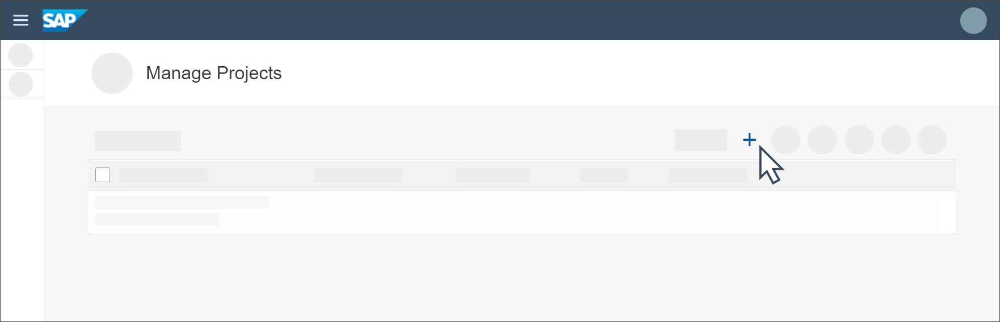

# Create a Project to Author Rules
<!-- description --> Create a business rules project to determine the equipment for a new employee based on employee details.

## Prerequisites
 - Ensure that you setup the **Workflow Management** service to access the **Manage Rule Projects** application. For more information, see [Set Up Workflow Management in Cloud Cockpit](cp-starter-ibpm-employeeonboarding-1-setup).

## You will learn
  - How to create a project to author rules

## Intro
Business Rules is a capability of SAP Workflow Management service that lets you digitize and automate decision making. You can author and manage your decisions using the **Manage Rule Projects** application of business rules service.

A project is used to configure and manage the entities of business rules. Entities of business rules include data objects, rules, rule sets, and rule services. You can create projects in the **Manage Rule Projects** application, which can be accessed from the **Workflow Management** home screen. For more information, see [Business Rules](https://help.sap.com/viewer/product/BUSINESS_RULES/Cloud/en-US).

### Open Manage Rules Project application

1. Log on to **Workflow Management** home screen, and choose **Manage Rule Projects** application tile.

    

2. In the **Manage Projects** screen, choose +.

    

### Enter details of the project

Since we are building a basic project in this tutorial, enter only the following details of the project:

|  Field     | Value
|  :------------- | :-------------
|  Name           | **`DetermineEquipment01`**
|  Label           | **`DetermineEquipment01`**
|  Description    | **`Business rules to determine equipment for the new hire.`**
|  System            | **`Cloud Runtime`**
|  Expression Language    | **`2.0`**

The other fields can be left as it is.

> We have used expression language 2.0 for this tutorial. For more information on expression languages in business rules, see [Expression Language 2.0](https://help.sap.com/viewer/0e4dd38c4e204f47b1ffd09e5684537b/Cloud/en-US/b10229a87b1644bd82baa8cd2c6e6991.html) and [Expression Language 1.0](https://help.sap.com/viewer/0e4dd38c4e204f47b1ffd09e5684537b/Cloud/en-US/0f73cd85e5f04e0ea77486109ee97964.html).

### Save your project

Choose **Save**.

