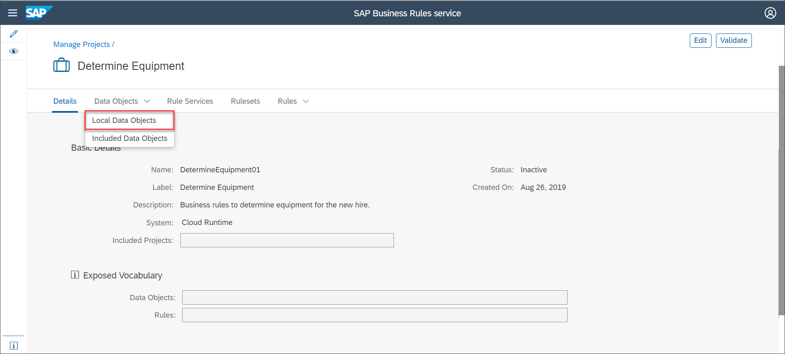
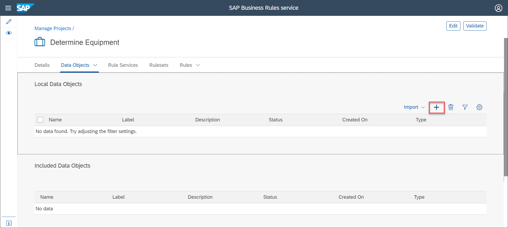
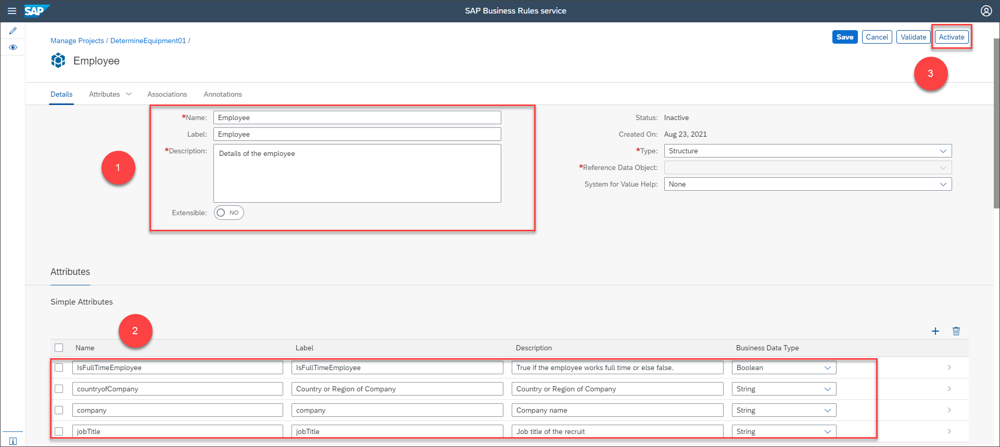
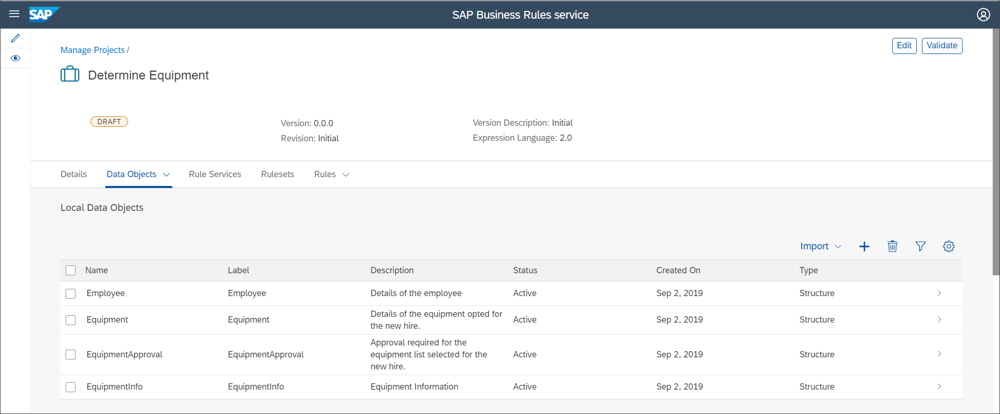
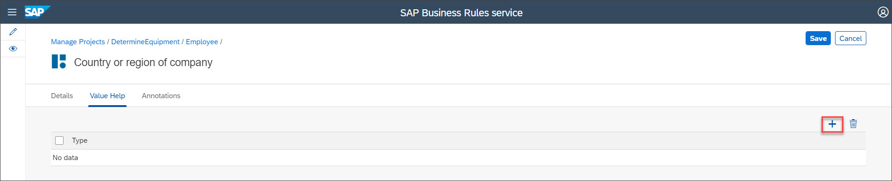
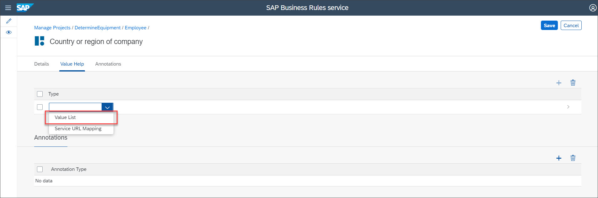
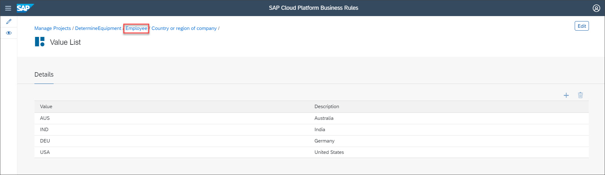
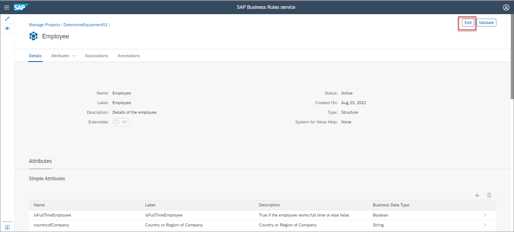
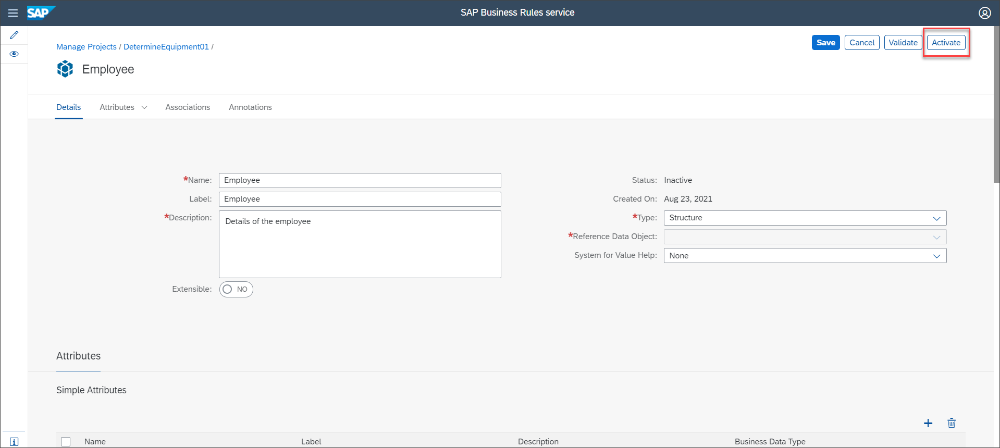

# Create Data Objects and Configure Value Help for a Data Object
<!-- description --> Create data objects that hold employee and equipment details, and create value help for a data object attribute.

## You will learn
  - How to create data objects for a scenario
  - How to configure the value help for a data object

  Data objects are the building blocks of a project. They store the input as well as output data of a rule. Data objects consist of attributes that store the data within a data object.

  In this tutorial, we will create data objects which hold the employee details and the equipment details. We will also model value help for a data object attribute to choose the values while modeling rules.

---

### Create data objects

1. Choose **`Data Objects`** > **`Local Data Objects`**.

    

2. In the **`Local Data Objects`** section, choose +.

    

3. In the **`New Data Object`** screen, provide the following details for the output data object as shown:

    |  Name    | Label | Description | Type
    |  :------------- | :------------- | :------------- | :-------------
    | **`EquipmentInfo`** | **`EquipmentInfo`** | **`Equipment Information`** | **`Structure`**

    > You can leave the other fields as it is.

    

4. Under **`Attributes`** tab, choose + in the **`Simple Attributes`** table to create a new attribute for the data object **`EquipmentInfo`**.

    

5. Enter the following details in the new row:

    |  Name    | Label    | Description | Business Data Type
    |  :------------- | :-------------|  :------------- | :-------------
    |  **`ProductDesc`**       | **`Product Description`**   |  **`Product description`**| **`String`**

    

6. Similarly, create five new attributes with the following values:

    |  Name    | Label    | Description | Business Data Type
    |  :------------- | :-------------|  :------------- | :-------------     
    |  **`Price`**           | **`Price`**  | **`Price of the equipment`**            | **`Number`**
    |  **`EquipmentType`**   | **`Equipment Type`** |  **`Type of equipment`**          | **`String`**
    |  **`ProductID`**            | **`Product ID`** |  **`Product ID`**  | **`String`**
    |  **`Currency`**            | **`Currency`** |  **`Currency`**                     | **`String`**

    Then, choose **`Activate`**.

    

    Activating will also save and validate the data object.

6. Similarly, create and activate **`EquipmentApproval`** data object and its attribute with the following values:

    **Data Object**:

    |  Name    | Label    | Description | Type
    |  :------------- | :-------------|  :------------- | :-------------
    | **`EquipmentApproval`** | **`EquipmentApproval`** | **`Approval required for the equipment list selected for the new hire.`** | **`Structure`**

    **Simple Attributes**:

    |  Name    | Label    | Description | Business Data Type
    |  :------------- | :-------------|  :------------- | :-------------  
    | **`ApprovalNeeded`** | **`ApprovalNeeded`** | **`Is approval needed for the equipment?`** | **`Boolean`**

    Then, choose **Activate**.

    

7. Similarly, create and activate **Equipment** data object and its attribute with the following values:

    **Data Object**:

    |  Name    | Label    | Description | Type
    |  :------------- | :-------------|  :------------- | :-------------
    | **`Equipment`** | **`Equipment`** | **`Details of the equipment opted for the new hire.`** | **`Structure`**

    **Simple Attributes**:

    |  Name    | Label    | Description | Business Data Type
    |  :------------- | :-------------|  :------------- | :-------------
    | **`TotalAmount`** | **`TotalAmount`** | **`Total amount of all the selected equipment`** | **`Number`**

    Then, choose **Activate**.

    

8. Similarly, create and activate **Employee** data object and its attributes with the following values:

    **Data Object**:

    |  Name    | Label    | Description | Type
    |  :------------- | :-------------|  :------------- | :-------------
    | **`Employee`** | **`Employee`** | **`Details of the employee`** | **`Structure`**

    **Simple Attributes**:

    **`IsFullTimeEmployee`**:

    |  Name    | Label    | Description | Business Data Type
    |  :------------- | :-------------|  :------------- | :-------------
    | **`IsFullTimeEmployee`** | **`IsFullTimeEmployee`** | **`True if the employee works full time or else false.`** | **`Boolean`**

    **`countryofCompany`**:

    |  Name    | Label    | Description | Business Data Type
    |  :------------- | :-------------|  :------------- | :-------------
    | **`countryofCompany`** | **`Country or Region of Company`** | **`Country or Region of company`** | **`String`**

    **`company`**:

    |  Name    | Label    | Description | Business Data Type
    |  :------------- | :-------------|  :------------- | :-------------
    | **`company`** | **`company`** | **`Company name`** | **`String`**

    **`jobTitle`**:

    |  Name    | Label    | Description | Business Data Type
    |  :------------- | :-------------|  :------------- | :-------------
    | **`jobTitle`** | **`jobTitle`** | **`Job title of the recruit`** | **`String`**

     Then, choose **Activate**.

     

9. Navigate to the **Local Data Objects** tab to view the list of data objects.

    

### Configure value help for an attribute of Employee data object

1. Choose **Employee** data object.

    

2. Choose **Edit** and then choose **`countryofCompany`** attribute.

    

3. Choose **Value Help** tab and then choose **Edit**.

    

4. Choose +.

    

5. Choose **Value List** from the dropdown list.

    

    Select the newly created **Value List**.

    

6. In the **Details** section, choose + to add a Value-Description pair and then provide the following values:

    |  Value     | Description
    |  :------------- | :-------------
    |   **`USA`**         | **`United States`**
    |  **`DEU`**           | **`Germany`**
    |  **`IND`**   | **`India`**
    |  **`AUS`** | **`Australia`**

    Then, choose **Save**.

    

7. As you edited the data object to configure value help, the status will change to **Inactive**. To activate the data object, choose **Employee** in the breadcrumb navigation.

    

8. Choose **Edit**.

    

    Then, choose **Activate**.

    

9. Choose **DetermineEquipment01** in the breadcrumb navigation to navigate to the **Data Objects** tab.

    

