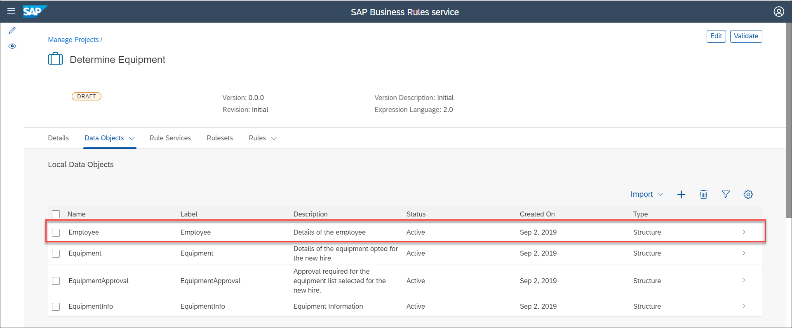
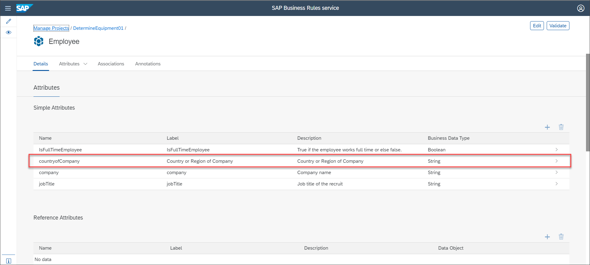
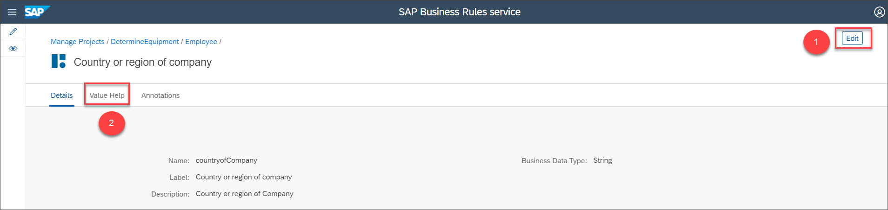
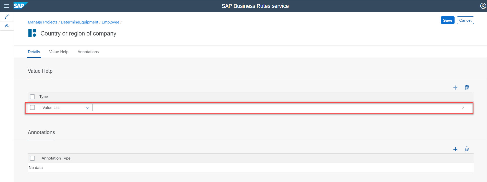
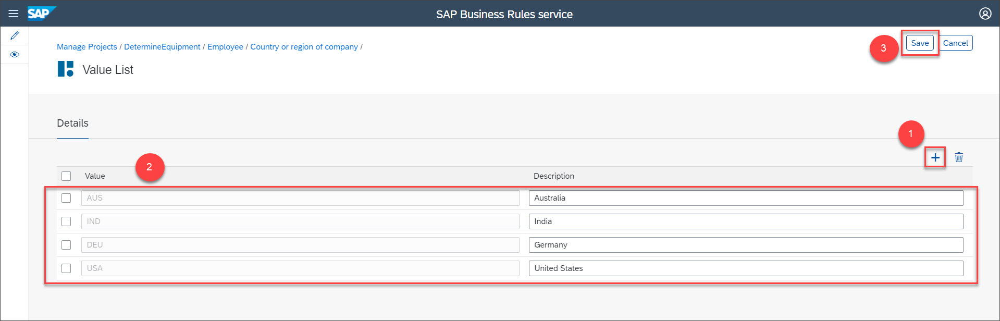

## Details
### You will learn
  - How to create data objects for a scenario
  - How to configure the value help for a data object

Data objects are the building blocks of a project. It can hold the input as well as output information of a business rule.

In this tutorial, we will create data objects which hold the employee details and the details of the equipment assigned to the employee.

---

[ACCORDION-BEGIN [Step 1: ](Create data objects)]

1. Choose **`Data Objects`** > **`Local Data Objects`**.

    

2. In the **`Local Data Objects`** section, choose +.

    

3. In the **`New Data Object`** screen, provide the following details for the output data object as shown:

    |  Field Name     | Value
    |  :------------- | :-------------
    |  Name           | **`EquipmentInfo`**
    |  Label           | **`EquipmentInfo`**
    |  Description    | **`Equipment Information`**
    |  Type            | **`Structure`**

    

4. Choose **`Attributes`** tab, then choose + to create a new attribute for the data object **`EquipmentInfo`**.

    

5. Similarly, create five new attributes with the following values:

    |  Name    | Label    | Description | Business Data Type
    |  :------------- | :-------------|  :------------- | :-------------
    |  **`ProducDesc`**       | **`Product Desc`**   |  **`Description of the product`**| **`String`**      
    |  **`Price`**           | **`Equipment Price`**  | **`Price`**                     | **`Number`**
    |  **`EquipmentType`**   | **`Equipment Type`** |  **`Type of equipment`**          | **`String`**
    |  **`ProductID`**            | **`Product ID`** |  **`Unique ID of the product`**  | **`String`**
    |  **`Currency`**            | **`Currency`** |  **`Currency`**                     | **`String`**

    Then, choose **`Activate`**.

    

    Activating will save, validate and activate the data object.

6. Similarly, create and activate **`EquipmentApproval`** data object and its attribute with the following values:

    **Data Object**:

    |  Field Name     | Value
    |  :------------- | :-------------
    |  Name           | **`EquipmentApproval`**
    |  Label           | **`EquipmentApproval`**
    |  Description    | **`Approval required for the equipment list selected for the new hire.`**

    **Attribute**:

    |  Field Name     | Value
    |  :------------- | :-------------
    |  Name           | **`ApprovalNeeded`**
    |  Label           | **`ApprovalNeeded`**
    |  Description    | **`Is approval needed for the equipment`**
    |  Business Data Type | **`String`**

    Then, choose **Activate**.

    

7. Similarly, create and activate **Equipment** data object and its attribute with the following values:

    **Data Object**:

    |  Field Name     | Value
    |  :------------- | :-------------
    |  Name           | **`Equipment`**
    |  Label           | **`Equipment`**
    |  Description    | **`Details of the equipment opted for the new hire.`**

    **Attributes**:

    |  Field Name     | Value
    |  :------------- | :-------------
    |  Name           | **`TotalAmount`**
    |  Label           | **`TotalAmount`**
    |  Description    | **`Total amount of all the selected equipment`**
    |  Business Data Type | **`Number`**

    Then, choose **Activate**.

    

8. Similarly, create and activate **Employee** data object and its attributes with the following values:

    **Data Object**:

    |  Field Name     | Value
    |  :------------- | :-------------
    |  Name           | **`Employee`**
    |  Label           | **`Employee`**
    |  Description    | **`Details of the employee`**

    **Attributes**:

    **`IsFullTimeEmployee`**:

    |  Field Name     | Value
    |  :------------- | :-------------
    |  Name           | **`IsFullTimeEmployee`**
    |  Label           | **`IsFullTimeEmployee`**
    |  Description    | **`True if the employee works full time or else false.`**
    |  Business Data Type | **`Boolean`**

    **`countryofCompany`**:

    |  Field Name     | Value
    |  :------------- | :-------------
    |  Name           | **`countryofCompany`**
    |  Label           | **`Country or Region of Company`**
    |  Description    | **`Country or Region of company`**
    |  Business Data Type | **`String`**

    **`company`**:

    |  Field Name     | Value
    |  :------------- | :-------------
    |  Name           | **`company`**
    |  Label           | **`company`**
    |  Description    | **`Company name`**
    |  Business Data Type | **`String`**

    **`jobTitle`**:

    |  Field Name     | Value
    |  :------------- | :-------------
    |  Name           | **`jobTitle`**
    |  Label           | **`jobTitle`**
    |  Description    | **`Job title of the recruit`**
    |  Business Data Type | **`String`**

     Then, choose **Activate**.

     

9. Navigate to the **Local Data Objects** tab to view the list of data objects.

[DONE]
[ACCORDION-END]

[ACCORDION-BEGIN [Step 2: ](Configure value help for Employee data object)]

1. Choose **Employee** data object.

    

2. Choose **Edit** and then choose **`countryofCompany`** attribute.

    

3. Choose **Value Help** tab and then choose **Edit**.

    

4. Choose +.

    

5. Choose **Value List** from the dropdown list.

    

    Select the newly created **Value List**.

    

6. In the **Details** section, choose + to add a Value-Description pair and then provide the following values:

    |  Value     | Description
    |  :------------- | :-------------
    |   **`USA`**         | **`United States`**
    |  **`DEU`**           | **`Germany`**
    |  **`IND`**   | **`India`**
    |  **`AUS`** | **`Australia`**

    Then, choose **Save**.

    

7. Choose **Employee** in the breadcrumb navigation.

    

8. Choose **Edit**.

    

    Then, choose **Activate**.

    

[VALIDATE_1]

[ACCORDION-END]
