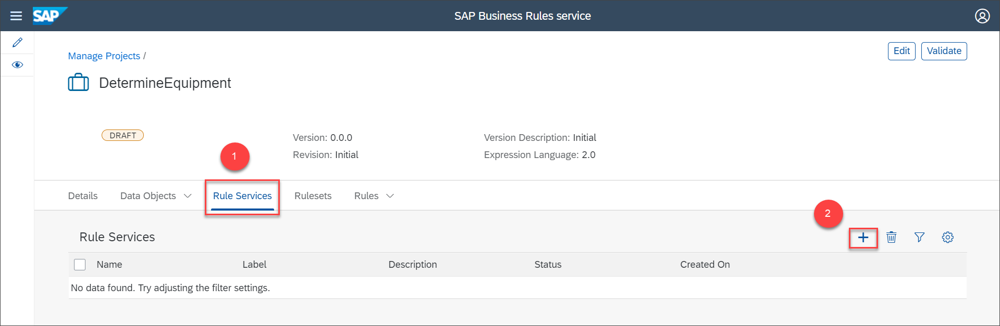
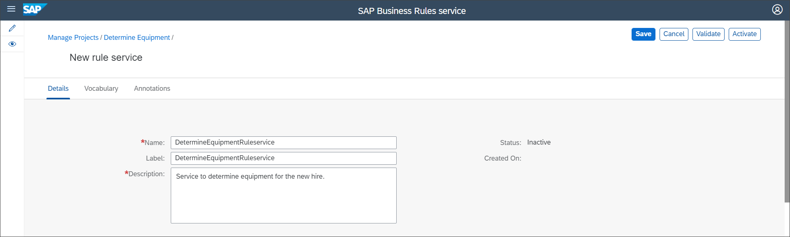
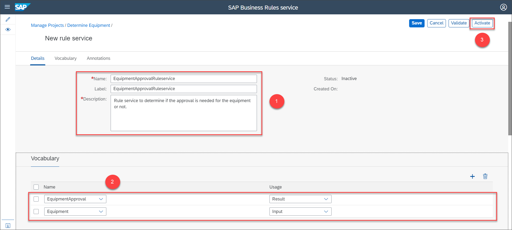
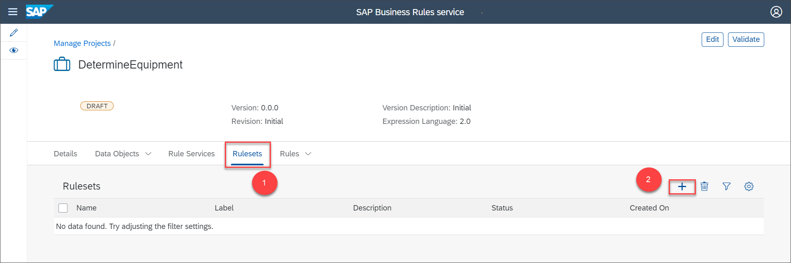
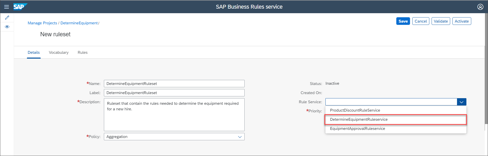
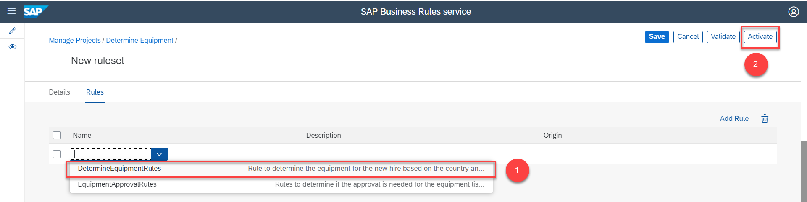
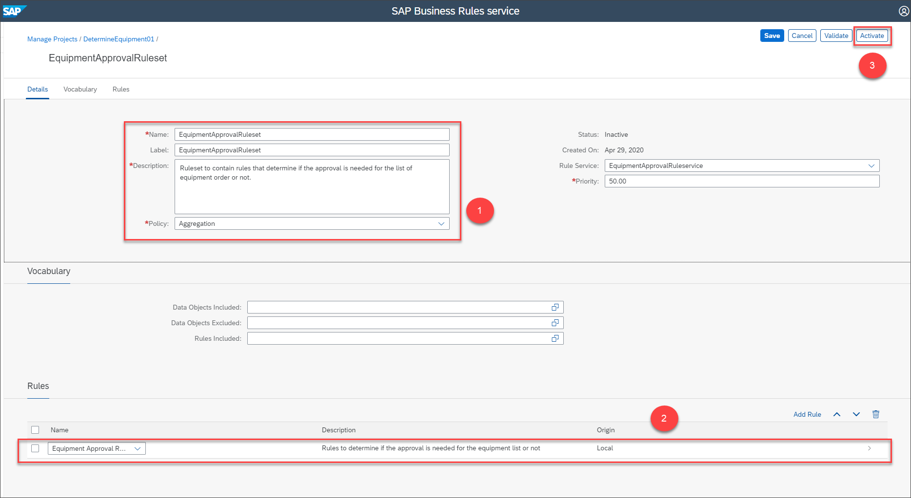
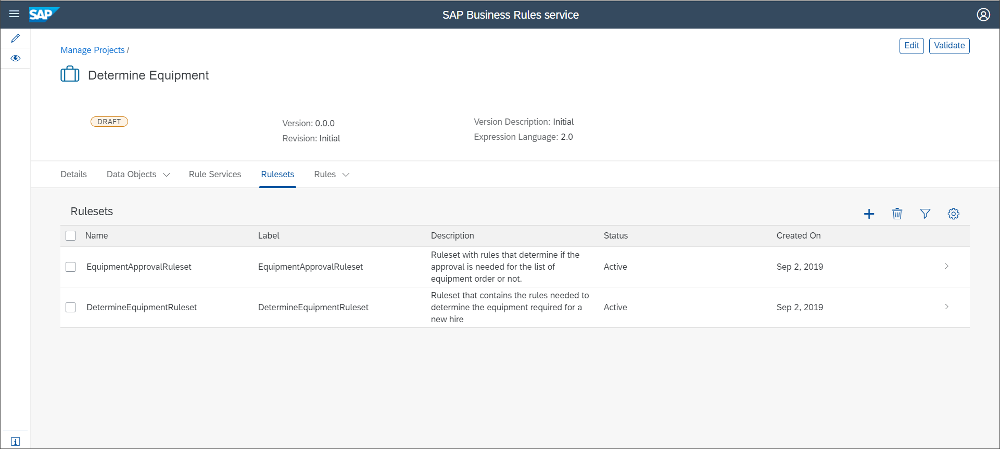

## Details
### You will learn
  - How to create a rule service as an interface
  - How to create a rule set and associate rules to a rule service

A rule service is an interface or an end point that enables an application to invoke a decision logic. A rule set is a collection of rules related to a particular scenario. A rule set can be linked to a rule service so that the set of rules in the rule set gets executed when the rule service is deployed.

In this tutorial, we will create the rule services and rule sets required to deploy the decision logic.

---

[ACCORDION-BEGIN [Step 1: ](Create rule services)]

1. Navigate to the **Rule Service** tab, then choose + to create a new rule service.

    

2. In the **New Rule Service** page, enter the following details:

    |  Field Name     | Value
    |  :------------- | :-------------
    |  Name           | **`DetermineEquipmentRuleservice`**
    |  Label         | **`DetermineEquipmentRuleservice`**
    |  Description    | **`Service to determine equipment for the new hire.`**

    

3. In the **Vocabulary** tab, choose + and select the following options:

    |  Field Name     | Value
    |  :------------- | :-------------
    |  Name           | **`Employee`**
    |  Usage         | **`Input`**

    Similarly, choose + to add a new row and select the following options:

    |  Field Name     | Value
    |  :------------- | :-------------
    |  Name           | **`EquipmentInfo`**
    |  Usage         | **`Result`**

    Then, choose **Activate**.

    

4. Navigate to the **Rule Service** tab and create and activate another rule service with the following details:

    |  Field Name     | Value
    |  :------------- | :-------------
    |  Name           | **`EquipmentApprovalRuleservice`**
    |  Label         | **`EquipmentApprovalRuleservice`**
    |  Description    | **`Rule service to determine if the approval is needed for the equipment or not.`**

    Vocabulary:

    |  Name     | Usage
    |  :------------- | :-------------
    |  **`Equipment`**           | **`Input`**
    |  **`EquipmentApproval`**    | **`Result`**

    Then, choose **Activate**.

    

    Navigate to the **Rule Service** tab to view the list of rule services.

    

[DONE]
[ACCORDION-END]

[ACCORDION-BEGIN [Step 2: ](Create rulesets)]

1. Navigate to the **`Ruleset`** tab, then choose +.

    

2. In the **`New Ruleset`** page, enter the following details:

    |  Field Name     | Value
    |  :------------- | :-------------
    |  Name           | **`DetermineRuleEquipmentRuleset`**
    |  Label         | **`DetermineRuleEquipmentRuleset`**
    |  Description    | **`Ruleset that contain the rules needed to determine the equipment required for a new hire.`**
    |  Rule Service   |  **`DetermineEquipmentRuleservice`**

    >You can leave the **Priority** and **Policy** fields and **Vocabulary** section as it is.

    

3. Choose the **Rules** tab, choose **Add Rule** > **Insert First**.

    

4. Select **`DetermineEquipmentRules`** from the dropdown list. Then, choose **Activate** to activate the rule set.

    

5. Similarly, create and activate a rule set with the following details:

    |  Field Name     | Value
    |  :------------- | :-------------
    |  Name           | **`EquipmentApprovalRuleset`**
    |  Label         | **`EquipmentApprovalRuleset`**
    |  Description    | **`Ruleset to contain rules that determine if the approval is needed for the list of equipment order or not.`**
    |  Rule Service   |  **`EquipmentApprovalRuleservice`**

    >You can leave the **Priority** and **Policy** fields and **Vocabulary** section as it is.

    In the **Rules** tab, choose **`EquipmentApprovalRules`** from the dropdown list and then choose **Activate**.

    

    Navigate to the **`Ruleset`** tab to view the list of rule sets as shown:

    

[VALIDATE_1]

[ACCORDION-END]
