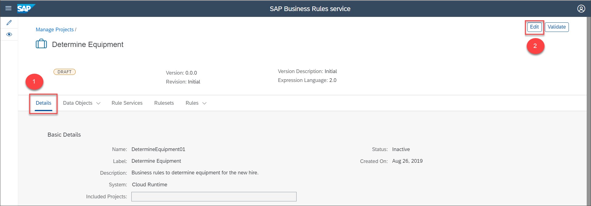
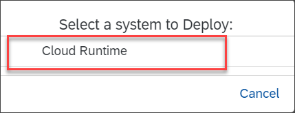

## Details
### You will learn
  - How to deploy a rule service to the consumer application to implement the decision logic

Once you have modelled the rule services, you can deploy them to execute the rule set associated to them. In this tutorial, we will deploy the rule services we have created. Using the next tutorial, you can test the decision logic using the Business Rules APIs in SAP API Business Hub.

---

[ACCORDION-BEGIN [Step 1: ](Activate project)]

1. Navigate to the **Details** tab of the project, then choose **Edit**.

    

2. Choose **Activate**.

    

    Ensure that each entity of the project is active.

[DONE]
[ACCORDION-END]

[ACCORDION-BEGIN [Step 2: ](Deploy rule service to SAP Cloud Platform)]

1. Navigate to the **Rule Service** tab and then choose **Deploy** button of **`EquipmentApprovalRuleservice`** to deploy the rule service.

    

2. Choose **SAP Cloud Platform** for deploying the rule service.

    

3. Similarly, choose **Deploy** button of **`DetermineEquipmentRuleservice`** and choose the system as **SAP Cloud Platform**.

    

    You will see the following message on successful activation of the rule service:

    

[VALIDATE_1]

[ACCORDION-END]
