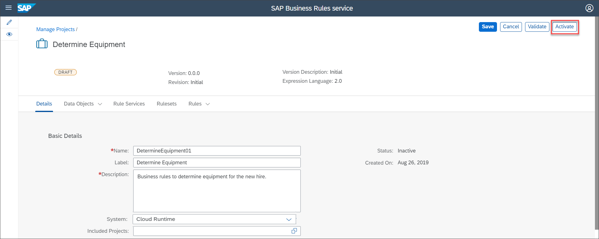
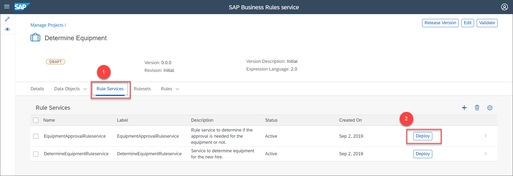
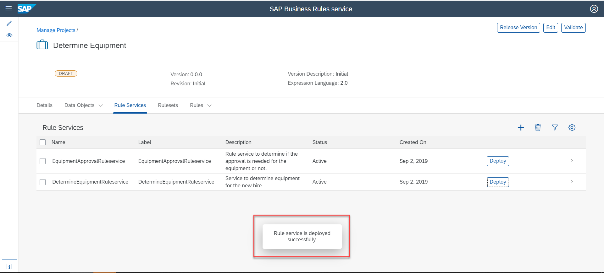

# Deploy a Rule Service
<!-- description --> Deploy a rule service so that other applications can consume the decision logic.

## You will learn
  - How to deploy a rule service to the consumer application to implement the decision logic

## Intro
Once you have modelled the rule services, you can deploy them to execute the rule set associated to them. In this tutorial, we will deploy the rule services we have created. In the next tutorial, you can test the decision logic using the Business Rules APIs in SAP API Business Hub.

---

### Activate the project

1. Navigate to the **Details** tab of the project, then choose **Edit**.

    

2. Choose **Activate**.

    

    Ensure that each entity of the project is active.

### Deploy rule service to cloud runtime

1. Navigate to the **Rule Service** tab and then choose **Deploy** button of **`EquipmentApprovalRuleservice`** to deploy the rule service.

    

2. Choose **Cloud Runtime** for deploying the rule service.

    

3. Similarly, choose the **Deploy** button of **`DetermineEquipmentRuleservice`** and then choose the system as **Cloud Runtime**.

      You will see the following message on successful activation of the rule service:

    

