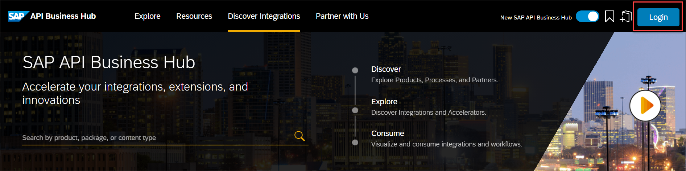
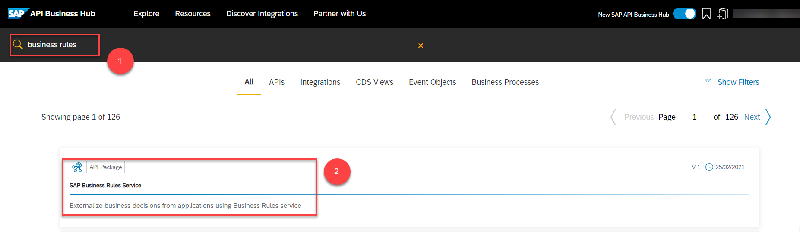
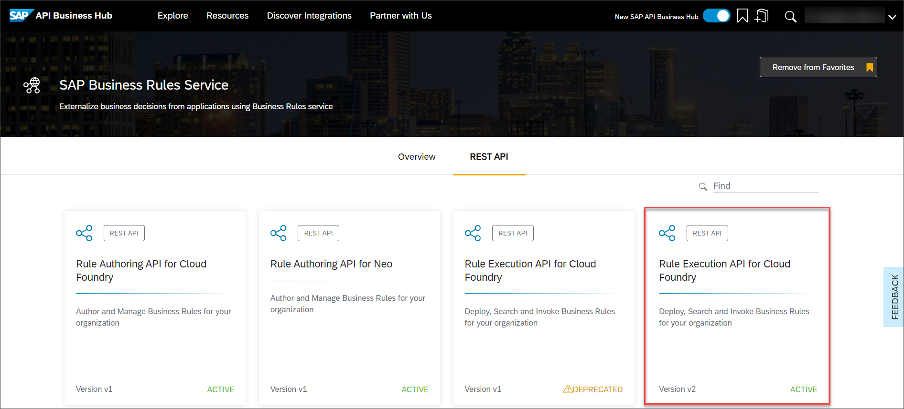
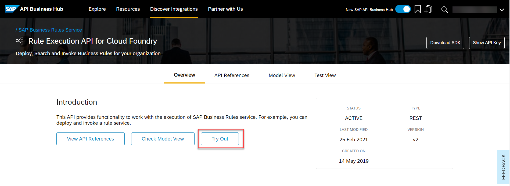

## Prerequisites
 - You have assigned the roles **`RuleRuntimeSuperUser`** and **`RuleRepositorySuperUser`** to you in SAP Cloud Platform Cockpit. For more information, see [Assign Roles to Users for Managing Business Rules](cp-cf-businessrules02-assign-roles).

## Details
### You will learn
  - How to use Business Rules APIs
  - How to test Business Rules project

SAP Cloud Platform Business Rules REST APIs are available on SAP API Business Hub which lets you execute rules from custom applications and external REST Clients. Since these APIs are based on OAuth 2.0, you need the service key parameters to use the APIs.

Note the following parameters from the service keys of your business rules instance:

- `clientid`
- `clientsecret`
- `url`


[ACCORDION-BEGIN [Step 1: ](Log onto SAP API Business Hub)]

1. Log on to [SAP API Business Hub](https://api.sap.com/)

    

2. In the search bar, search for **Business rule**. From the search results, select the API package for SAP Cloud Platform Business Rules.

    

3. Choose the **Rule Execution API for Cloud Foundry** tile of **Version v2**.

    

[DONE]
[ACCORDION-END]

[ACCORDION-BEGIN [Step 2: ](Configure the environment)]

Here, you need to configure the environment to link it to the business rules project which you have created in Manage Rules Project application. Since Business Rules APIs are based on OAuth 2.0 authentication, you need to provide the authentication details too.

1. Choose **Configure Environments**.

    

2. In the **Configure Environments** window, provide the following details:

    |  Field Name     | Value
    |  :------------- | :-------------
    |  `Display Name for Environments`          | **`EU10`**
    |  `runtimeurl`        | **`bpmruleruntime.cfapps.eu10.hana.ondemand.com`**
    |  `Client Id`    | **`<clientid from service key>`**
    |  `Secret`      | **`<clientsecret from service key>`**
    |  `tokenurl`     | **`<url from service key>`**


    

    Then, choose **Save**.

    


[DONE]
[ACCORDION-END]


[ACCORDION-BEGIN [Step 3: ](Invoke a rule service)]

1. Select **Invoke a Rule Service** API and then choose **`/v2/workingset-rule-services`**. Then choose **Try out** to execute the API.

    

2. Fetch the rule service ID from Manage Rules Project application. This is required for the API JSON payload.

    In the **Rule services** tab, choose **Settings** icon.

    

    Select **ID** and choose **OK**.

    

    Copy the ID from the rule service.

    

3. Paste the rule service ID in place of **`<rule-service-ID>`** in the following JSON payload and copy it to the body of the API:

    ```JSON
        {
      "RuleServiceId": "<rule-service-ID>",
      "Vocabulary": [
        {
          "Employee": {
            "isFullTimeEmployee": true,
            "countryofCompany": "USA",
            "jobTitle": "Engineer II",
             "company": "2000"
           }
        }
      ]
    }
    ```

    Then choose **Execute**.

    


[DONE]
[ACCORDION-END]

[ACCORDION-BEGIN [Step 4: ](Observe the API response)]

You can view the equipment assigned to the employee in the response body of the API.


[VALIDATE_1]

[ACCORDION-END]
