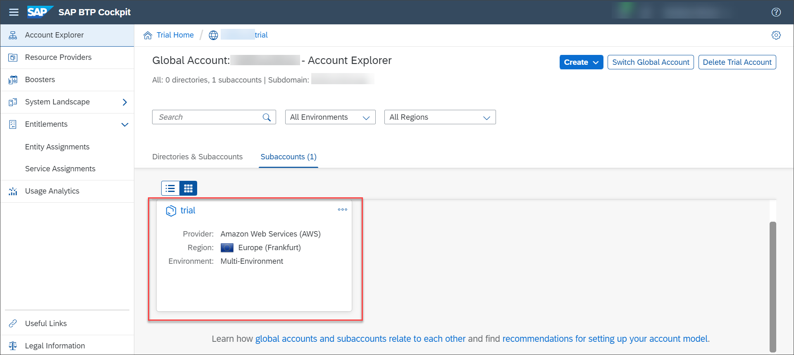
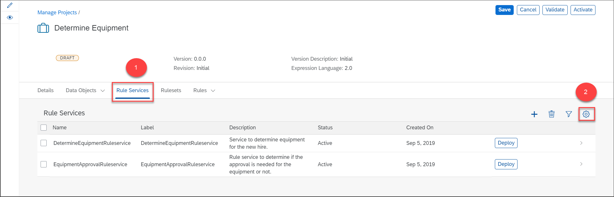
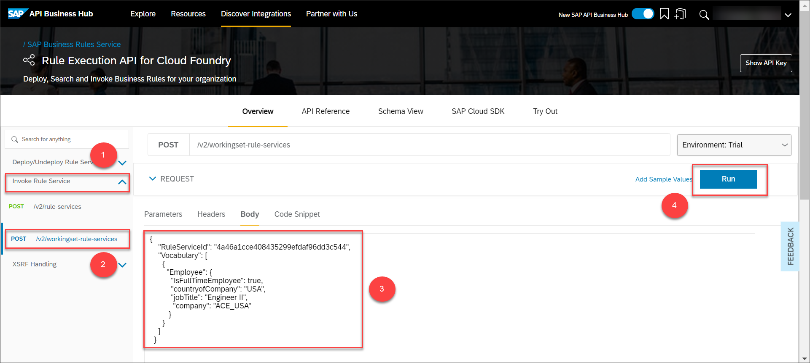

## Prerequisites
 - You have created the business rules project and deployed the rule service. For more information, see [Create Your First Business Rules Project](group.cp-rules-first-project).

## Details
### You will learn
  - How to use Business Rules APIs
  - How to test Business Rules project

Generally, after a rule service is deployed to a custom application, the rule service should be invoked to implement the decision logic. In this tutorial, we will simulate the rule service invocation by invoking the rule service from SAP API Business Hub.

Business Rules REST APIs are available on SAP API Business Hub which lets you execute rules from custom applications and external REST Clients. Since these APIs are based on OAuth 2.0 authorization, you need the client credentials to access them. You get the client credentials from the service key of the business rules service instance.

[ACCORDION-BEGIN [Step 1: ](Log on to SAP API Business Hub)]

1. Log on to [SAP API Business Hub](https://api.sap.com/)

    

2. In the search bar, search for **Business rules**. From the search results, select the API package for SAP Business Rules Service.

    

3. Choose the **Rule Execution API for Cloud Foundry** tile of **Version v2**.

    

[DONE]
[ACCORDION-END]

[ACCORDION-BEGIN [Step 2: ](Determine the service key parameters)]

Service key parameters are required to configure the environment in SAP API Business Hub.

1. Log on to [SAP BTP Cockpit](https://cockpit.hanatrial.ondemand.com/).

2. Choose **Enter your trial account**.

    

3. Choose your trial subaccount.

    

    Choose your space.

    > In the following screenshot, the name of the space is **`dev`**. Space name can also be a custom name that you have provided.

    

4. From the navigation menu, choose **Instances**.

    

5. In the **`wm_business-rules`** service instance, choose the actions button, and then choose **Create Service Key**.

    

6. In the **New Service Key** window,  provide the name of the service key as **business-rules** or any name of your choice, and then choose **Create**.

    

    > Service key of **`wm_business-rules`** service instance will be created.

7. Choose the service key.

    

8. From the service key, note the following parameters required for configuring the environment:

    - `clientid`
    - `clientsecret`
    - `url`

    

[DONE]
[ACCORDION-END]

[ACCORDION-BEGIN [Step 3: ](Configure the environment)]

You need to configure the environment to link it to the business rules project which you have created in **Manage Rule Projects** application. Since Business Rules APIs are based on OAuth 2.0 authentication, you need to provide the client credentials determined in step 2.

1. Choose **Configure Environments**.

    

2. In the **Configure Environments** window, provide the following details:

    |  Field Name     | Value
    |  :------------- | :-------------
    |  `Display Name for Environments`          | **`EU10`**
    |  `runtimeurl`        | **`bpmruleruntime.cfapps.eu10.hana.ondemand.com`**
    |  `Client Id`    | **`clientid`**
    |  `Secret`      | **`clientsecret`**
    |  `tokenurl`     | **`url`**

> Enter the token URL without **`https://`**. For example, if the token URL in the service key is **`https://<trial ID>.authentication.eu10.hana.ondemand.com`**, then enter **`<trial ID>.authentication.eu10.hana.ondemand.com`**.


Then, choose **Save**.


[DONE]
[ACCORDION-END]


[ACCORDION-BEGIN [Step 4: ](Invoke a rule service)]

1. Select **Invoke a Rule Service** API and then choose **`/v2/workingset-rule-services`**. Then choose **Try out** to execute the API.

    

2. Fetch the rule service ID from Manage Rule Projects application. This is required for the API JSON payload.

    In the **Rule services** tab, choose **Settings** icon.

    

    Select **ID** and choose **OK**.

    

    Copy the ID from the rule service.

    

3. Paste the rule service ID in place of **`<rule-service-ID>`** in the following JSON payload and copy it to the body of the API:

    ```JSON
        {
      "RuleServiceId": "<rule-service-ID>",
      "Vocabulary": [
        {
          "Employee": {
            "IsFullTimeEmployee": true,
            "countryofCompany": "USA",
            "jobTitle": "Engineer II",
             "company": "2000"
           }
        }
      ]
    }
    ```

    Then choose **Execute**.

    


[DONE]
[ACCORDION-END]

[ACCORDION-BEGIN [Step 5: ](Observe the API response)]

You can view the equipment assigned to the employee in the response body of the API.


[VALIDATE_1]

[ACCORDION-END]
