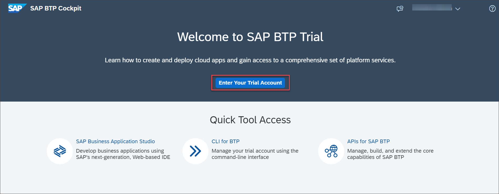
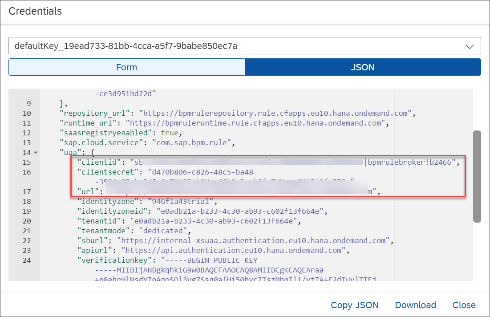
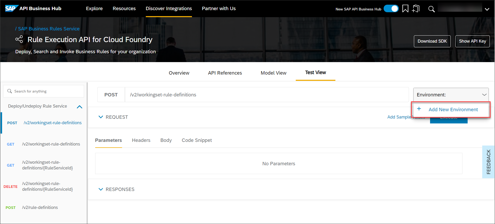
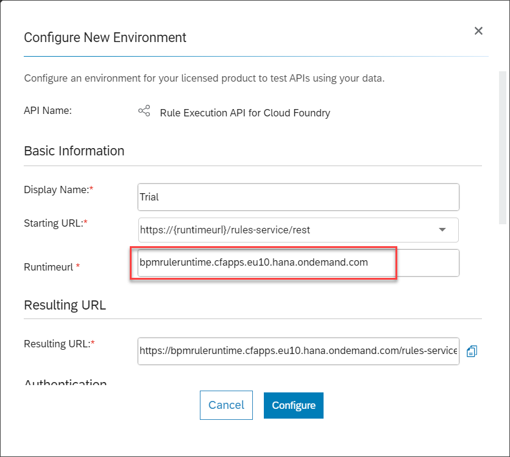
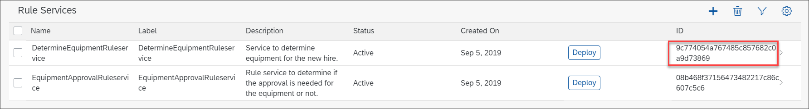
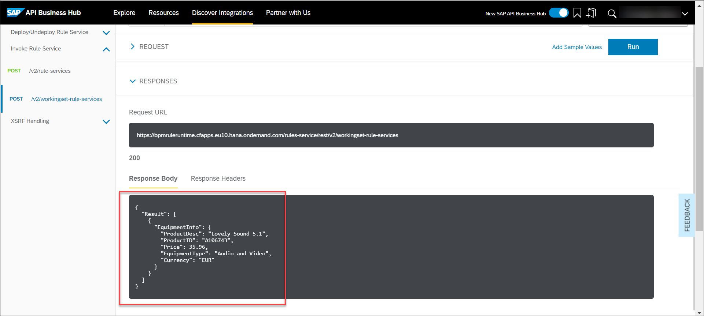
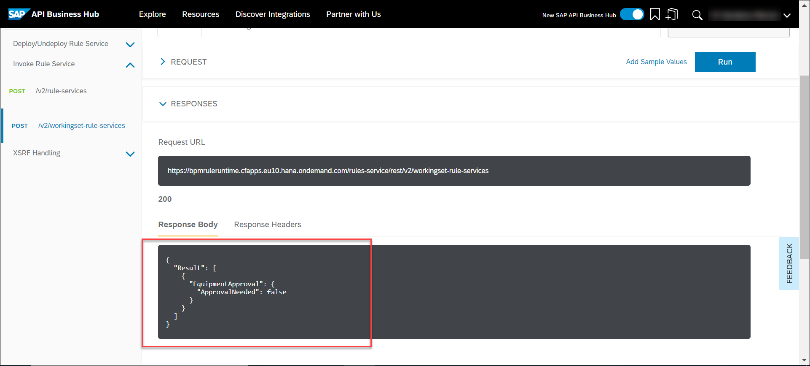

# Test the Business Rules API from SAP API Business Hub
<!-- description --> Use SAP API Business Hub to test and run the business rules API to see how business rules can be consumed from a custom application.

## Prerequisites
 - You have created the business rules project and deployed the rule service. For more information, see [Create Your First Business Rules Project](group.cp-rules-first-project).

## You will learn
  - How to use Business Rules APIs
  - How to test Business Rules project

## Intro
After a rule service is deployed to a custom application, the rule service should be invoked to implement the decision logic. In this tutorial, we will simulate the rule service invocation by invoking the rule service from SAP API Business Hub.

Business Rules REST APIs are available on SAP API Business Hub which lets you execute rules from custom applications and external REST clients. Since these APIs are based on OAuth 2.0 authorization, you need the client credentials to access them. You get the client credentials from the service key of the business rules service instance.

### Log on to SAP API Business Hub


1. Log on to [SAP API Business Hub](https://api.sap.com/)

    

2. In the search bar, search for **Business rules**. From the search results, select the API package for SAP Business Rules Service.

    

3. Choose the **Rule Execution API for Cloud Foundry** tile of **Version v2**.

    

4. Choose **Try out** to execute the APIs.

    


### Determine the service key parameters to configure environment


To try out the APIs, you need to configure your trial environment on SAP API Business Hub. The communication between a REST client (SAP API Business Hub in this case) and the service is achieved via a service instance. You can use the service keys to generate credentials to communicate with a service instance. Since Business Rules APIs are based on OAuth 2.0 authentication, you need to configure the environment using the service key parameters or the client credentials.

1. Log on to [SAP BTP Cockpit](https://cockpit.hanatrial.ondemand.com/).

2. Choose **Enter your trial account**.

    

3. Choose the trial subaccount where you have the Workflow Management service subscription.

    


4. From the navigation menu, choose **Instances and Subscriptions**. Under **Instances**, choose the **Credentials** to open the service key of the **`wm_business-rules`** service instance.

    

5. From the service key, note the following parameters required for configuring the environment:

    - `clientid`
    - `clientsecret`
    - `url`

    


### Configure the environment


 Configure the environment using the service key parameters or the client credentials determined in step 2.

1. Go to **SAP API Business Hub** and then choose **Add New Environment**.

    

2. In the **Configure New Environment** window, provide the following details:

    Under **Basic Information** section:

    |  Field Name     | Value
    |  :------------- | :-------------
    |  `Display Name`          | **`Trial`**
    |  `Runtimeurl`        | **`bpmruleruntime.cfapps.eu10.hana.ondemand.com`**

      

    Under **Authentication** section:

    |  Field Name     | Value
    |  :------------- | :-------------
    |  `Client ID`    | **`clientid`**
    |  `Client Secret`      | **`clientsecret`**
    |  `Token URL`     | **`url`**

    >Enter the token URL without **`https://`**. For example, if the token URL in the service key is **`https://<trial ID>.authentication.eu10.hana.ondemand.com`**, then enter **`<trial ID>.authentication.eu10.hana.ondemand.com`**.

    Then, choose **Configure**.

    


### Invoke the rule services and observe the results in the API response


1. Fetch the ID of the **`DetermineEquipmentRuleservice`** rule service from Manage Rule Projects application. This is a required parameter in the body JSON payload of the API.

    In the **Rule services** tab, choose **Settings** icon.

    

    Select **ID** and choose **OK**.

    

    Copy the ID of the **`DetermineEquipmentRuleservice`** rule service.

    

2. In SAP API Business Hub, select **Invoke a Rule Service** API and then choose **`/v2/workingset-rule-services`**. Paste the rule service ID in place of **`<rule-service-ID>`** in the following JSON payload and copy it to the **Body** of the API:

    ```JSON
        {
      "RuleServiceId": "<rule-service-ID>",
      "Vocabulary": [
        {
          "Employee": {
            "IsFullTimeEmployee": true,
            "countryofCompany": "USA",
            "jobTitle": "Engineer II",
             "company": "ACE_USA"
           }
        }
      ]
    }
    ```

    Then choose **Run**.

    

3. Observe the API response in the response body of the API. You can view the equipment assigned to the employee.

    


4. Similarly, fetch the ID of **`EquipmentApprovalRuleservice`** from Manage Rule Projects application like in Step 3.1.

5. Paste the rule service ID in place of **`<rule-service-ID>`** in the following JSON payload and copy it to the **Body** of the same API:

    ```JSON
        {
      "RuleServiceId": "<rule-service-ID>",
      "Vocabulary": [
        {
          "Equipment": {
            "TotalAmount": 780
           }
        }
      ]
    }
    ```
 6. Observe the API response in the response body of the API.

    

    You also try changing the rule logic or the JSON payload values to see different results.


