## Prerequisites
  - The project used in this tutorial is the **Determine Equipment** project. You can also use your own project to perform the tasks in this tutorial. To create the same project, use the group: [Create Your First Business Rules Project](https://developers.sap.com/group.cp-rules-first-project.html)

## Details
### You will learn
  - The difference between a version and a revision
  - How to create different versions and revisions of your business rules project

**Versions** are useful when you want to periodically release different versions of your project to the customer or add patch changes to the project. A revision is a group of versions. You can create up to ten different versions of your project under one or more revisions.

Each version of your project can have minor changes in technical or business logic. The project and its entities should be active for creating a version. When your project has a considerable number of changes when compared to the previous versions, you can create a new **revision** of your project.

The project that you are working on will always be in **Draft** state while the versioned projects will be in **Revised Content** state.

---

[ACCORDION-BEGIN [Step 1: ](Create a version of your project)]

Before you start making changes to the project, release the existing project as the first version of your project. This is to keep the base project content intact.

1. In the **Manage Rules Project** application, select the  **`DetermineEquipment01`** project which you created using the previous tutorials.

    

2. In the **Details** tab, choose **Release Version**.

    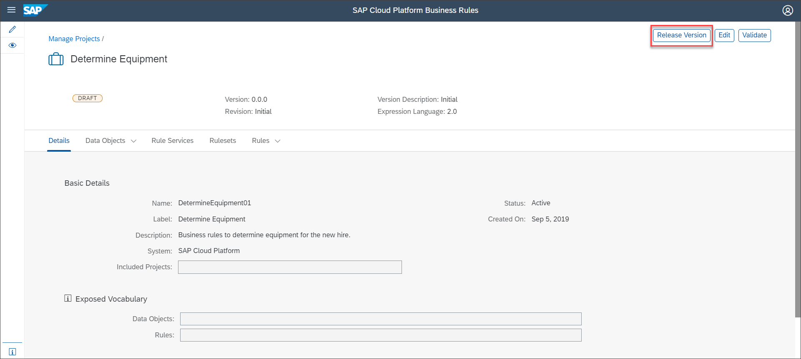

3. Provide the following project version and revision details, and then choose **Release**.

    |  Field Name     | Value
    |  :------------- | :-------------
    |  Version           | **`1.0.0`**
    |  Revision         | **`Revision2018`**
    |  Description    | **`Rules for determining the equipment for a new hire.`**

    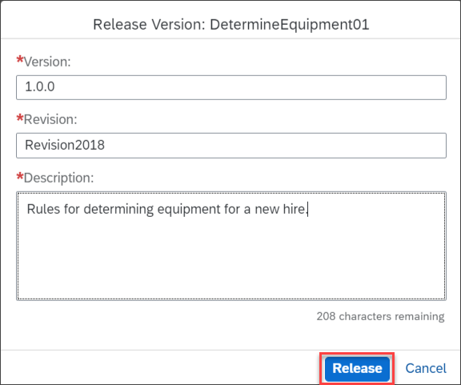

You can view the project version **1.0.0** of revision **`Revision2018`** as soon as you release the version as shown:

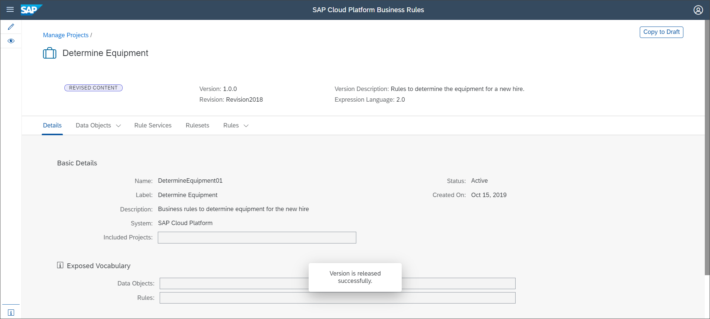

[DONE]
[ACCORDION-END]

[ACCORDION-BEGIN [Step 2: ](Edit and create a new version of your project )]

Edit your project by adding a new condition in the decision table rule. Release this project as version **1.0.1**.

1. Navigate to the **Manage Projects** screen and choose your project.

2. Navigate to the **Rules** tab and then choose the rule **`DetermineEquipmentRules`**.

    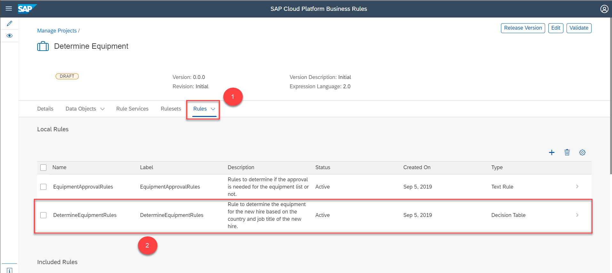

3. Choose **Edit**

    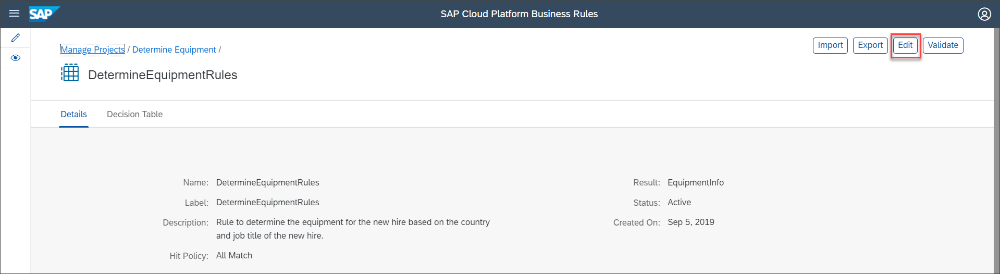

4. Add the following row to the decision table and then choose **Activate**.

    |  Field Name     | Value
    |  :------------- | :-------------
    |  **`Employee.countryofCompany`**   | **`= 'DEU'`**
    |  **`Employee.company`**   | **`= 'SAP_DEU'`**
    |  **`Employee.jobTitle`**   | **`MATCHES '.*'`**
    |  **`Employee.isFullTimeEmployee`**   | **`= true OR Employee.isFullTimeEmployee = false`**
    |  **`Currency`**   | **`DEM`**
    |  **`ProductID`**   | **`203679`**
    |  **`Equipment Type`**   | **`Audio and Video`**
    |  **`Equipment Price`**   | **`40.00`**
    |  **`Product Desc`**   | **`Lovely Sound 7.2`**

    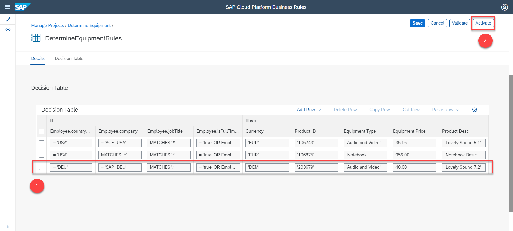

5. Navigate to the **Details** tab of your project and then choose **Release Version**.

    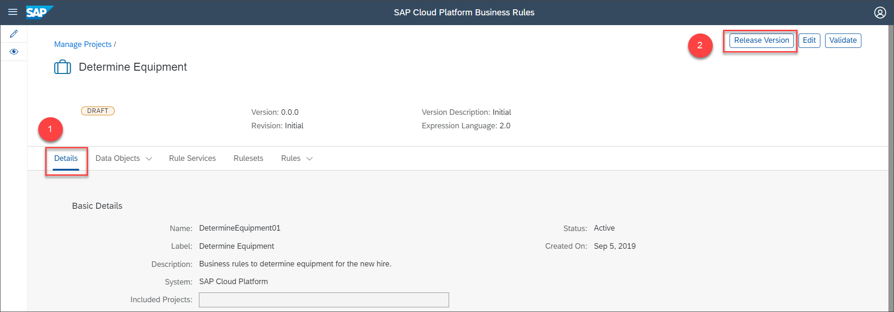

> Ensure that your project and all its entities are active.

6. Provide the following details in the **`Release Version: DetermineEquipment01`** window:

    |  Field Name     | Value
    |  :------------- | :-------------
    |  Version           | **`1.0.1`**
    |  Revision         | **`Revision2018`**
    |  Description    | **`Rules for determining the equipment for a new hire - version 1.`**

    Then, choose **Release**.

    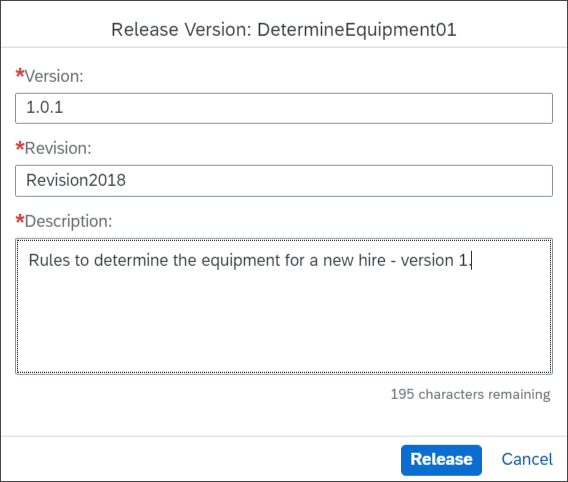

You can view the project version **1.0.1** of revision **`Revision2018`** as soon as you release the version as shown:

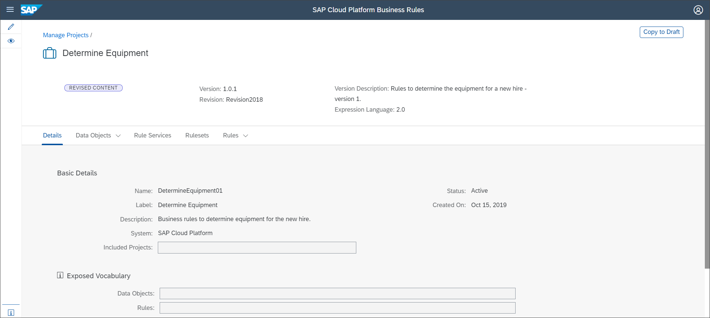

[DONE]
[ACCORDION-END]

[ACCORDION-BEGIN [Step 3: ](View the versions of your project)]

1. Navigate to the **Manage Projects** screen.

2. Select your project and choose **History**.

    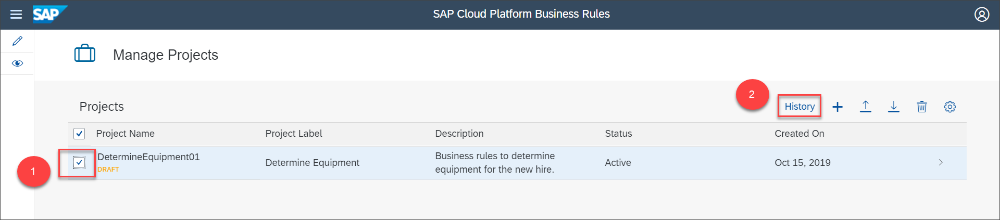

    The list of project versions is displayed as shown:

    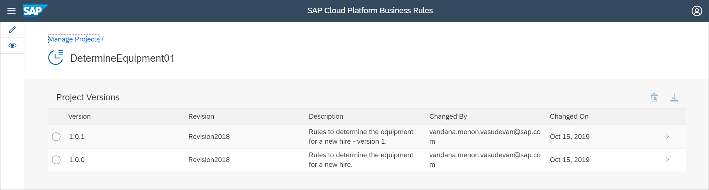

[VALIDATE_1]

[DONE]
[ACCORDION-END]

---
