## Details
### You will learn
  - How to edit a version of your project

You can edit a version of your project by copying the versioned content to the draft project and saving it as a new version. You can only edit a project that is in **Draft** state.

In this tutorial, we will edit an existing version of a project and create a new revision and version of that project.
---

[ACCORDION-BEGIN [Step 1: ](Copy the project version to draft)]

The version content will be copied to the project that you're working on, that is, the base project content will be overwritten. In the previous tutorial, you have saved the base project content as version **1.0.0** for reference.

1. Choose project version **1.0.1**.

    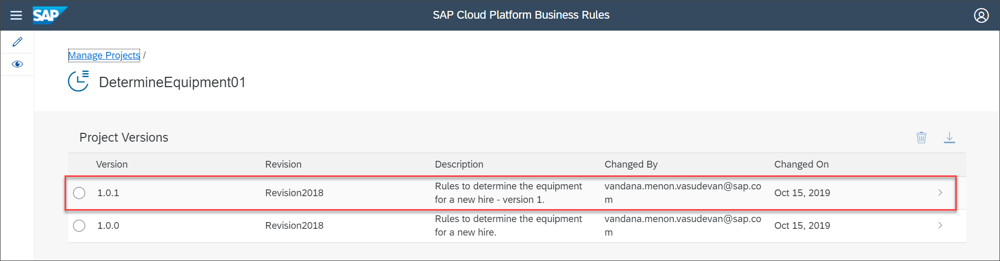

2. Choose **Copy to Draft**.

    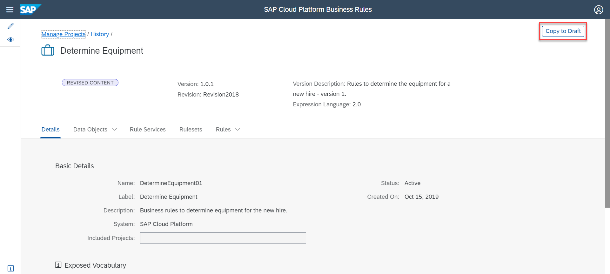

    In the **Warning** message pop-up, choose **Continue** to load the versioned content in **Draft** state.

    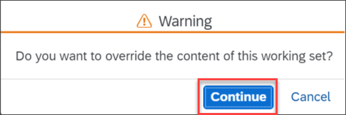

    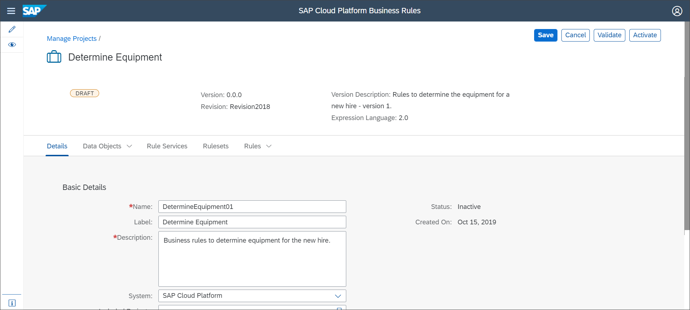

[DONE]
[ACCORDION-END]

[ACCORDION-BEGIN [Step 2: ](Edit a rule of the project version)]

1. Choose **Rules** tab and then choose **`DetermineEquipmentRules`** rule.

    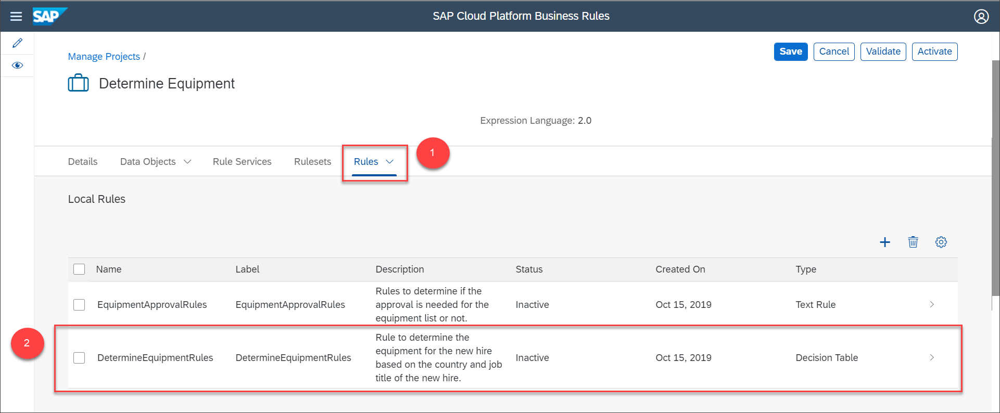

2. Add the following row to the decision table and then choose **Activate**.

    |  Field Name     | Value
    |  :------------- | :-------------
    |  **`Employee.countryofCompany`**   | **`= 'DEU'`**
    |  **`Employee.company`**   | **`MATCHES '.*'`**
    |  **`Employee.jobTitle`**   | **`MATCHES '.*'`**
    |  **`Employee.isFullTimeEmployee`**   | **`= true OR Employee.isFullTimeEmployee = false`**
    |  **`Currency`**   | **`DEM`**
    |  **`ProductID`**   | **`203478`**
    |  **`Equipment Type`**   | **`Notebook`**
    |  **`Equipment Price`**   | **`299.20`**
    |  **`Product Desc`**   | **`Notebook Basic 10`**

    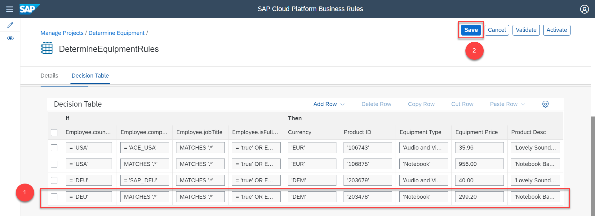

3. Since your project and entities are in **Inactive** state, activate each entity and the project to create a version. To do this, choose **Edit** in each entity view and then choose **Activate**.

For example,

    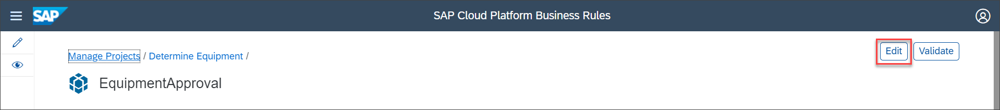
    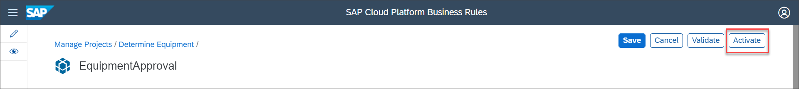

[DONE]
[ACCORDION-END]

[ACCORDION-BEGIN [Step 3: ](Create a new revision and version of your project)]

1. Navigate to the **Details** tab of your project and then choose **Release Version**.

    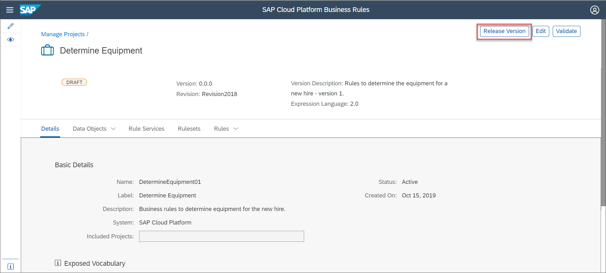

2. Provide the following details in the **`Release Version:DetermineEquipment01`** window:

    |  Field Name     | Value
    |  :------------- | :-------------
    |  Version           | **`2.0.0`**
    |  Revision         | **`Revision2019`**
    |  Description    | **`Business rules for determining the equipment for a new hire.`**

    Then, choose **Release**.

    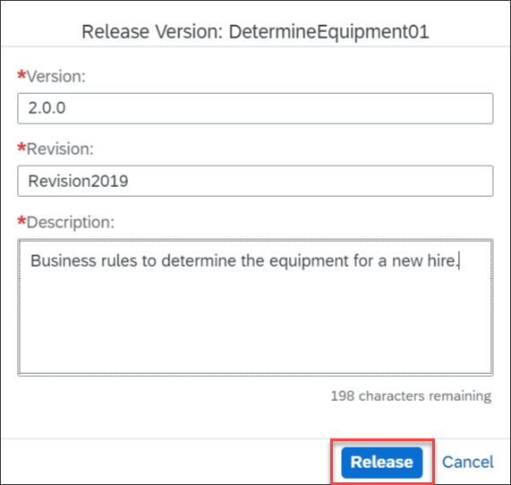

    You can see the new version of your project as soon as your release the version as shown:

    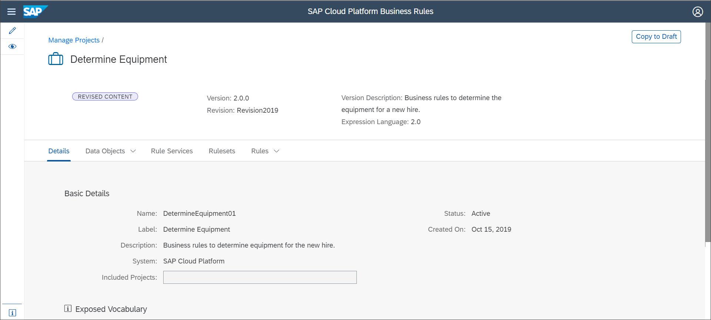

The list of project versions and revisions are as shown:

    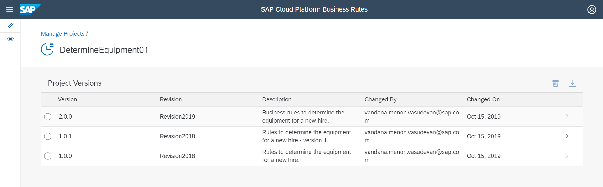

[VALIDATE_1]

[DONE]
[ACCORDION-END]
