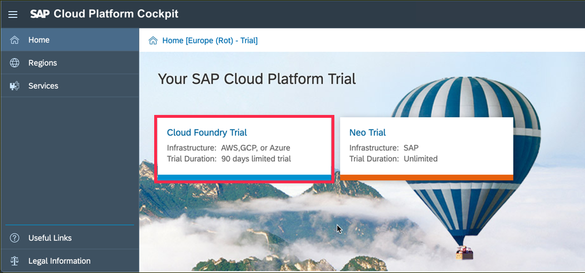
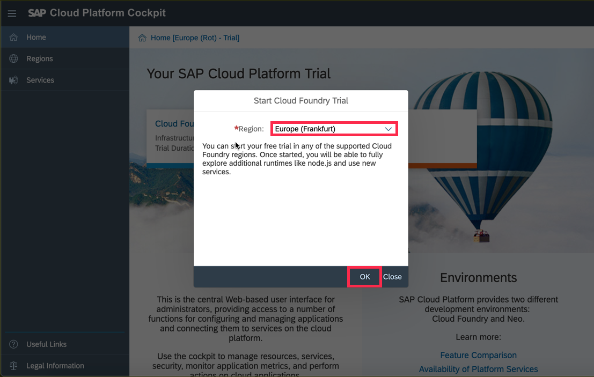
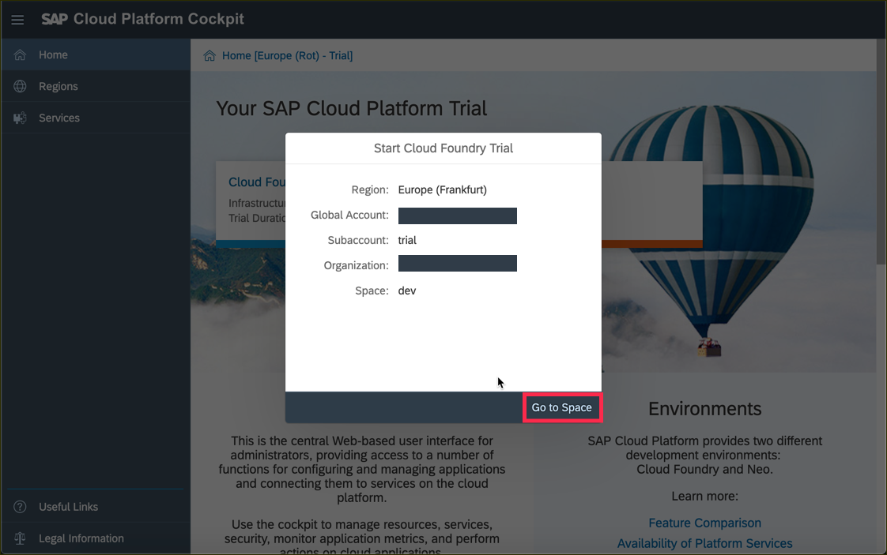
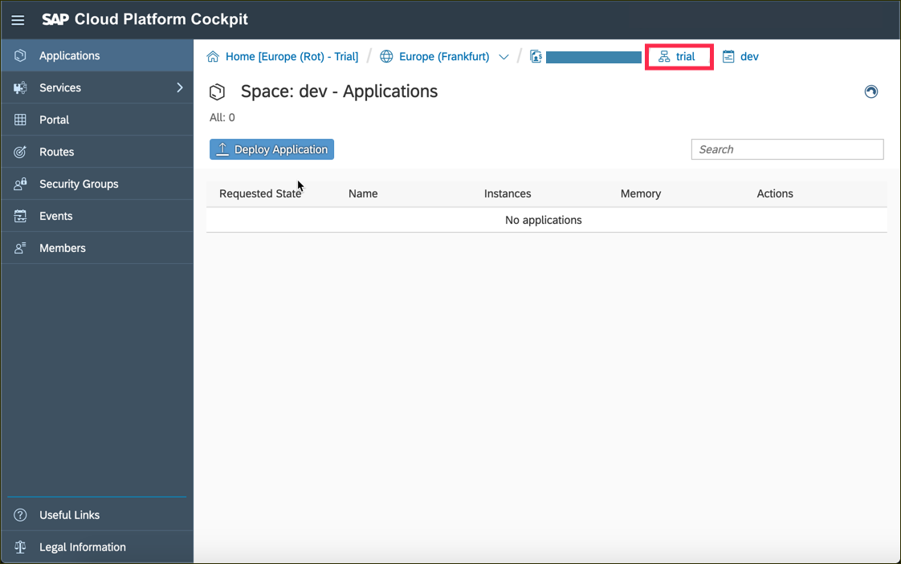
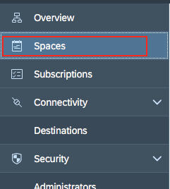
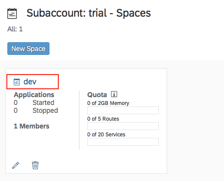
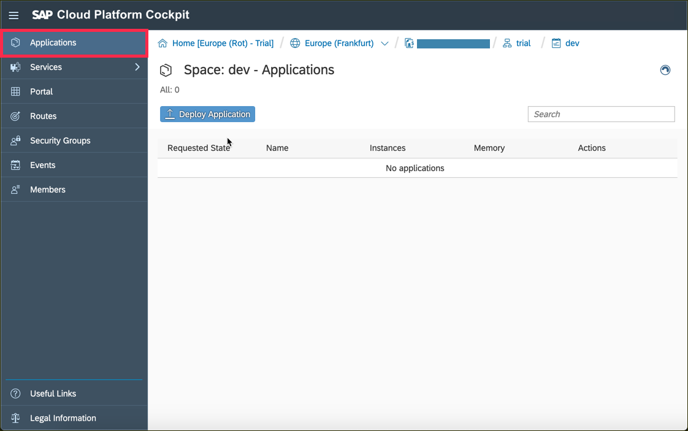
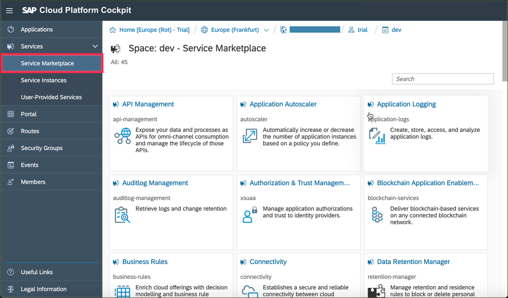

## Details
### You will learn  
 - How to create a new trial Cloud Foundry account on SAP Cloud platform
 - How to navigate to your sub-account and space
 - Where to find information on three important Cloud Foundry areas:  Applications, Service Marketplace, and Routes

---

[ACCORDION-BEGIN [Step](Log into SAP Cloud Platform)]

Start by [logging into SAP Cloud Platform](https://account.hanatrial.ondemand.com/).

>If you don't have an account on SAP Cloud Platform yet, go to the [Get a Free Trial Account on SAP Cloud Platform](https://www.sap.com/developer/tutorials/hcp-create-trial-account.html) tutorial, and then come back to this step.

[DONE]
[ACCORDION-END]

[ACCORDION-BEGIN [Step](Select account type)]

The opening screen will appear.  Choose **Cloud Foundry Trial** as the type of account.

[DONE]
[ACCORDION-END]

[ACCORDION-BEGIN [Step](Select region for trial account)]

Clicking on the Cloud Foundry trial link will bring up the **Start Cloud Foundry Trial** dialog box.  Choose one of regions from this list.    

We suggest that you use the _Europe (Frankfurt)_ region.  

> We suggest the _Europe (Frankfurt)_ region because it has the largest list of services.  If you want to use a region closer to you, [check to be certain it has the services you want before selecting it](https://help.sap.com/doc/aa1ccd10da6c4337aa737df2ead1855b/Cloud/en-US/3b642f68227b4b1398d2ce1a5351389a.html?3b642f68227b4b1398d2ce1a5351389a.html).

You will then see a dialog box while the account is set up.  When complete, the dialog box will look like this.  Click **Go To Space** to continue.

[VALIDATE_3]
[ACCORDION-END]

[ACCORDION-BEGIN [Step](Navigate to the Subaccounts page)]

If you re-enter the cockpit from the screen with both Neo and Cloud Foundry environments listed, you will end up at the Global Account screen.

> **Don't see this?** When you first create an account, you will go directly to the **Space** page, so you can skip this step!

The trial account contains **one** subaccount and space.  The details of subaccounts and spaces will be discussed in later tutorials.

For now, click on the **trial** subaccount.

[DONE]
[ACCORDION-END]

[ACCORDION-BEGIN [Step](Navigate to the Spaces page)]

Once you are in the Subaccount, there is one more step to access your working area, or **Space**.  

Start by clicking on the **Spaces** box in the right navigation bar.

Next, click on the **dev** space box to open your working space.

Now, you should be in the area labeled **Space: dev - Applications**

[DONE]
[ACCORDION-END]

[ACCORDION-BEGIN [Step](Learn about Applications and Service Marketplace tabs)]

Our final stop in this tutorial are two tabs in the **Spaces** page: **Applications**, and **Service Marketplace**.

The **Applications** tab is where all of your applications will be listed, and new applications can be added in to your Cloud Foundry runtime environment.  

The **Service Marketplace** is where you can find services to attach to any of your applications.  These services are provided by SAP Cloud Platform to make it easier to create, and produce, web applications quickly and easily.

These areas, and more of the features of Cloud Foundry, will be explained in later tutorials.

[DONE]
[ACCORDION-END]

You are now set up to use the Cloud Foundry systems on SAP Cloud Platform.
