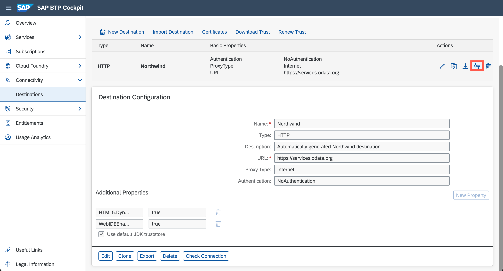

## Details
### You will learn
- How to configure a basic destination
- What some of the additional properties are for
- How to specify the SAP Business Application Studio usage parameter for a generic OData service

Destinations are key building blocks in SAP BTP, and are used to define connections for outbound communication from your application to remote systems. These remote systems can be on-premises or in the cloud.

A destination has a name, a URL, authentication details, and some other configuration details.

The destination you will define here is for the set of [OData](http://www.odata.org) services known as the "Northwind" services, which are publicly available and hosted by OASIS at <https://services.odata.org>.

The Northwind OData services comes in several versions.  The tutorials currently use either V2 (<https://services.odata.org/V2/Northwind/Northwind.svc/>) or V4 (<https://services.odata.org/V4/Northwind/Northwind.svc/>).  To support both versions, and other versions that may be added later, you will create a generic connection to the Northwind service.  The exact path - and exact version - will be configured in later tutorials.

---

[ACCORDION-BEGIN [Step : ](Enter your trial account)]

Go to <https://account.hanatrial.ondemand.com> and log in to your SAP BTP cockpit. Click the **Enter Your Trial Account** button.

!

[DONE]
[ACCORDION-END]

[ACCORDION-BEGIN [Step : ](Access your subaccount)]

Click on the tile of your Cloud Foundry subaccount.

!

[DONE]
[ACCORDION-END]

[ACCORDION-BEGIN [Step : ](Open the Destinations view)]

Click on the **Destinations** button on the left panel and click **New Destination** to open a new destination configuration form.

!

[DONE]
[ACCORDION-END]

[ACCORDION-BEGIN [Step : ](Create new destination)]
Enter/confirm all fields in the destination configuration section with the information below and confirm with **Save**.

Field Name     | Value
:------------- | :-------------
Name           | **`Northwind`**
Type           | **`HTTP`**
Description    | **`Northwind OData services`**
URL            | **`https://services.odata.org`**
Proxy Type     | **`Internet`**
Authentication | **`NoAuthentication`**

And the following *Additional Properties*

Property Name     | Value
:------------- | :-------------
`HTML5.DynamicDestination`           | **`true`** (enter this property manually as it is not available in the dropdown list)
`WebIDEEnabled`           | **`true`**

> Do **not** use the entire path for the URL.  The URL should only be `https://services.odata.org`
> You can find more information on the used properties in the [documentation](https://help.sap.com/viewer/9d1db9835307451daa8c930fbd9ab264/Cloud/en-US/7e49887e6fd34182bebeca5a6841a0cc.html)

When you specify a URL with the HTTPS scheme, a checkbox **Use default JDK truststore** will appear. Ensure that this is checked.

!

[DONE]
[ACCORDION-END]

[ACCORDION-BEGIN [Step : ](Check the connection)]

Click on the `Check Connection` icon on the newly created Destination to see if everything works.

!

[VALIDATE_1]
[ACCORDION-END]
