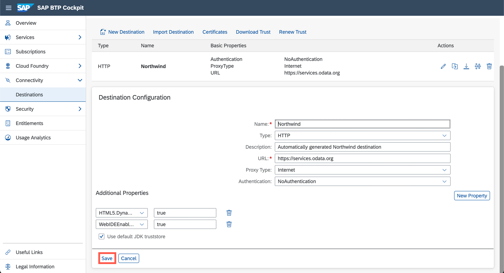

# Create a Destination in the SAP BTP Cockpit
<!-- description --> Create a destination in the SAP BTP cockpit to allow application access to the Northwind OData services.

## Prerequisites
- You have one of the following:
    - **SAP BTP free tier or trial account:** You have previously [Set Up a BTP Account for Tutorials](group.btp-setup).
    - **SAP BTP enterprise account:** You have a subaccount for which you can manage entitlements. If you need help setting up your subaccount, have a look at [Managing Subaccounts Using the Cockpit](https://help.sap.com/viewer/65de2977205c403bbc107264b8eccf4b/Cloud/en-US/55d0b6d8b96846b8ae93b85194df0944.html).

## You will learn
- How to configure a basic destination.
- What some of the additional properties are for.
- How to specify the SAP Business Application Studio usage parameter for a generic OData service.

## Intro
Destinations are key building blocks in SAP BTP, as they are used to define connections for outbound communication from your application to remote systems. These remote systems can be on-premises or in the cloud.

A destination has a name, a URL, authentication details, and other optional configuration details.

The destination you will create in this tutorial connects to a set of [OData](http://www.odata.org) services known as the "Northwind" services, which are publicly available and hosted by OASIS at <https://services.odata.org>. These services are frequently used for tutorials and testing purposes, as they require no authentication and contain realistic mock data.

The Northwind OData services are available in several versions. Most tutorials currently use either V2 (<https://services.odata.org/V2/Northwind/Northwind.svc/>) or V4 (<https://services.odata.org/V4/Northwind/Northwind.svc/>). To support both versions, and other versions that may be added later, you will create a generic connection to the Northwind service. The exact path and exact version will be configured in later tutorials.

---

### Enter your SAP BTP account

- For Free Trial Accounts: <https://account.hanatrial.ondemand.com>
- For Free Tier and Enterprise Accounts on **feature set A**: <https://account.hana.ondemand.com>
- For Free Tier and Enterprise Accounts on **feature set B**: The link depends on your region. One option is <https://cockpit.eu10.hana.ondemand.com/cockpit/>. (Replace "eu10" with your region.)

### Access your subaccount

Click on the tile of your Cloud Foundry subaccount:

<!-- border -->

### Open the Destinations view

Click on the **Destinations** button on the left panel and click **New Destination** to open a new destination configuration form:

<!-- border -->

### Create a new destination

Enter/confirm all fields in the destination configuration section with the information below and confirm with **Save**:

Field Name     | Value
:------------- | :-------------
Name           | **`Northwind`**
Type           | **`HTTP`**
Description    | **`Northwind OData services`**
URL            | **`https://services.odata.org`**
Proxy Type     | **`Internet`**
Authentication | **`NoAuthentication`**

Add the following *Additional Properties*:

Property Name     | Value
:------------- | :-------------
`HTML5.DynamicDestination`           | **`true`**
`WebIDEEnabled`           | **`true`**

> Do **not** use the entire path for the URL.  The URL should only be `https://services.odata.org`. You can find more information on the used properties in the [documentation](https://help.sap.com/docs/bas/sap-business-application-studio/connecting-to-external-systems).

When specifying a URL with the HTTPS scheme, a checkbox **Use default JDK truststore** will appear. Ensure that this is checked.

<!-- border -->

### Check the connection

Click on the `Check Connection` icon on the newly created Destination to see if everything works as expected:

<!-- border -->

