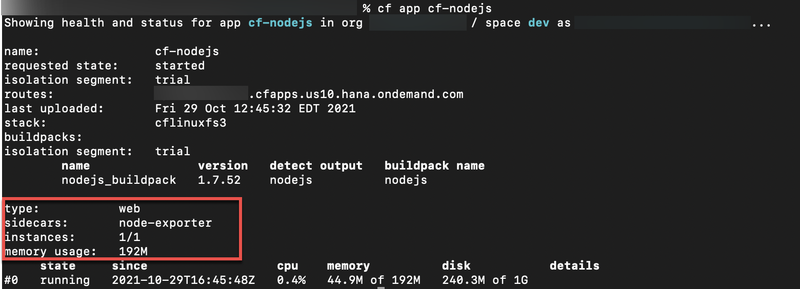
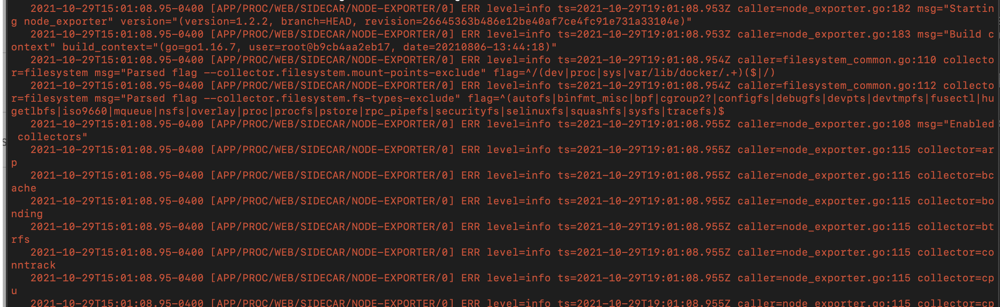

# Overview of Custom Metrics
<!-- description --> An overview of custom metrics and instrumentation

## Prerequisites
 - **Tutorials** [Understand the Cloud Foundry Application Lifecycle for Buildpack Applications](cp-cf-understand-application-lifecycle)

## You will learn
  - Why custom application metrics are useful
  - What instrumentation is
  - What agents and sidecars are
  - How to run a Prometheus exporter as a sidecar

---

### Custom Metrics Overview


While container metrics can provide a general idea of your application's resource usage, alone they rarely provide enough insight to deeply understand - and therefore improve - your application's performance.

This is where creating your own custom metrics comes in. Custom application metrics can:

  - Show you how a particular function is performing;

  - Track various performance measurements, e.g. number of successful requests to an endpoint;

  - Gather data on number of visitors, latency, and more.

Custom metrics are useful in a wide range of scenarios, from using them with analysis tools to track user trends over time, to identifying performance bottlenecks (which can help identify reasons for poor performance of other metrics), to shedding light on hard-to-identify errors within your application(s). Custom application metrics aren't a panacea for all issues. There may be times you cannot get exactly the data you want and other times you will have trouble separating useful data from tons of verbose noise also generated. It is a good first step because, in the rare cases you can't get the information you are after, it can at least give you some clues as to what the next step in diagnosing the problem might be.


### Instrument your app with Custom Metrics


Instrumenting an app to collect custom metrics require changes in the app itself. There are different options available for gathering custom metrics from your application (depending on its runtime/language). Many of these options involve forwarding your metrics to another service, or providing an endpoint for the metrics to be retrieved from. Here is a list with some options, which is by far not complete, but should be a starting point for looking into this topic:

  - Libraries and packages available for your application's specific language like [Expvar](https://pkg.go.dev/expvar) for Golang.

  - Third-party monitoring systems, to see what they provide for instrumenting your application. Usually, they provide client libraries for the different languages which can collect metrics and forward the collected metrics directly to their system or providing an endpoint within your application from which relevant metrics can be retrieved. E.g. the Prometheus [client libraries](https://prometheus.io/docs/instrumenting/clientlibs/) can be used for metric collection and they can create endpoints within your app that can be used by a Prometheus system to retrieve them.

  - [SAP provides its own Java library that can be used to produce metrics](https://github.com/SAP/cf-java-logging-support#custom-metrics). The metrics are sent to `stdout` in a JSON format that the SAP Application Logging service automatically knows how to parse. This allows the output to be processed _as metrics_, not just as logs.

Sending metrics to `stdout` is generally not an optimal choice, since that output will have to be parsed by another client/service as a second step out-of-band, after ingesting all the data being streamed out from your app. This is why we recommend sending the specific metrics you need to an appropriate service, or providing an application endpoint from which metrics can be retrieved by said service.


### Metrics through agents


An agent is a process that you run in the same container as your application, and they are often used in Cloud Foundry for gathering metrics. The agents get activated through the used buildpacks and are integrated into the buildpacks via the so called `frameworks`. These `frameworks` are used to download, install, and configure an agent within a container. Each buildpack only supports the agents it has a `framework` for, so you will need to check which agents your application's buildpack supports.

E.g. when you follow the steps described in [Dynatrace Integration](https://help.sap.com/products/BTP/65de2977205c403bbc107264b8eccf4b/1610eac123c04d07babaf89c47d82c91.html) to add Dynatrace to your application, the `VCAP_SERVICES` environment variable gets updated with a reference to the created user provided service. Once you re-stage or re-push your application the buildpack checks the `VCAP_SERVICES` environment variable, and if it recognizes that a service is referenced that requires an agent it then downloads, installs, and configures that `agent` to monitor your application. The Dynatrace Integration provides a standalone agent to gather memory, disk, CPU, and networking data, and forwards this on to your monitoring environment hosted by Dynatrace. Use of this service is dependent upon your buildpack. To see which buildpacks are supported and how to set up this service you can check out the [Dynatrace setup documentation](https://www.dynatrace.com/support/help/setup-and-configuration/setup-on-container-platforms/cloud-foundry/deploy-oneagent-on-sap-cloud-platform-for-application-only-monitoring/). It is worth to mention here that the Dynatrace agent doesn't run as an extra process in the container but is injected into the app process. E.g. in Java this works with the so called Java agent interface.

Other options for agents may include, but are not limited to, [`Telegraf`](https://docs.influxdata.com/telegraf/v1.20/), `New Relic`, `DataDog`, and others. SAP does not endorse these third parties and they are only provided here as options for your research. We strongly advise you to carefully evaluate all options for suitability in your use case before selection or implementation.


### Metrics through sidecars


A [sidecar](https://docs.cloudfoundry.org/devguide/sidecars.html) is a process that runs inside the same container as your application, like an agent. There are several benefits to using sidecars, such as near-zero latency networking and/or access to the same filesystem, to name a few. You can deploy a sidecar along with your application one of two ways:

  1. Specify the sidecar within the [app manifest](https://docs.cloudfoundry.org/devguide/sidecars.html#create), and you can push it along with your app; or...
  2. Use a [custom buildpack](https://docs.cloudfoundry.org/buildpacks/sidecar-buildpacks.html).

Just like with agents, your sidecar processes can forward metrics to another service, or serve an endpoint from which metrics can be retrieved by an external service. You can also run agents themselves as sidecars by building out the software and configuration, rather than relying on the framework from a buildpack to build it for you.

E.g. Prometheus also provides various additional libraries, software servers and/or tools, called [exporters](https://prometheus.io/docs/instrumenting/exporters/), that can be deployed as a sidecar and are useful when it's not feasible to instrument Prometheus metrics directly within the existing service. These may allow you to retrieve metrics exposed by the utility (for example, a load balancer or database) without having to build Prometheus integration into it.


### Set up a prometheus exporter as a sidecar


Prometheus provides an exporter to collect system metrics called [Node Exporter](https://prometheus.io/docs/guides/node-exporter/). To gain an understanding of how exporters and sidecars work you will add this exporter to your `cf-nodejs` application as a sidecar.

> This is only for example purposes and should not be used in production.

First you will need to [download](https://github.com/prometheus/node_exporter/releases) the Node Exporter release for Linux, extract the files using `tar`, and copy the `node_exporter` executable file to the same directory as your `cf-nodejs` application. Once you have the executable the next step is to add a sidecars section to your manifest so that it can be used. See the following code for how your `manifest.yml` file should be set up:

```
---
applications:
# or whatever you named the app
- name: cf-nodejs
  memory: 192M
  instances: 1
  random-route: false
  sidecars:
    - name: node-exporter
      process_types: ['web']
      command: './node_exporter'
```

Once you have the code added you need to save your manifest, and then run `cf push`. This will re-push your application, adding the node-exporter sidecar. You can run `cf app cf-nodejs` to confirm that the sidecar has been added, as you will now see the name of your sidecar under the sidecars section.

<!-- border -->

You can also confirm that the sidecar is running by looking at your application logs using `cf logs cf-nodejs --recent`, and you should see logs dealing with the sidecar.

<!-- border -->

> Accessing the metrics without ssh-ing into the app will not work because by default CF can only receive traffic on port 8080 and the node exporter provides its metrics on port 9100. For the purposes of this tutorial it is enough to see that the sidecar is added successfully.


---
