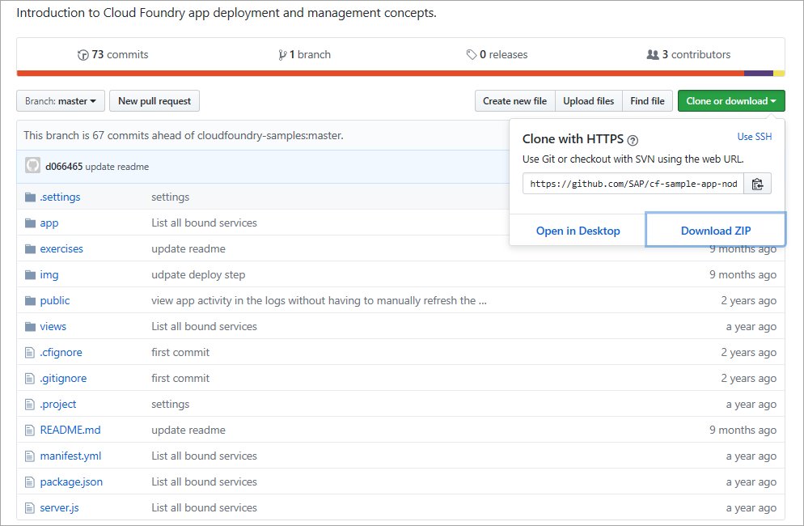
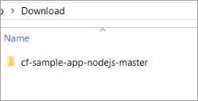
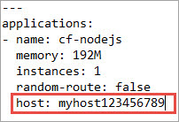

## Details
### You will learn
- What a typical small Node.js app looks like
- What a Cloud Foundry deployment descriptor contains

In this tutorial, you'll download a simple Node.js app from GitHub that returns an index page with various information about itself, in response to an HTTP request. You'll open up and edit the app's deployment descriptor, a file containing information about the app, including memory requirements, hostname and more.

---

[ACCORDION-BEGIN [Step 1: ](Find the sample app on GitHub)]

The sample app is available in a repository on GitHub.

Open it up at this URL: <https://github.com/SAP/cf-sample-app-nodejs>.

[DONE]
[ACCORDION-END]

[ACCORDION-BEGIN [Step 2: ](Download sample files)]

This tutorial is preparing the app for deployment to the SAP BTP, Cloud Foundry runtime, and you'll be deploying it (in another tutorial) from your own machine. So you'll need to download the repository first.

Choose **Clone or download** and then choose **Download ZIP**.

Enter the name of the file you just downloaded and choose **Validate**.

[VALIDATE_1]
[ACCORDION-END]

[ACCORDION-BEGIN [Step 3: ](Extract sample files)]

Open the zip file and extract its content to a folder on your local computer. You will have extracted a folder named `cf-sample-app-nodejs-master`.

[DONE]
[ACCORDION-END]

[ACCORDION-BEGIN [Step 4: ](Open the deployment descriptor)]

The sample app repository contains a basic deployment descriptor, but you'll need to edit it before the deployment. The deployment descriptor is the file called `manifest.yml` in the root of the app folder structure.

Open the `manifest.yml` file with an editor of your choice.

What is the value of the `name` parameter that exists already in the `manifest.yml`?

[VALIDATE_4]
[ACCORDION-END]

[ACCORDION-BEGIN [Step 5: ](Add a unique host name to the deployment descriptor)]

The host name for your app must be unique within a combination of region and runtime, in that it forms the most significant part of the fully qualified hostname in the app's URL space. For example, if your app host name is `myapp`, the fully qualified hostname for the Cloud Foundry runtime in the `EU10` region will be:

`myapp.cfapps.eu10.hana.ondemand.com`

If someone else is already using that hostname within that region and runtime, you won't be able to deploy your application.

  1. Add a parameter named `host` to the `manifest.yml` file and provide a unique value. For example, use your birth date or a random number or string or incorporate your user ID:

    

    > The YAML format uses whitespace significantly -- make sure you format this new parameter correctly, as shown.

  2. Don't forget to save your changes.

[VALIDATE_5]
[ACCORDION-END]

---

