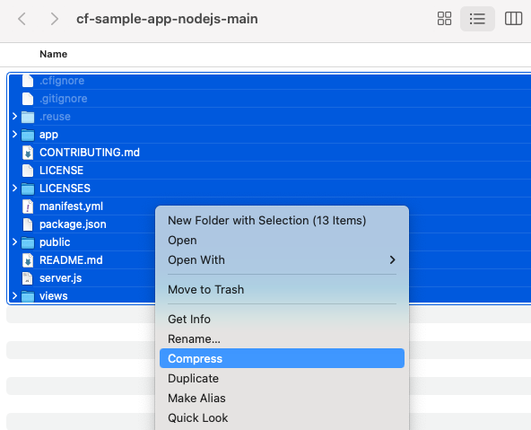

# Deploy an App to SAP BTP, Cloud Foundry runtime
<!-- description --> Use SAP BTP cockpit to deploy an app to the Cloud Foundry runtime, then explore what was deployed and created.

## You will learn
  - How to deploy an app to the SAP BTP, Cloud Foundry runtime using the cockpit
  - What is created when an app is deployed

## Intro
This tutorial assumes you've completed the [Download and Prepare App for Cloud Foundry Deployment](cp-cf-dev-01-prepare-app) tutorial, where you should have a folder containing a sample Node.js app with a deployment descriptor file. You're going to package the app and deploy it directly from your machine using a feature in the SAP BTP cockpit itself.

---
### Package the app up

To deploy your sample application on SAP BTP, create a zip file that contains the necessary files.

 1. Open the folder `cf-sample-app-nodejs-main` which contains your sample app.
 1. Select the entire contents of this folder -- all folders & files -- and add them to a new `hello-nodejs.zip` file (if you're on macOS, you can use the "Compress" feature and then change the filename from `Archive.zip` to `hello-nodejs.zip`).

> Be sure not to include the containing folder in the zip file -- you must explicitly select only the contents of the `cf-sample-app-nodejs-main` folder and not that folder itself.

### Go to your dev space on SAP BTP

In the SAP BTP cockpit, go to the Cloud Foundry **dev** space of your trial account.

Make sure that the **Applications** tab is selected in the navigation menu.

### Deploy the sample application

 1. Choose **Deploy Application**.

    

 1. Choose **Browse** to select the **`hello-nodejs.zip`** file you created earlier.

 1. Enable **Use Manifest**.

 1.  Choose **Browse** to select the **`manifest.yml`** file (the one that you edited in the previous tutorial) in the same folder.

    

 1.  Choose **Deploy**.

The application is deployed to SAP BTP and starts automatically. It appears in the list of applications and the status will turn green if the application starts without problem.

### Explore the deployed app

1. Choose the application from the list of applications by clicking on its name.

    The application overview opens.

1. In the **Application Routes** section, choose the URL to open the application you've just deployed.

    

    A new tab opens that displays the app information.

    

At this stage, you have your sample app deployed and running in Cloud Foundry on SAP BTP. Well done!

---
