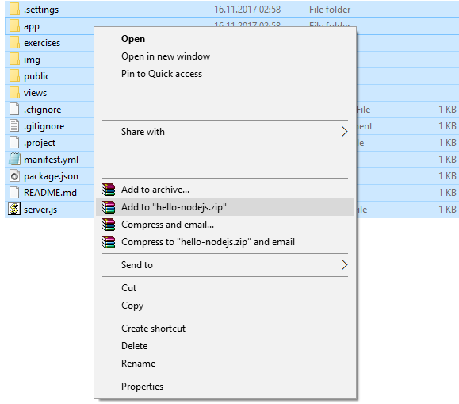
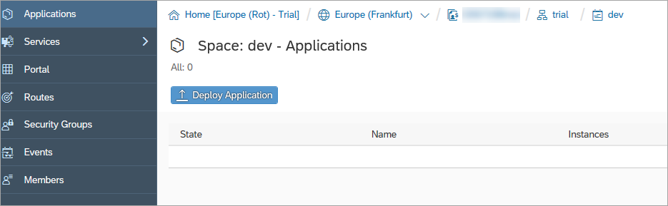
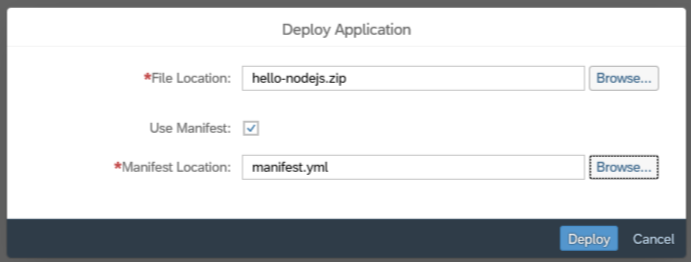
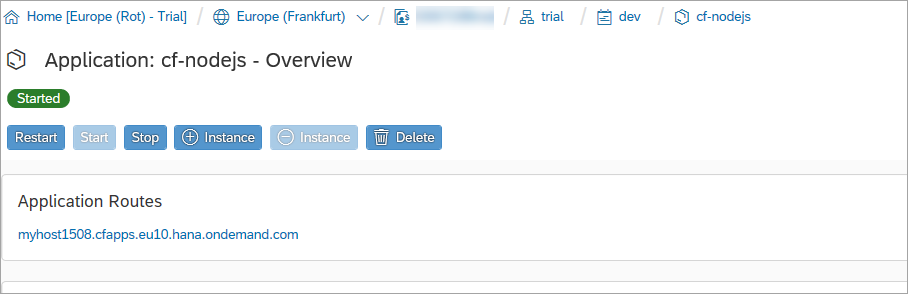
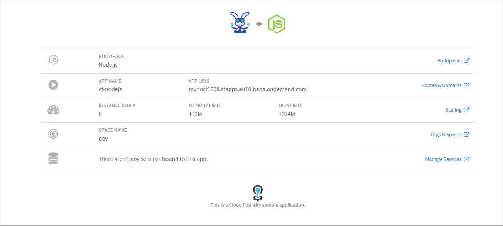

## Details
### You will learn
  - How to deploy an app to the SAP BTP, Cloud Foundry runtime using the cockpit
  - What is created when an app is deployed

This tutorial assumes you've completed the [Download and Prepare App for Cloud Foundry Deployment](https://developers.sap.com/tutorials/cp-cf-dev-01-prepare-app.html) tutorial, where you should have a folder containing a sample Node.js app with a deployment descriptor file. You're going to package the app and deploy it directly from your machine using a feature in the SAP BTP cockpit itself.

---
[ACCORDION-BEGIN [Step 1: ](Package the app up)]

To deploy your sample application on SAP BTP, create a zip file that contains the necessary files.

 1. Open the folder `cf-sample-app-nodejs-master` which contains your sample app.
 1. Select the entire contents of this folder -- all folders & files -- and add them to a new `hello-nodejs.zip` file.

> Be sure not to include the containing folder in the zip file -- you must explicitly select only the contents of the `cf-sample-app-nodejs-master` folder and not that folder itself.

[DONE]
[ACCORDION-END]

[ACCORDION-BEGIN [Step 2: ](Go to your dev space on SAP BTP)]

In the SAP BTP cockpit, go to the Cloud Foundry **dev** space of your trial account.

Make sure that the **Applications** tab is selected in the navigation menu.

[DONE]
[ACCORDION-END]

[ACCORDION-BEGIN [Step 3: ](Deploy the sample application)]

 1. Choose **Deploy Application**.

    

 1. Choose **Browse** to select the **`hello-nodejs.zip`** file you created earlier.

 1. Enable **Use Manifest**.

 1.  Choose **Browse** to select the **`manifest.yml`** file in your **`hello-nodejs`** folder.

    

 1.  Choose **Deploy**.

The application is deployed to SAP BTP and starts automatically. It appears in the list of applications. The requested state is initially red, but turns green if the application starts without problem.

[VALIDATE_3]
[ACCORDION-END]

[ACCORDION-BEGIN [Step 4: ](Explore the deployed app)]

1. Choose the application from the list of applications by clicking on its name.

    The application overview opens.

1. In the **Application Routes** section, choose the URL to open the application you've just deployed.

    

    A new tab opens that displays the app information.

    

At this stage, you have your sample app deployed and running in Cloud Foundry on SAP BTP. Well done!

[DONE]
[ACCORDION-END]

---

