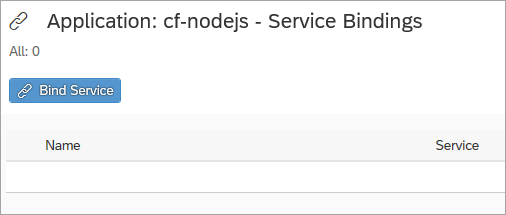
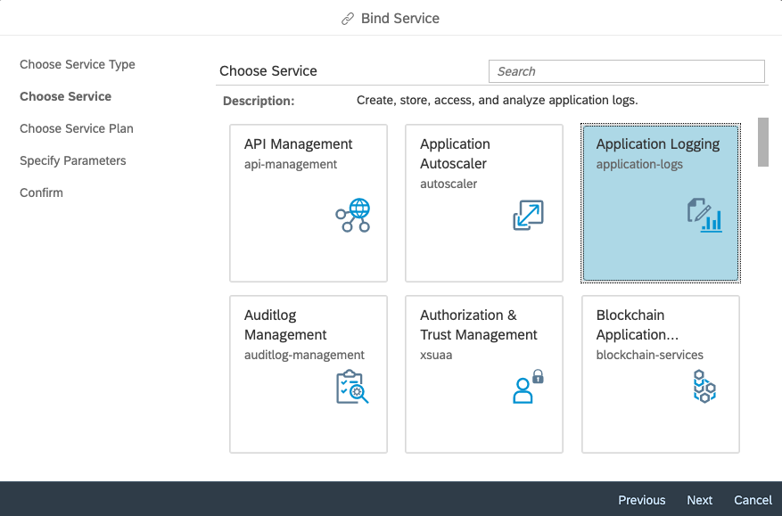
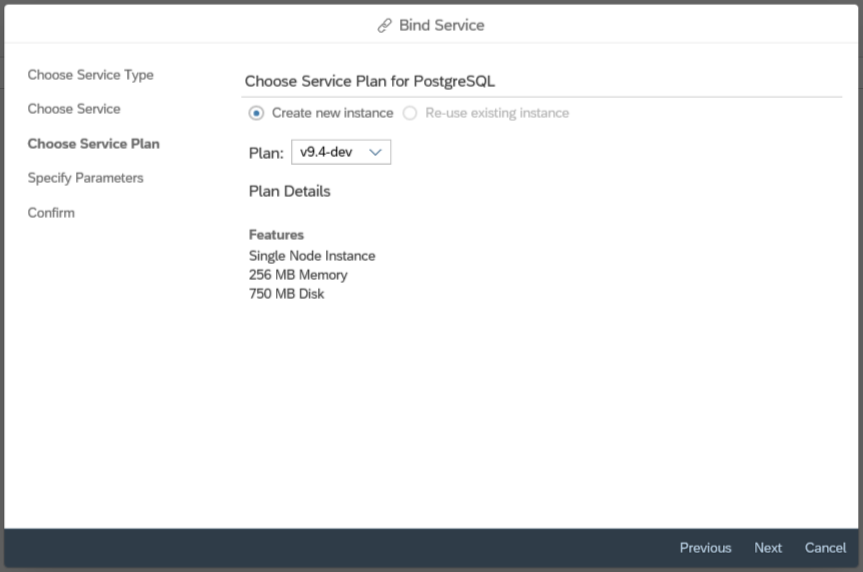
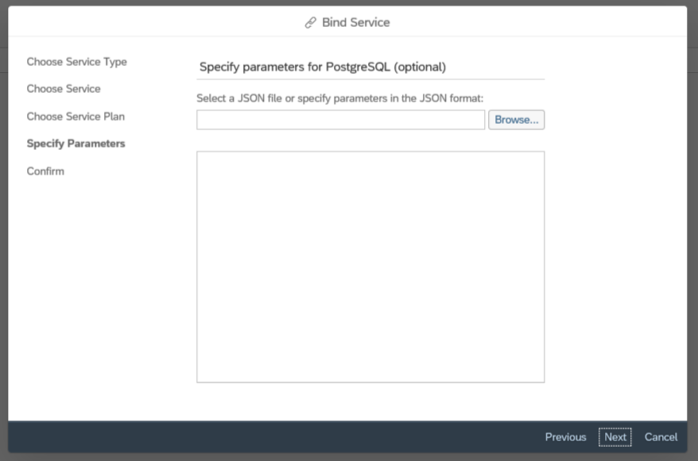
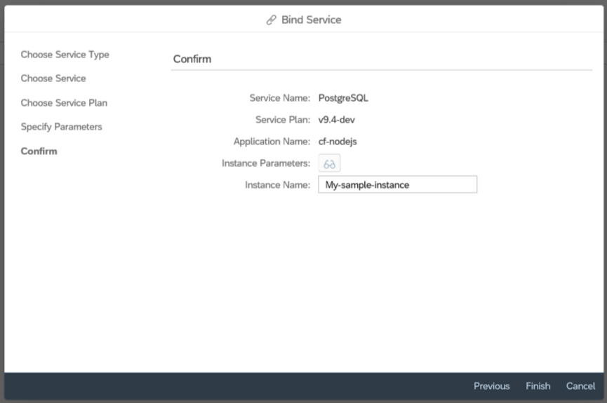
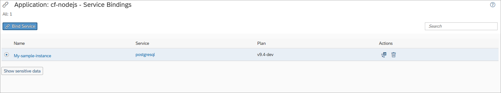
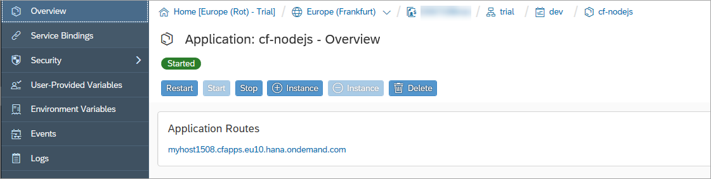
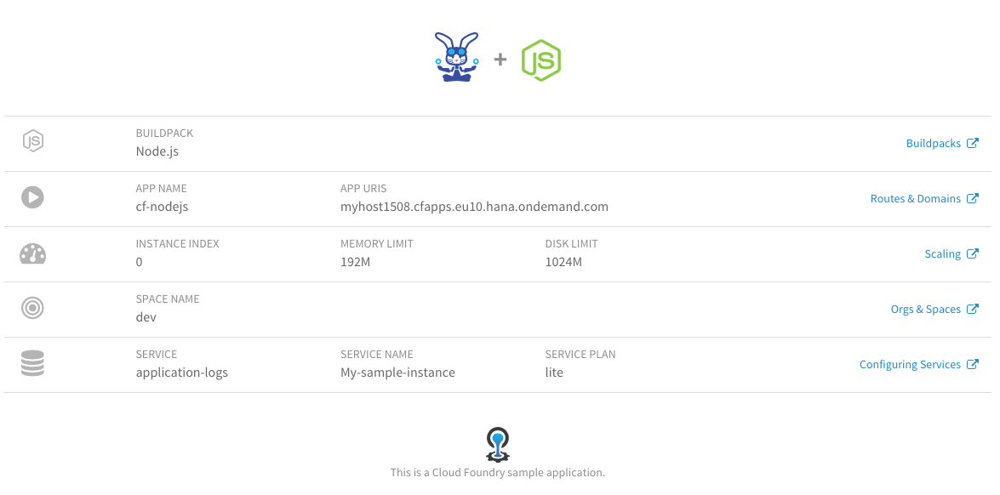

## Details
### You will learn
- How apps and services are related
- How to bind a service to an app

In SAP BTP, Cloud Foundry runtime there are apps and there are services. In many cases, apps are what you write, and services are what are available for your app to make use of.

The [Application Logging](https://help.sap.com/viewer/ee8e8a203e024bbb8c8c2d03fce527dc/Cloud/en-US/68454d44ad41458788959485a24305e2.html) service enables the central capture and analysis of log messages from applications that are bound to it. You can manage the availability of services, and the instances thereof, in the SAP BTP cockpit.

---

[ACCORDION-BEGIN [Step 1: ](Open service bindings for your app)]

In the SAP BTP cockpit, navigate to the page for your app, as you learned to do in the [Deploy an App to SAP Cloud BTP, Cloud Foundry runtime](https://developers.sap.com/tutorials/cp-cf-dev-02-deploy-app.html) tutorial.

Choose **Service Bindings** in the navigation area.

[DONE]
[ACCORDION-END]

[ACCORDION-BEGIN [Step 2: ](Bind an instance of the Application Logging service to your app)]

 1. Choose **Bind Service**.

    

 1. Choose **Service from the catalog** and choose **Next**.

    

 1. Choose the **Application Logging** tile and choose **Next**.

    !

 1. Choose the **Create new instance** option, select a service plan from the **Plan** field, and then choose **Next**.

    !

 1. Skip specifying parameters by choosing **Next**.

    !

 1. Enter a name for the service instance and choose **Finish**.

    !

The binding is created and added to the list of service bindings:

In the text area below, enter the name of the service used in the service bindings of your application. **HINT:** The name appears in the **Service** column in the list of service bindings.

[VALIDATE_1]
[ACCORDION-END]

[ACCORDION-BEGIN [Step 3: ](Explore your binding)]

 1.  In the navigation area of the cockpit, choose **Overview**.

 1.  Choose **Restart** to restart your application.

    

 1.  In the **Application Routes** section, choose the URL to open the application.

 A new tab opens that displays the app information.

 !

In the app, you can see the additional information about the service binding.

[DONE]
[ACCORDION-END]

---

