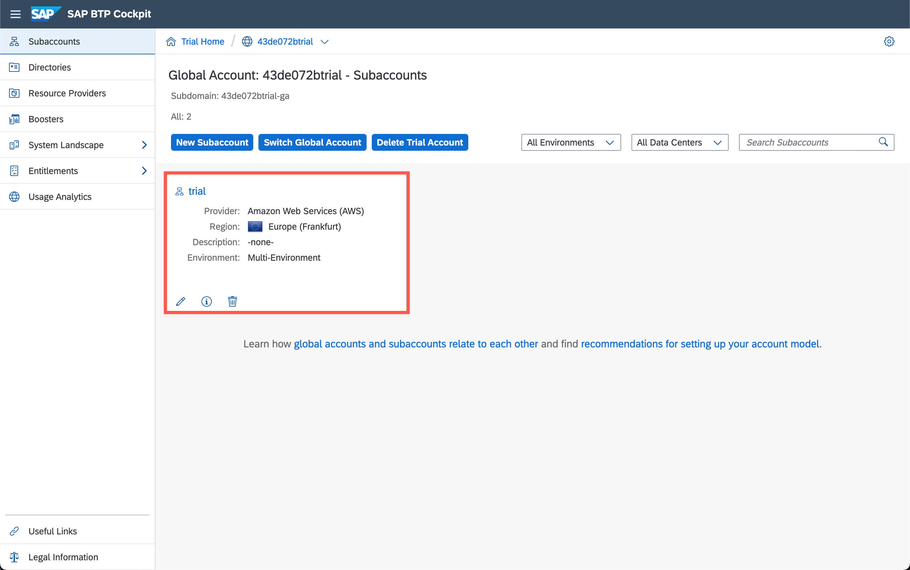
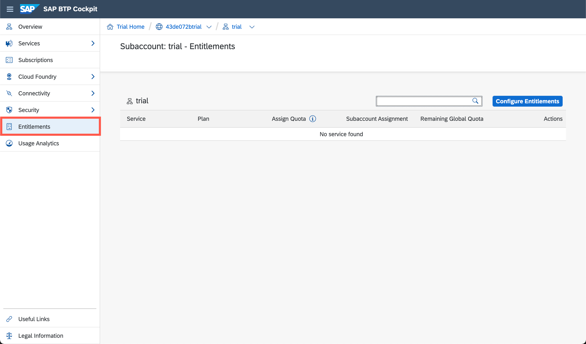
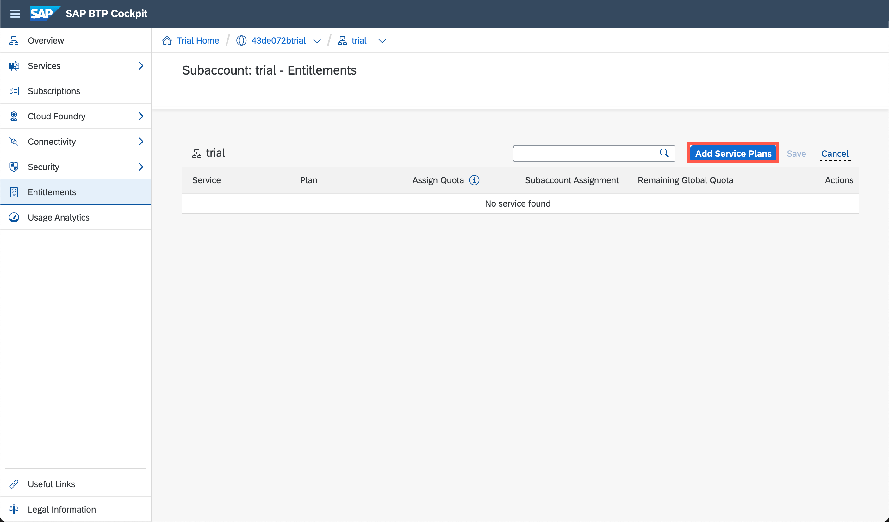
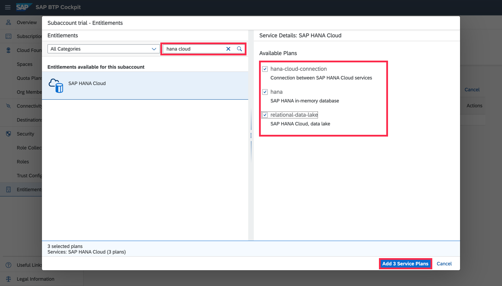
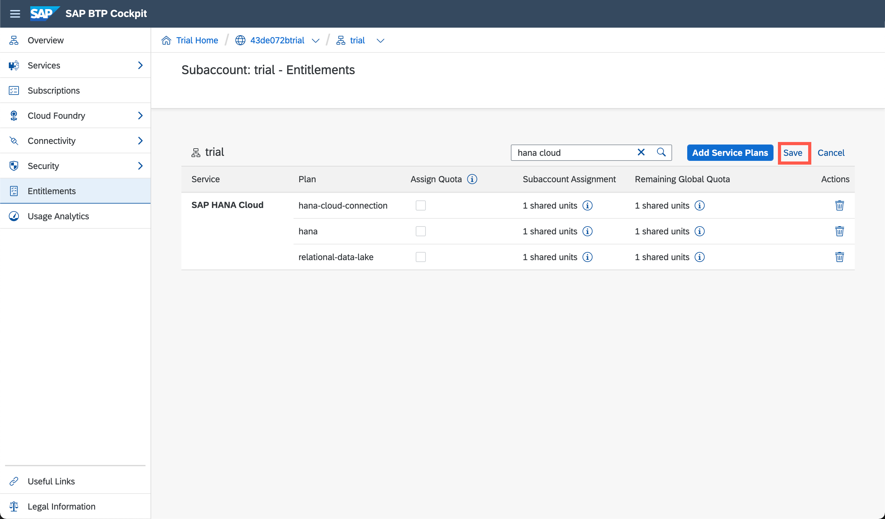

## Details
### You will learn
  - Where to find all entitlements of your subaccount
  - How to add a new entitlement to your subaccount

Entitlements are the heart of all subaccounts in SAP Cloud Platform. They define which service and runtime artifacts you are able to use. This tutorial will show you how you can set up the entitlements you need to develop success solutions on SAP Cloud Platform.

---

[ACCORDION-BEGIN [Step: ](Log into SAP Cloud Platform)]

1. Go to <https://account.hanatrial.ondemand.com> and log in to your SAP Cloud Platform cockpit.

2. Click on "Enter Your Access Trial Account" to access the SAP Cloud Platform Cockpit.

    !

[DONE]
[ACCORDION-END]
[ACCORDION-BEGIN [Step: ](Switch to entitlements view)]

1. **Select** the tile of the subaccount you want to add entitlements to.

    !

2. Click on **Entitlements** in the left-hand sidebar.

    !

[DONE]
[ACCORDION-END]
[ACCORDION-BEGIN [Step: ](Add a SAP HANA service entitlement to subaccount)]

In this step we will add a new service plan to a subaccount. Depending on when you created the SAP Cloud Platform account, this entitlement might already be assigned to the subaccount.

1. You can use the filter box if you see too many entries to find the entitlement you are looking for. Click on **Configure Entitlements** to switch the table into edit mode.

    !

2. Click on **Add Service Plans** to see all available entitlements.

    !

3. Use the filter bar the search for **`hana cloud`** to reduce the number of available entitlements. Click the checkbox to select the service plans **`hdi-data-connection`**, **`hana`**, and **`relational-data-lake`**. Finally, confirm your selection by clicking on **Add 3 Service Plan**.

    !

4. In the table, you may see the quota you are going to assign to the subaccount depending on the selected service. As the trial landscape is for free, you can max out all your service plans.

> If you are not able to increase the quota of a given service plan, you might already consume this service plan in another subaccount. Please make sure to release the quota from other subaccounts, before reassigning it.

[DONE]
[ACCORDION-END]
[ACCORDION-BEGIN [Step: ](Add more entitlements to subaccount)]

Congratulations, you just enabled the SAP HANA Cloud service in your subaccount. Depending on what you want to build, you might want to add one of more of the following service plans as well:

| Service | Usage Scenario |
|----|----|
|ABAP environment| For exploring the free trial of the SAP Cloud Platform ABAP environment.|
|Kyma environment|For exploring the free trial of the SAP Cloud Platform Kyma environment.|
|Application Runtime|Needed to run application on SAP Cloud Platform Cloud Foundry environment. Quota defined the available memory of the Cloud Foundry Application Runtime (CFAR). |
|Enterprise Messaging|Messaging bus for inter-app communication within the Cloud Foundry environment.|
|Launchpad|The connect your SAPUI5 components to the Fiori Launchpad.|
|SAP HANA Cloud|To store data in an cloud-based in-memory database.|
|SAp HANA Schemas|The create HDI containers that can be connected to your apps.|
|Workflow|To use the SAP Cloud Platform Workflow service within the Cloud Foundry environment.|
|SAP Business Application Studio|The development tools for cloud-native business applications.|
|SAP Web IDE for HANA development|The development tools for HANA contain the SAP Web IDE Full-Stack aimed for HANA native development targeting your Cloud Foundry trial environment.|
> This is an incomplete enumeration.

Follow the instructions from the previous step to add these new entitlements to your subaccount.

[VALIDATE_1]
[ACCORDION-END]
[ACCORDION-BEGIN [Step: ](Save the entitlements)]

Confirm you selection with **Save**.

!

[DONE]
[ACCORDION-END]

---
