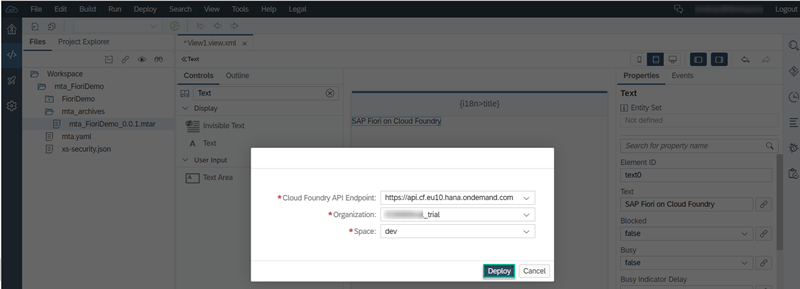
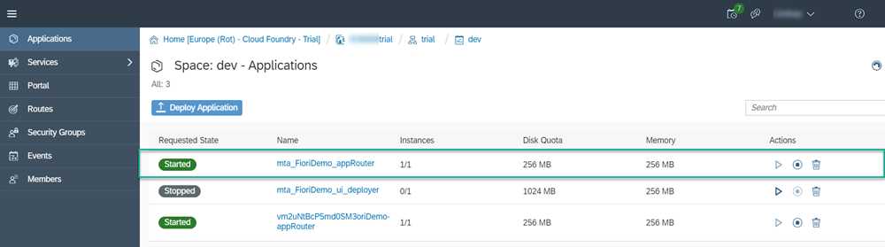

## Prerequisites
 - Make sure you have access to the trial version of SAP Web IDE Full-Stack. For more information, see [Getting Started with SAP Web IDE Full-Stack](https://developers.sap.com/tutorials/webide-innovation-beta.html).
 - Set up a trial Cloud Foundry account. Follow **steps 1-3** in this tutorial: [Getting started with Cloud Foundry](https://developers.sap.com/tutorials/hcp-cf-getting-started.html)

## Details
### You will learn
  - How to create a new SAPUI5 application for SAP Cloud Platform Cloud Foundry
  - How to configure your Cloud Foundry settings in SAP Web IDE
  - How to build and deploy your application to Cloud Foundry

  Create, configure, build, and deploy a simple application on Cloud Foundry in SAP Web IDE Full-Stack.

---

[ACCORDION-BEGIN [Step 1: ](Create a new project)]
In SAP Web IDE Full-Stack, right-click your workspace choose **New > Project from Template**.

In the template wizard that opens, in the **Environment** dropdown list, select **Cloud Foundry**. Then choose **Next**.

In the **Basic Information** screen, in the **Module Name** field, enter `FioriDemo`. In the **Namespace** field, enter `mynamespace` and then choose **Next**.

On the **Template Customization** screen, accept the default values shown below and choose **Finish**.

The new project now appears in your SAP Web IDE workspace.

[DONE]
[ACCORDION-END]

[ACCORDION-BEGIN [Step 2: ](Open the layout editor)]

Now you need to open the layout editor in SAP Web IDE to easily make a few changes.

Choose **`FioriDemo` > `webapp` > `view`** and right-click the `View1.view.xml` file that you created in the wizard in the previous step.

Choose **Open Layout Editor**.

[DONE]
[ACCORDION-END]

[ACCORDION-BEGIN [Step 3: ](Use the layout editor)]

Now you will make some changes using the layout editor, with no need to do any coding.

1. In the layout editor, in the **Controls** pane, in the Search box on the top enter `Text` to filter the controls list. Select the **Text** control.

    

2. Drag the **Text** control and drop it on the **View** control in the canvas to the right.

    

    The **View** control should now look like this.

    

3. Select the **Text** control, and in the **Properties** pane on the right, in the **Text** property, clear the default text and enter `SAP Fiori on Cloud Foundry`.

    

Save your work by clicking either the **Save** or **Save All** icon located at the top of the workspace.

[DONE]
[ACCORDION-END]

[ACCORDION-BEGIN [Step 4: ](Set Cloud Foundry preferences)]

Now, before you can build and deploy your new application, you need to set your Cloud Foundry preferences.

1. Open the **Preferences** perspective in SAP Web IDE by clicking the **Preferences** icon and then select **Cloud Foundry**.

    

2. In the pane on the right, select the API endpoint, organization and space for your project.

    

3. Save your preferences.

[DONE]
[ACCORDION-END]

[ACCORDION-BEGIN [Step 5: ](Test your new application)]
Now you need to run your new application to test it.

But first, check the project settings to make sure that Cloud Foundry is enabled for your project.

> By default, the target environment in your run configuration is set to Cloud Foundry.

1. In the workspace, right-click the `FioriDemo` folder, then choose **Run > Run Configurations**.

    

2. In the **Run Configurations for `FioriDemo`** window that opens, on the left choose **Run `index.html`**. On the right you can see that under **Target Environment**, **Run on Cloud Foundry** is selected.

    

3. Choose **Cancel**.

In the workspace, right-click the `FioriDemo` folder, then select **Project > Project Settings**. Select **Cloud Foundry** and make sure that in the pane on the right that the API endpoint, organization, and space are the same as what you had configured in the **Preferences** perspective in the previous step.

To run the application:

1. Go back to the **Development** perspective, then in the workspace, select the `FioriDemo` folder.

2. Click on the green **Run** button in the upper toolbar.

    

    A new tab opens in your browser and displays a preview of your application:

    

[DONE]
[ACCORDION-END]

[ACCORDION-BEGIN [Step 6: ](Build your application)]

Now you need to build your application.

In your workspace, right-click the **`mta_FioriDemo`** folder and choose **Build > Build**.

The build process creates a multi-target archive (`MTAR`) file in your workspace that packages all the project modules for deployment.

[DONE]
[ACCORDION-END]

[ACCORDION-BEGIN [Step 7: ](Deploy your application)]

Now, you need to deploy your application to SAP Cloud Platform, Cloud Foundry environment.

In your workspace, locate and right-click the new `mta_FioriDemo_0.0.1.mtar` file in the `mta_archives` folder, and select **Deploy > Deploy to SAP Cloud Platform**.

The **Deploy to SAP Cloud Platform** dialog box opens. Enter your credentials as required and choose **Deploy**.

The deployment process takes a few minutes. You can see that the deployment is still in progress in the status bar at the bottom right of your screen:

When SAP Web IDE has finished the deployment process, you should see a notification in the console at the bottom of your screen:

Also, these notification messages should be displayed at the top right of the screen:

[DONE]
[ACCORDION-END]

[ACCORDION-BEGIN [Step 8: ](Create a URL for your new application)]
Now you can access your deployed application in the SAP Cloud Platform cockpit. The steps below show you how to create a URL that you can use to access your new application.

1. Open SAP Cloud Platform cockpit from the **Tools** menu in SAP Web IDE. Click the **Home** tab.

    

2. On the **Home** page of the SAP Cloud Platform cockpit, click **Cloud Foundry Trial**.

    

3. Click the **trial** subaccount box, assuming you are working on the trial version of SAP Web IDE. Otherwise, your subaccount will have a different name.

    

4. Click the number link to your Cloud Foundry spaces.

    

5. Click your space box to open it.

    

6. On your applications page, you should see your new application in the list: `mta_FioriDemo_appRouter` and that it has a **Started** status. Click this link.

    

7. A new page opens: **Application: `mta-FioriDemo_appRouter` - Overview.** Right-click the URL under **Application Routes** and save the URL in a text file such as in  **Notepad** or **Notes**.

    

8. In your text editor you need to add the following suffix to the URL that you saved in step 7: `/mynamespaceFioriDemo/index.html`

> For future reference, bear in mind that this is the construct of the final URL: `<URL_from_application_overview_page>/<mynamespace><project_name>/index.html`

You can now use this URL in any browser to access your new application.

[VALIDATE_8]
[ACCORDION-END]

---
