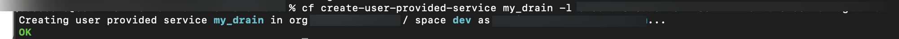
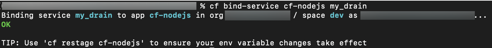

# Forward Logs and Container Metrics
<!-- description --> Understand the various ways logs and container metrics are forwarded so that they can be consumed by the user.

## Prerequisites
 - **Tutorial** [Overview of Cloud Foundry Application Logs](cp-cf-application-logs-overview)
 - **Tutorial** [Overview of Cloud Foundry Application Metrics](cp-cf-overview-application-metrics)

## You will learn
  - What a drain is
  - How the Log Cache API and Plugin work
  - What the Loggregator Firehose is and how nozzles work
  - How logs and metrics reach the SAP Application Logging service

## Intro
This tutorial assumes you've completed the [Create a Service Instance and Bind it to Your App](cp-cf-dev-03-service-instance) tutorial and have a working knowledge of the SAP Application Logging service.

---

### Drains and how they work


Drains, also referred to as `syslog drains`, serve as a place for your logs to flow into. When you bind a drain to your application you are telling Cloud Foundry's logging system to forward the application's logs to whatever service the drain references. This can be a service already in your Cloud Foundry marketplace or it can be a third-party log management service, or even an application you have created yourself. You can even have multiple drains to handle different types of logs. The main purpose of using a drain is to allow your logs to persist for as long as you need, rather than being overwritten when the Cloud Foundry log buffer gets too full. This way you can access your data over a longer period of time and get more useful analytics.

> Custom metrics sent to Cloud Foundry's logging system are also treated as logs, and will be forwarded when you set up a drain. Container metrics are not forwarded when you set up a drain.


To drain your logs to third-party log management service, you will need:

1. A properly [configured log management service](https://docs.cloudfoundry.org/devguide/services/log-management.html#step1)
2. A `syslog drain` service to bind to your application. This can be done with the `cf cli` which is explained in the section below.
3. Restage of your application

Cloud foundry has several [service-specific instructions](https://docs.cloudfoundry.org/devguide/services/log-management-thirdparty-svc.html) for setting up drains as well.

> For your Log Management Service to work properly with the SAP BTP CF platform you may need to allow communication _from_ the CF platform _to_ the Log Management Service. This is accomplished by configuring your Log Management Service to allow access from the IP addresses within your [corresponding region](https://help.sap.com/viewer/65de2977205c403bbc107264b8eccf4b/Cloud/en-US/350356d1dc314d3199dca15bd2ab9b0e.html#loiof344a57233d34199b2123b9620d0bb41).


### Set up a Drain using the CF CLI


First create a service instance:

```
$ cf create-user-provided-service <drain-name> -l <drain-url>
```

  - `drain-name`: any name you would like to use for your drain service
  - `drain-url`: the URL provided by the third-party service for long-term persistence (storage)

<!-- border -->

Next, bind an app to the service by specifying the service in the manifest, or running:

```
$ cf bind-service <app-name> <drain-name>
```

  - `app-name`: the name of the app you want to get logs _from_
  - `drain-name`: the name of the service you created in step 1 above

<!-- border -->

Finally, you need to restage your application so it picks up the configuration changes. Simply restarting the application does not pick up the changes.

> It is **NOT** recommended to deploy your drain to to the BTP Cloud Foundry as you may face rate limiting countermeasures. The logs will need to flow out to the internet, and then back into the BTP, causing a sudden spike in high volume inbound/outbound traffic, which will likely trigger automated rate limiting protections at the infrastructure level.


### The Log Cache


The [Log Cache](https://github.com/cloudfoundry/log-cache-release) is an **in-memory cache** that receives logs and container metrics from the Cloud Foundry's logging system. By default SAP BTP Cloud Foundry is set up with the log cache already enabled, and you can connect to the log cache using the [log cache API](https://github.com/cloudfoundry/log-cache-release/blob/v2.11.11/src/README.md#apis) or the [log cache plugin](https://github.com/cloudfoundry/log-cache-cli). Using the Log Cache you can see logs and metrics over a longer period of time.

To see what is contained within the log cache you can install the log cache plugin:

```
cf install-plugin -r CF-Community "log-cache"
```

And then run the following command (where `<app-name>` is the name of the application you are interested in):

```
cf tail <app-name>
```

> For information on how to use the log cache plugin check out the [Overview of Cloud Foundry Application Logs](cp-cf-application-logs-overview) tutorial.


### The Loggregator Firehose and nozzles


While the log cache or a drain are the recommended ways of collecting logs and/or metrics, you also have the option of using a **Firehose nozzle**. SAP BTP Cloud Foundry's logging system leverages the [Firehose Architecture](https://docs.cloudfoundry.org/loggregator/architecture.html#firehose-architecture), which specifies that all logs and container metrics are forwarded to the Loggregator Firehose. The Firehose acts as a resource which you can connect to through "nozzles". Nozzles allow you to "filter" the logs spewing out of the aforementioned `firehose` so you can work with that data in some way, like forwarding logs to one location (say, a third party log storage service), and metrics to a time series database (e.g. Prometheus), for example. The main difference between a nozzle and a drain is how the data being received is formatted. Nozzles receive the data in JSON format, while drains receive data in the `syslog` format.

The critical piece making all this possible is the Firehose API. There are two versions of this API as of the time of this writing:

  - v1, which is **deprecated** and should not be used unless you really have no other choice
  - v2, the current version of the API and this is the one you should use. For more information about how it works you can check out the following on [Building a Nozzle Using the RLP Gateway](https://github.com/cf-platform-eng/firehose-nozzle-v2#building-a-nozzle-using-rlp-gateway)

> Several [nozzles](https://github.com/cloudfoundry/loggregator-release/blob/main/docs/community-nozzles.md) have been developed by the Cloud Foundry community, and operators can also create their own.

If you want to access the output of the `firehose` through the `cf cli`, you can use the [Loggregator Firehose Plugin](https://docs.cloudfoundry.org/loggregator/cli-plugin.html). While this plugin uses the deprecated "v1" version of the Firehose API, it does provide an easy way to see the application logs being sent to the `firehose`. You can install the plugin:

```
cf install-plugin -r CF-Community "Firehose Plugin"
```

Afterwards you can start a live stream of the `firehose` logs right into your console with:

```
cf app-nozzle <app-name>
```

> Firehose API v2 has some limitations. Because logs and metrics get converted to and from JSON as they are transported through the RLP gateway, overall throughput for v2 may be lower than v1. Additionally, CPU and memory utilization may be higher on nozzles and the Traffic Controller VMs. It has also been known to happen that a small amount of log data may get lost when clients disconnect (this is apparent when the RLP Gateway refreshes connections, every 14 minutes at minimum) from the API. You should still use v2, however, as v1 is deprecated and support will cease at some point in the future.


### The SAP Application Logging service


The [SAP Application Logging](https://help.sap.com/viewer/ee8e8a203e024bbb8c8c2d03fce527dc/Cloud/en-US) service works just like a nozzle to collect logs and metrics. Binding an application to an instance of this service configures the nozzle to collect logs and metrics for your application from the `firehose`, saving you the time and effort of configuring all this yourself. You can also bind other applications to the same instance of the SAP Application Logging service, and have all of their logs and metrics collected by the nozzle as well. You could also have a separate instance of the SAP Application Logging Service for each of your applications, if desired.

> Make sure to check the quotas related to this service.


---
