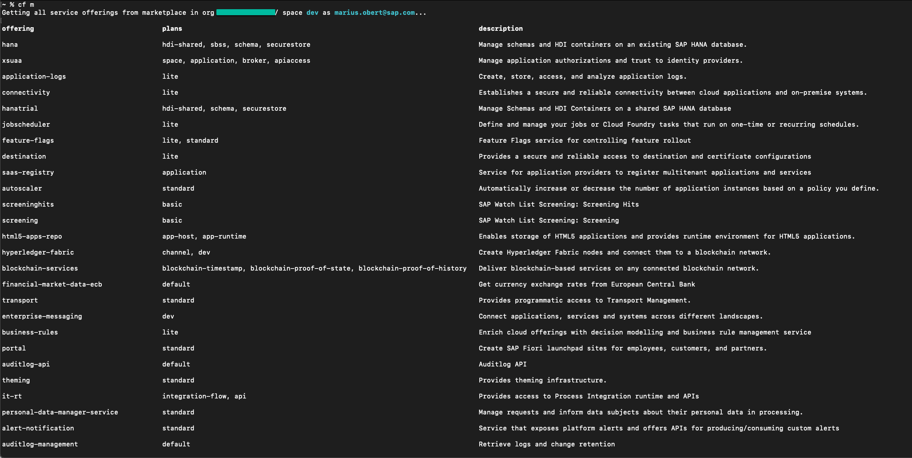
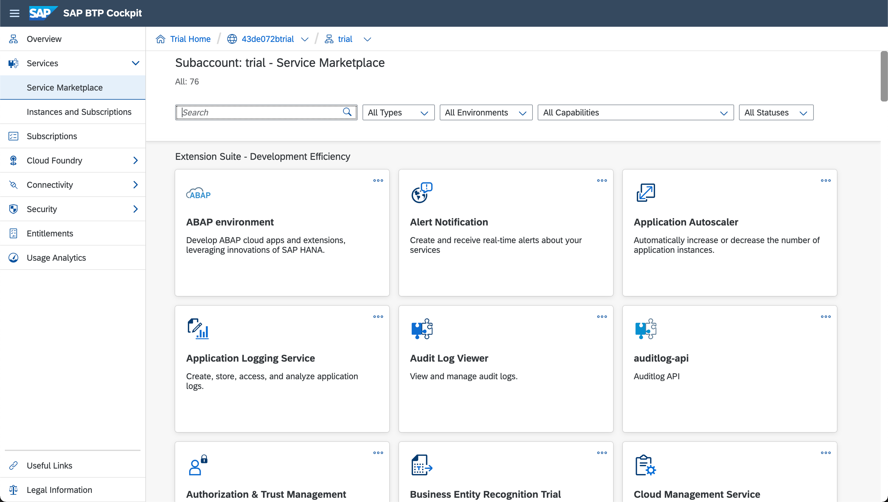

## Details
### You will learn  
  - What is Cloud Foundry
  - Details about the Platform as a Service (PaaS)
  - How Cloud Foundry assembles and runs your applications
  - About the Service Marketplace, and services provided by SAP
  - Spaces and resource management

---

[ACCORDION-BEGIN [Step](Introduction to the Cloud Foundry Foundation)]

Let's begin by explaining the name Cloud Foundry.  What is it?  Cloud Foundry (or CF) is a specification and set of software tools by the [Cloud Foundry Foundation](https://www.cloudfoundry.org/) (and before that, the Linux foundation).  It's entirely open source, and any company or organization can use the tools or create a system that follows the CF specifications.

SAP has implemented Cloud Foundry on SAP BTP by creating a dedicated environment for it as a simple-to-use Platform as a Service (PaaS).  

Cloud Foundry has significant benefits to developers and organizations:

- **Language independent** - choose any language runtime, and add new languages as needed
- **Admin separation** - administrators and developers can work in parallel
- **Standard Command Line Interface** - the same CLI is used by all CF providers, not just SAP
- **Open Source** - contributions by many companies, updates and new features are faster

We will discuss many of these new features in the sections below.

[DONE]
[ACCORDION-END]

[ACCORDION-BEGIN [Step](Cloud Foundry - Plaform as a Service PaaS)]

Let's start with what Cloud Foundry provides to you, as a developers

As you can see from the diagram, traditional development requires the entire system.  Hardware, Operating System, application servers, and software are all managed and maintained by the organization.  This is called "on premise".

Traditional Cloud development moved the hardware and infrastructure out of the organization.  The developers and administrators, however, still must maintain everything from the Operating System (OS) on up.

Platform as a Service PaaS moves control of the runtime - the application servers, databases, and other fundamental applications - away from the organization and back to the cloud.

[DONE]
[ACCORDION-END]

[ACCORDION-BEGIN [Step](Fixing a PaaS problem - buildpacks and services)]

PaaS systems suffer from one problem, however.  Moving the runtime layer to the cloud means the organization loses control of the runtime layer.  If the organization wants to make changes, they need to work with the cloud provider.  

Cloud Foundry solves that problem by offering runtime control to both the cloud provider and the organization.

In Cloud Foundry, the *admin controlled* section above is accessible to both the cloud provider and the organization.  

This is done using two concepts: buildpacks, and services.  

A buildpack defines a container for running an application.  For example, one buildpack might run a Java web application, another runs a Node.js application.  [Cloud Foundry offers a number of standard buildpacks](https://docs.cloudfoundry.org/buildpacks/), and then there is a [GitHub repository with many others](https://github.com/cloudfoundry-community/cf-docs-contrib/wiki/Buildpacks#community-created) contributed as Open Source projects.  Organizations can also create their own buildpacks, to add new languages, upgrade to the latest versions, or to create a set of standard authorized runtime containers vetted by IT.

A [Cloud Foundry service](https://docs.cloudfoundry.org/devguide/services/) is a software program, or set of programs, that are offered to all the different runtime environments.  The most common service is a database (or some other persistent storage) which provides a common data storage location.  Other services might include logging, messaging, or other tools common to multiple applications.

Here is a partial list of services on the SAP BTP, Cloud Foundry environment:

[VALIDATE_1]
[ACCORDION-END]

[ACCORDION-BEGIN [Step](Development made easy)]

Cloud Platform makes running and testing an application in the cloud very easy.  In fact, it's a single command to upload and start an application in Cloud Foundry:  `cf push`.

Take, for example, a Java web application.  Java web apps are deployed in a zip file called a WAR (for Web ARchive).  Creating a WAR is easy, most tools and IDE's will do it for you.  

Running the WAR file in the cloud is simple.  Just run the command `cf push WAR-FILE-NAME`.  Cloud Foundry does the rest of the work.  It does all this automatically:

- Uploads and stores the file (or files)
- Examines and stores app metadata
- Creates a "droplet" (the Cloud Foundry unit of execution) for the app
- Selects an appropriate runtime to run the droplet
- Starts the app

[DONE]
[ACCORDION-END]

[ACCORDION-BEGIN [Step](Service Marketplace - Services we provide)]

SAP has provided a number of services for Cloud Foundry developers.  

Our services include SAP software (for example [SAP HANA](https://help.sap.com/viewer/product/HANA_SERVICE/Cloud/en-US)), and also a number of software components to connect to 3rd party platforms (for example [Open Connectors](https://www.sap.com/products/cloud-platform/capabilities/integration.open-connectors.html)).

Of course, [both developers and organizations can bring their own services](https://docs.cloudfoundry.org/devguide/services/user-provided.html) to meet the needs of the project or organization.

[DONE]
[ACCORDION-END]

[ACCORDION-BEGIN [Step](Understanding spaces)]

Cloud Foundry has a standard working environment for individual applications:  it's called a **space**.  

Spaces are individual working areas, which normally contain a single application.  Each space has an allocation of resources from the global account (the global account belongs to your team or organization).  The allocation is called a **quota** by SAP, and limits the amount of memory, the number of URL's (called routes), and other resources.  Each space is assigned to 1 or more users (called **members**).

> Spaces can contain more than one application, if you want.  

Organizations can create spaces for individual projects as each space is separate, and isolated from all the others.

[DONE]
[ACCORDION-END]

---

That is a basic introduction to Cloud Platform on SAP.  Continue to the other tutorials to learn how easy it is to develop or customize using Cloud Platform.

---
