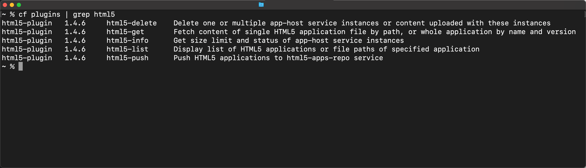

## Details
### You will learn
  - How to install a Cloud Foundry CLI plugin
  - How to use the [HTML5 Applications Repository plugin](https://github.com/SAP/cf-html5-apps-repo-cli-plugin)


---

[ACCORDION-BEGIN [Step 1: ](Verify that the Cloud Foundry CLI is installed)]

Make sure you installed the Cloud Foundry CLI successfully:
```Bash
cf --version
```

Now you should see the release number of the CLI you are using.


> You can go to [this tutorial](cp-cf-download-cli) to install the Cloud Foundry CLI if necessary


[DONE]
[ACCORDION-END]
[ACCORDION-BEGIN [Step 2: ](Install the plugin)]


Install the plugin from the OS-specific binary, using the following command:

[OPTION BEGIN [macOS]]
```Bash
cf install-plugin -f https://github.com/SAP/cf-html5-apps-repo-cli-plugin/releases/latest/download/cf-html5-apps-repo-cli-plugin-darwin-amd64
```
[OPTION END]
[OPTION BEGIN [Windows]]
```Bash
cf install-plugin -f https://github.com/SAP/cf-html5-apps-repo-cli-plugin/releases/latest/download/cf-html5-apps-repo-cli-plugin-windows-amd64.exe
```
[OPTION END]
[OPTION BEGIN [Linux]]
```Bash
cf install-plugin -f https://github.com/SAP/cf-html5-apps-repo-cli-plugin/releases/latest/download/cf-html5-apps-repo-cli-plugin-linux-amd64
```
[OPTION END]


[DONE]
[ACCORDION-END]
[ACCORDION-BEGIN [Step 3: ](Verify the installation of the plugin)]

List all Cloud Foundry CLI plugins to see whether the installation worked.
```Bash
cf plugins | grep html5   
```
You should now see the following output:



> This list shows you all the new commands you added to the CLI. E.g., now you can run `cf html5-list` and `cf html5-push` from the command line.

[DONE]
[ACCORDION-END]
[ACCORDION-BEGIN [Step 4: ](Inspect the deploy command options)]
Run the following command to inspect all options for the `cf cf html5-push` command:
```Bash
cf html5-push --help
```

> Visit the [GitHub repository](https://sap.github.io/cf-html5-apps-repo-cli-plugin/) to learn about more commands that are offered by this tool.

[VALIDATE_1]
[ACCORDION-END]

---
