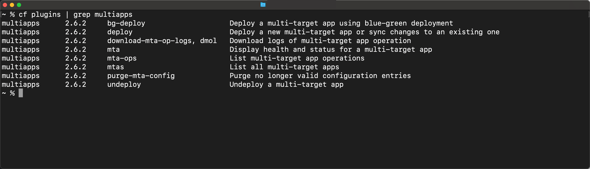

## Details
### You will learn
  - How to install a Cloud Foundry CLI plugin
  - How to use the [MTA (aka MultiApps) plugin](https://github.com/cloudfoundry-incubator/multiapps-cli-plugin)

---

[ACCORDION-BEGIN [Step 1: ](Verify that the Cloud Foundry CLI is installed)]

Make sure you installed the Cloud Foundry CLI successfully:
```Bash
cf --version
```

Now you should see the release number of the CLI you are using.


> You can go to [this tutorial](cp-cf-download-cli) to install the Cloud Foundry CLI if necessary


[DONE]
[ACCORDION-END]
[ACCORDION-BEGIN [Step 3: ](Install the plugin)]


Install the plugin from the OS-specific binary, using the following command:

[OPTION BEGIN [macOS]]
```Bash
cf install-plugin -f https://github.com/cloudfoundry-incubator/multiapps-cli-plugin/releases/latest/download/multiapps-plugin.osx
```
[OPTION END]
[OPTION BEGIN [Windows 64 Bit]]
```Bash
cf install-plugin -f https://github.com/cloudfoundry-incubator/multiapps-cli-plugin/releases/latest/download/multiapps-plugin.win64
```
[OPTION END]
[OPTION BEGIN [Linux 64 Bit]]
```Bash
cf install-plugin -f https://github.com/cloudfoundry-incubator/multiapps-cli-plugin/releases/latest/download/multiapps-plugin.linux64
```
[OPTION END]
[OPTION BEGIN [Windows 32 Bit]]
```Bash
cf install-plugin -f https://github.com/cloudfoundry-incubator/multiapps-cli-plugin/releases/latest/download/multiapps-plugin.win32
```
[OPTION END]
[OPTION BEGIN [Linux 32 Bit]]
```Bash
cf install-plugin -f https://github.com/cloudfoundry-incubator/multiapps-cli-plugin/releases/latest/download/multiapps-plugin.linux32
```
[OPTION END]

[DONE]
[ACCORDION-END]
[ACCORDION-BEGIN [Step 4: ](Verify the installation of the plugin)]

List all Cloud Foundry CLI plugins to see whether the installation worked.
```Bash
cf plugins | grep multiapps
```
You should now see the following output:



> This list shows you all the new commands you added to the CLI. E.g., now you can run `cf deploy` and `cf mta` from the command line.

[DONE]
[ACCORDION-END]
[ACCORDION-BEGIN [Step 5: ](Inspect the deploy command options)]
Run the following command to inspect all options for the `cf deploy` command:
```Bash
cf deploy --help
```


[VALIDATE_1]
[ACCORDION-END]

---
