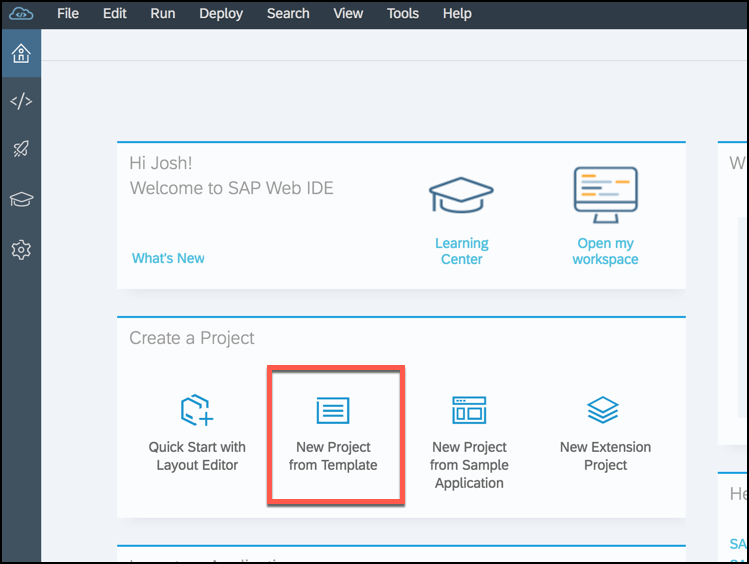
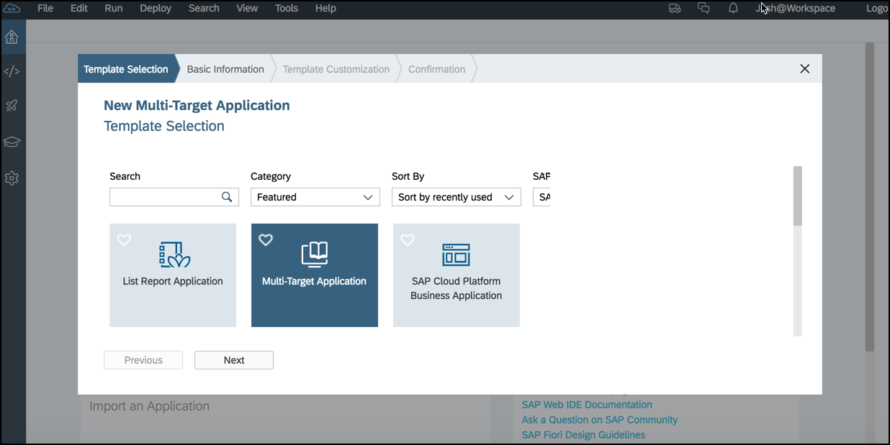
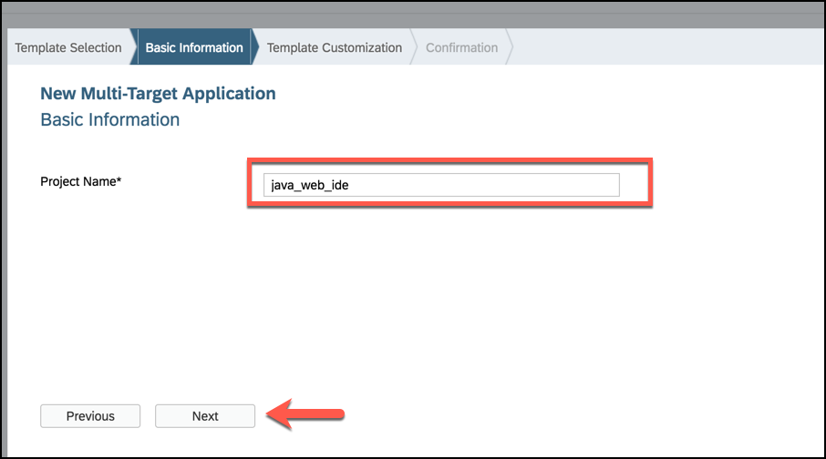
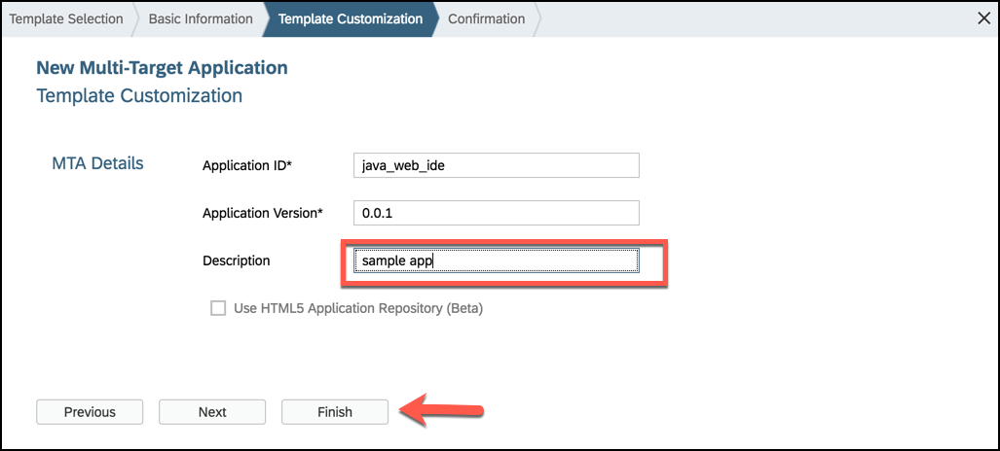
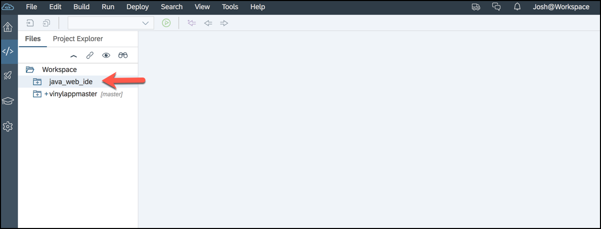

## Prerequisites  
 - [Getting Started with SAP Web IDE](https://developers.sap.com/tutorials/webide-onboarding-mc.html)

## Details
### You will learn  
  - How to create a project with the **Template** option in SAP Web IDE
  - What an MTA descriptor file looks like

**Please make note** that most of the information on the SAP Web IDE will reference deploying an application to the traditional SAP Cloud Platform data center infrastructure called **Neo**, but the _Prerequisites_ section utilizes a tutorial that has information on how to enable java developers to utilize **Cloud Foundry** spaces.

[ACCORDION-BEGIN [Step 1: ](Create a new project from template)]

In order to create a Java app in the Web IDE and deploy it, you will first need to create a **Multi-Target Application** project.

>For more details, you can check a detailed description of [The Multi-Target Application Model](https://www.sap.com/docs/download/2016/06/e2f618e4-757c-0010-82c7-eda71af511fa.pdf).

Open SAP Web IDE and from the home page click **New Project from Template**.

Next, click the template **Select Multi-Target Application**.

Now name your project **`java_web_ide`**.

Add an optional description if you would like, then save your project by clicking **Finish**.

[DONE]
[ACCORDION-END]

[ACCORDION-BEGIN [Step 2: ](Find your project files in the workspace)]

Now you will see your new Java app in the **Workspace** file explorer. For this tutorial, you will see your project folder `java_web_ide` in the file list.

Congratulations, you are finished creating a simple Java application that you can start editing and debugging in follow-up tutorials.

[DONE]
[ACCORDION-END]

[ACCORDION-BEGIN [Step 3: ](Validate the base type of your project)]

In order to create your project, you had to fill in a few mandatory fields in the **Multi-Target Application** template wizard.  

[VALIDATE_3]
[ACCORDION-END]
