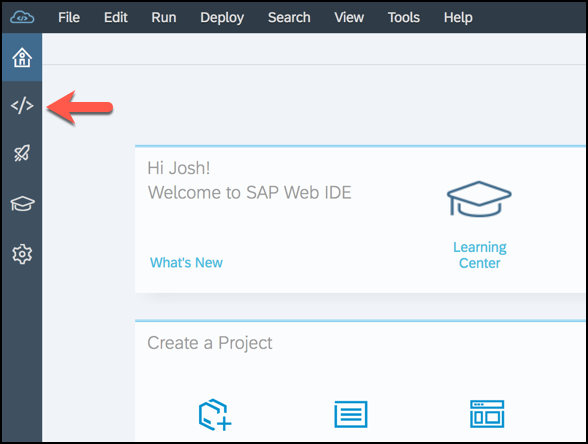
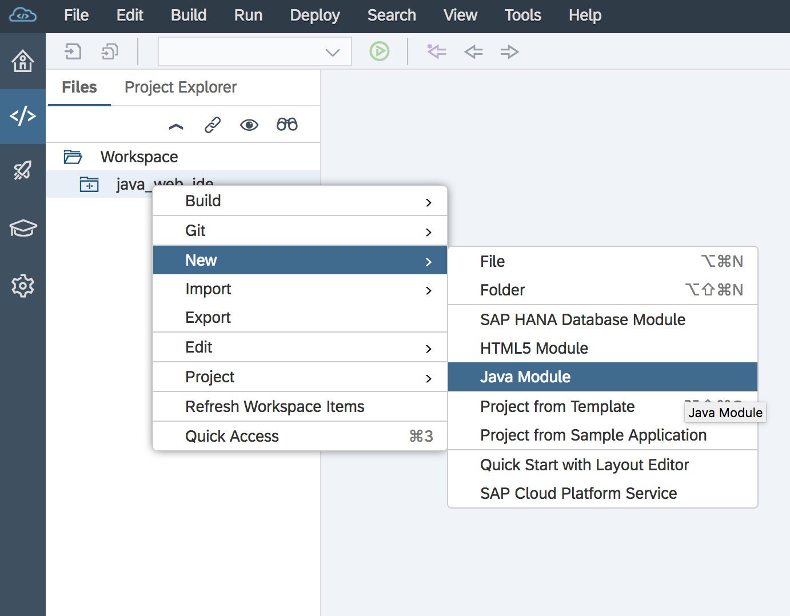
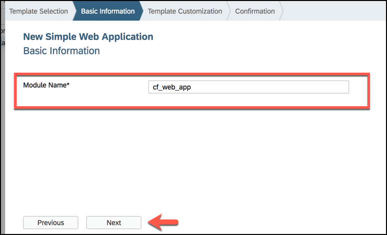
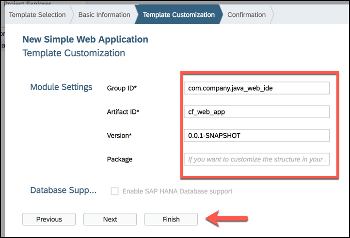
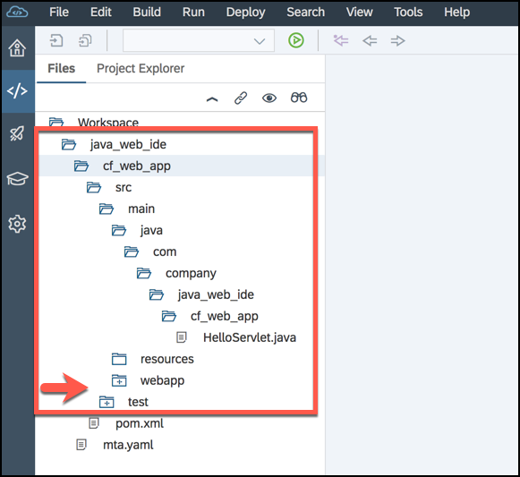

## Details
### You will learn  
  - Where to do edit/add to your java codebase via the SAP Web IDE
  - How to edit an application before running and deploying it

[ACCORDION-BEGIN [Step 1: ](Start the New Java Module wizard)]

In SAP Web IDE, navigate to the **Development** perspective and expand the **Workspace** folder.

Find your Java application in the file tree.

Now, you need to right click (or use **CTRL + Click**) on your project folder `java_web_ide` to open a contextual menu.

Select **New > Java Module**

[DONE]
[ACCORDION-END]

[ACCORDION-BEGIN [Step 2: ](Add Java module via template)]

Now that you have opened the **Java Module** template selection wizard, you can scroll down to select **Simple Web Application** from the list of tiles.

You should see a description of what this template will add below the highlighted tile.  

Click **Next**.

Now name your Java module **`cf_web_app`**, and click **Next**.

Keep the default values and click **Finish**.

You should have a new file tree structure.  

Click any of the folders with a **+** symbol to expand them.

[DONE]
[ACCORDION-END]

[ACCORDION-BEGIN [Step 3: ](Validate choices from the wizard)]

When selecting your add-on, there was a menu of available tiles to choose from like some of those shown in the picture below.  

[VALIDATE_2]
[ACCORDION-END]

---
