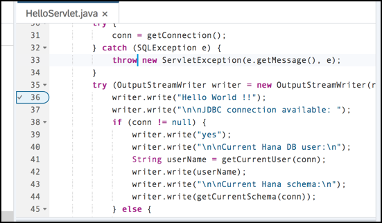
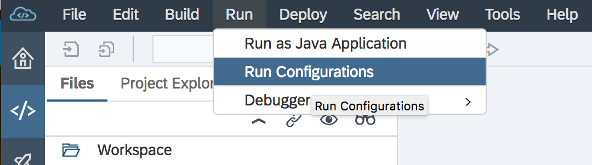
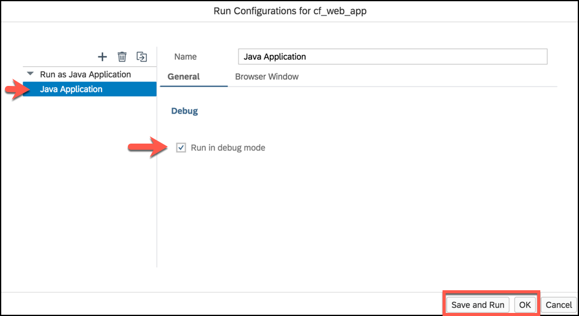
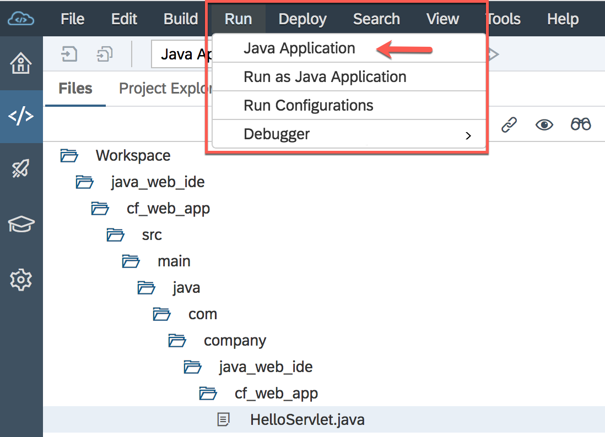
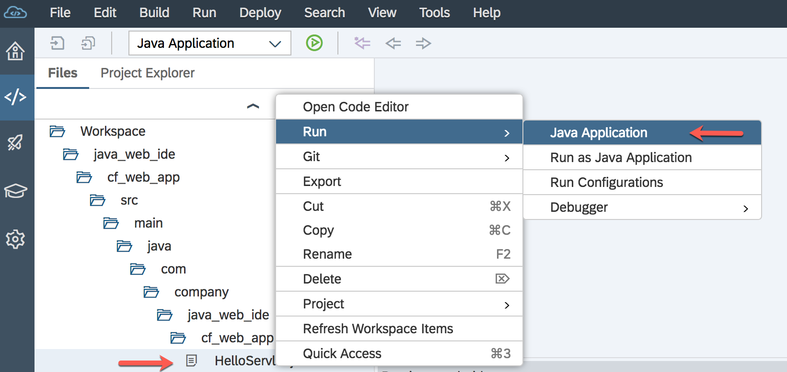
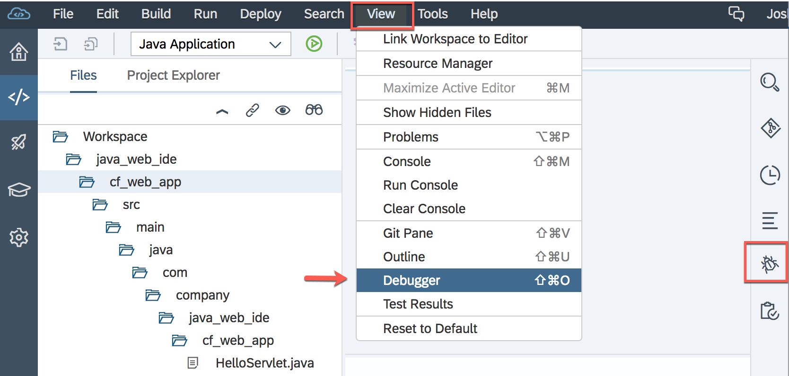
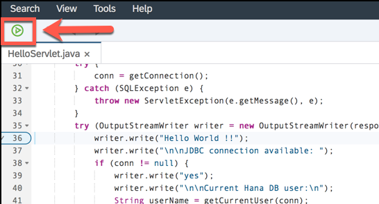
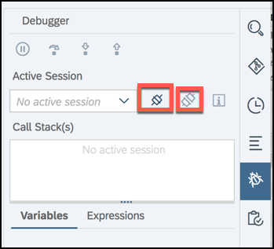
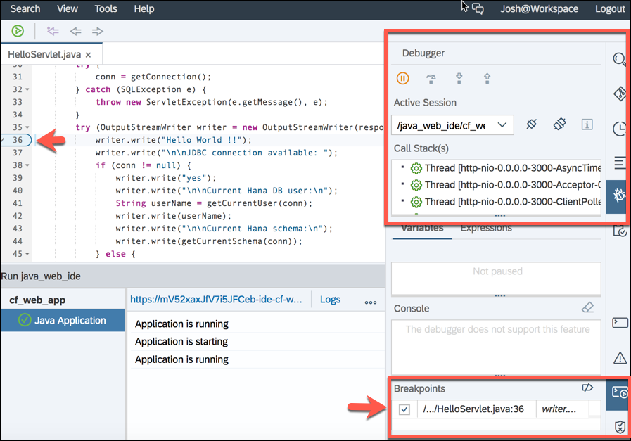

## Details
### You will learn  
  - How to add a breakpoint to your application
  - Options to open the debugger
  - How to run your application with debugger active

[ACCORDION-BEGIN [Step 1: ](Add a breakpoint to your app)]

In order to use the built-in debugger, you need to add a breakpoint. For this tutorial, you are going to add a breakpoint.  You will need to open your application to add a breakpoint.  

  1. First, open the **`HelloServlet.java`** file.
  2. Navigate to a line of code where you want to add a breakpoint. Let's go to line **36** of the  **`HelloServlet.java`** file.
  3. Add a breakpoint by clicking on the row number, **36**.

[DONE]
[ACCORDION-END]

[ACCORDION-BEGIN [Step 2: ](Setting debugger options)]

Now that you have a breakpoint, you can run your application again. but to ensure the debugger will open, let's set the options.

  1. In the menu bar, select **Run > Run Configurations**.

    

  2. Select **Java Application** and check the **Run in debug mode** option.

Once you have done this, you can click **OK** if you need to make other changes, or you can click **Save and Run**, which will open your application.

Back in the SAP Web IDE, there's a couple different ways to run your application once the run configuration has been set. With the file selected, you can click on **Run** along the top menu, followed by clicking **Java Application**.  

Or another option is to right-click the file name and select **Run > Java Applications**

[DONE]
[ACCORDION-END]

[ACCORDION-BEGIN [Step 3: ](Open debugger)]

In addition to selecting **Run in debug mode**, there are a few quick options to access the debugger window. 
You can select the **bug** icon to far right bar, or you can select **View > Debugger** from the menu bar.

After adding a breakpoint, you will see a small green **Run** icon in the top toolbar.

If you want to run it with the breakpoint added, simply press the green **Run** icon.

Once you have activated one of these options, you will see the debugger window open on the right side of SAP Web IDE.

You can also attach or detach the debugger form the right menu so you can quickly switch between running the application with or without your breakpoints. Detaching the debugger is equivalent to not checking the box in the run configurations.

Now let's summarize the options described in this step in a single view of the SAP Web IDE panels. You have the **file editor**, **debugger**, and **breakpoints** all running and displayed.

[VALIDATE_3]
[ACCORDION-END]

---
