## Prerequisites  
 - You will need the login credentials for your SAP Cloud Platform account

## Details
### You will learn  
  - How to run a Java application via the SAP Web IDE
  - How to ensure the Cloud Foundry environment is built for your workspace

In the steps below, you will run your Java app for the first time.  In case you have not enabled the Cloud Foundry tools for your workspace, we will confirm those are active as well.

[ACCORDION-BEGIN [Step 1: ](Attempt to run your Java app)]

In the SAP Web IDE, navigate to the **Development** perspective and expand the `Workspace` folder to reach the `cf_web_app` Java project.

Right-click the `HelloServlet.java` file and then select **Run > Java Application**.

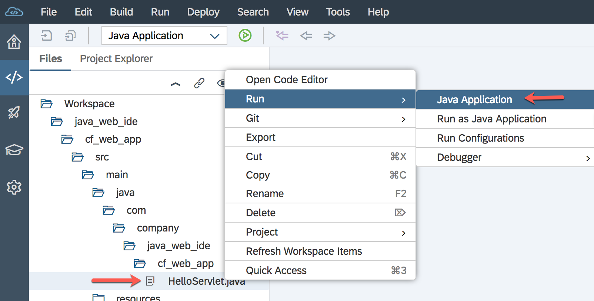

You may see an error that your Cloud Foundry settings are not configured.

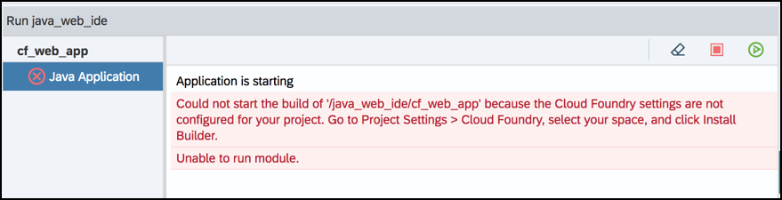

If your settings are configured and you do NOT get the error, skip to Step 2.

### Cloud Foundry settings

If you get the error, do the following:

  1.  Open the project settings by right-clicking the `cf_web_app` Java project and selecting **Project > Project Settings**.

    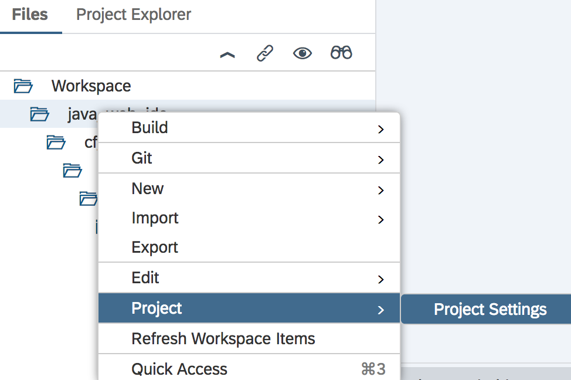

    You can also open the workspace settings by clicking on the **gear** icon on left bar, and selecting **Cloud Foundry** under **Workspace Preferences**.

    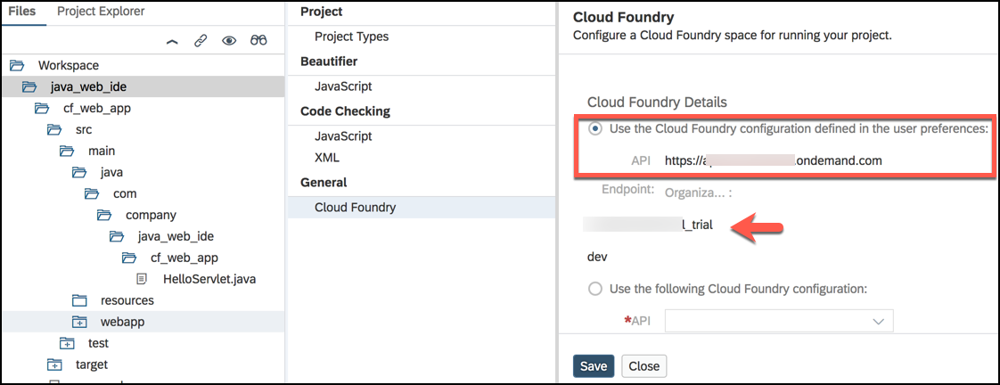

  2. Select the **API Endpoint** that matched your **SAP Cloud Platform** region (**US** or **EU**).

  3. Enter your **User E-mail** and **password** to authenticate.  

  4. After authenticating, click **Install Builder**.

    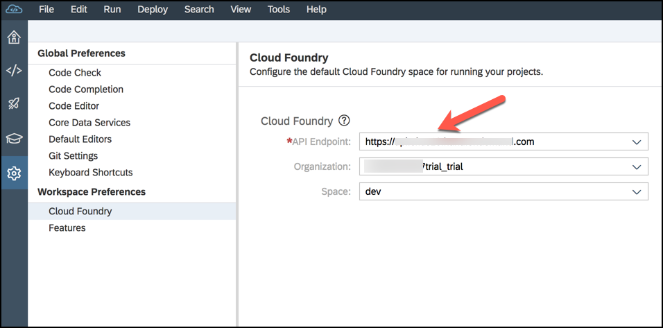

Now that this is complete, go back and run your Java app again.

[DONE]
[ACCORDION-END]

[ACCORDION-BEGIN [Step 2: ](Run your Java app)]

Right-click the `HelloServlet.java` file, then select **Run > Java Application**.

Your Application will start up. When finished your will see a few changes to the screen.  

  - Your Java app will have a green check mark next to it.  
  - You will have a URL that you can click to open your Java servlet in a new tab/window.

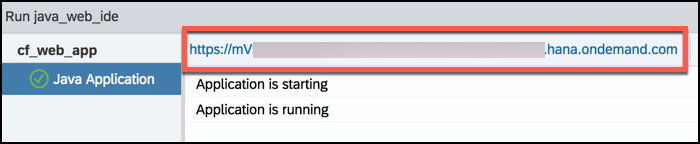

Click on the URL, which opens a servlet like this:

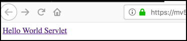

Click **Hello World Servlet** and confirm your app returns HTML data like this:

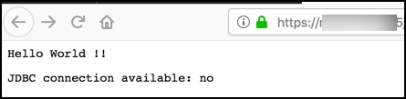

[VALIDATE_1]
[ACCORDION-END]

[ACCORDION-BEGIN [Step 3: ](Confirm Java app deployment)]

In your SAP Cloud Platform cockpit, let's go to the **dev** space and see if our app is running.

Open the SAP Cloud Platform cockpit and click the **Cloud Foundry Trial** tile.

Now click on the sub-account you used to build your app -- named **trial** in the screenshot below.

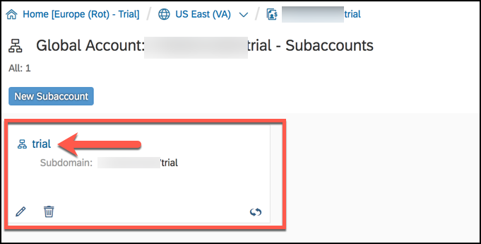

Under **Spaces**, click on the **dev** tile -- to open the **dev** space -- to see what apps are deployed and their associated status.  

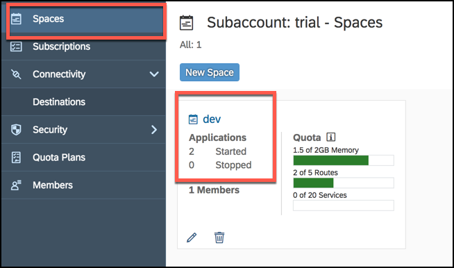

In the **dev** space, you will see an **Applications** section automatically highlighted on the left menu.  In the center, there's a list of all your apps.

Find your `cf-web-app` filename in the list, and click it for more details.

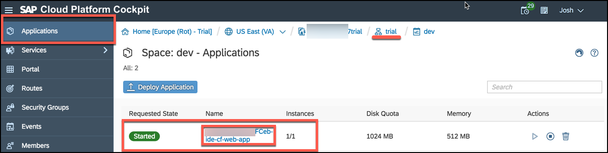

Here you see all the details and controls available for this app.

You can also see a list of breadcrumbs across the top to navigate back to any of the earlier clicks that brought us here.

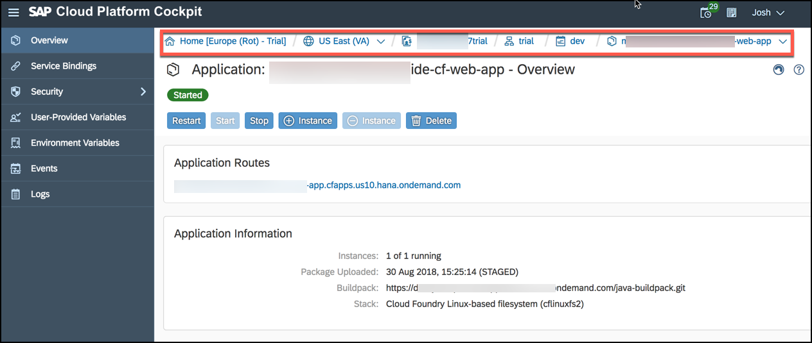

[DONE]
[ACCORDION-END]
