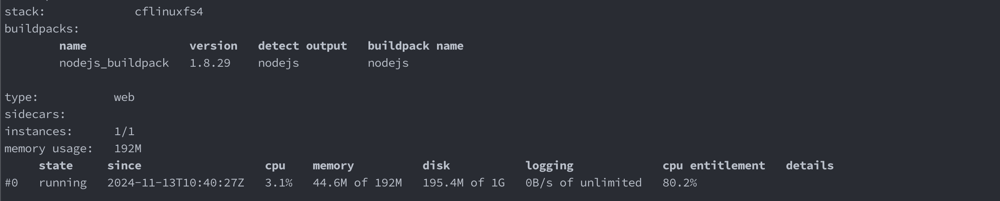
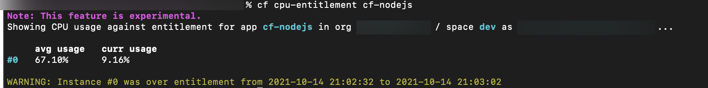
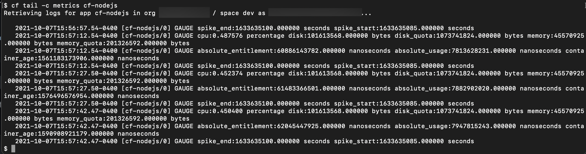

# Overview of Cloud Foundry Application Container Metrics
<!-- description --> Gain a broad understanding of application container metrics.

## Prerequisites
 - **Tutorials** [Understand the Cloud Foundry Application Lifecycle](cp-cf-understand-application-lifecycle)
 - **Tutorials** [Overview of Cloud Foundry Application Logs](cp-cf-application-logs-overview)
 - **Tutorials** [Add a New Entitlement to Your Subaccount](cp-cf-entitlements-add)


## You will learn
  - What container metrics are
  - How to understand memory, disk, and CPU metrics
  - How to view container metrics using the `cf cli` and log cache plugin

## Intro
This tutorial assumes you have completed the tutorials within the [Create Your First App on Cloud Foundry](group.scp-3-first-app.html) group and you have a working `cf-nodejs` application.

---

### Metrics Overview


Application metrics can generally be divided into two main categories

 - Metrics for the container itself
 - Metrics generated by your application (usually unique to the application and they are known as custom app metrics)


Every container managed by Cloud Foundry emits a set of metrics that can be viewed and analyzed to understand what is going on within the container; these are known as the **container metrics**.

> Remember: a container is where an application runs once you've deployed it with `cf push`.

Container metrics are generally very simple, and mostly provide information about resource utilization. They are averaged and emitted about every 15 seconds. Container metrics include, but may not be limited to, the following by default:

|  Metric    | Description
|  :-------------              | :-------------
|  `cpu`                       | **`How much CPU an application instance uses as a percentage of a single core`**
|  `cpu_entitlement`           | **`How much CPU an application instance uses as a percentage of its CPU entitlement.`**
|  `memory`                    | **`Amount of memory used by the application instance`**
|  `memory_quota`              | **`Total amount of memory available for the application instance`**
|  `disk`                      | **`Disk space used by the application instance`**
|  `disk_quota`                | **`Total amount of disk space available for the application instance`**
|  `container_age`             | **`Age of the container in nanoseconds`**

> To see the complete list and more detailed information on these metrics you can check out the official page on [Diego Container Metrics](https://docs.cloudfoundry.org/loggregator/container-metrics.html#container-metrics).

What if you need more detailed information, like what parts of your app are using how much memory each, for example? That's where **custom app metrics** come in. Custom metrics are beyond the scope of this tutorial, but you can check the tutorial [Overview of Custom Metrics](cp-cf-custom-metrics) for more information.


### Memory and Disk Metrics


 The `memory` metric is about the overall used memory in the app container and doesn't provide any details about the used memory for the different processes running inside the container. You will most often see memory metrics displayed as `memory` of `memory_quota`, or in other words, the amount of memory used out of the total available memory for an instance. For example your app could be using 30MB of memory (`memory`) out of 256MB of memory (`memory_quota`), and this would be represented as "30M of 256M". Disk metrics are displayed similarly to memory metrics except that they are represented as `disk` of `disk_quota` (e.g. "100M of 1G".). The disk measurements are how much space is used by the application on disk, not a measure of disk I/O.

The total memory and disk space can be set with the application manifest, or through the command line via arguments to `cf push`. SAP allows a **maximum memory per instance of 16GB**, starting with 1024MB of memory by default. SAP also allows a **maximum disk quota of 10GB per instance**, and by default each app instance starts with 512MB.


### CPU Metrics


When it comes to the CPU metrics it's important to know the difference between the `cpu` metric and the `cpu_entitlement` metric. The `cpu` metric gives you the percentage of CPU used by an application instance in relation to the total CPU available on the Diego Cell. The `cpu_entitlement` metric on the other hand gives the percentage of CPU used by the application instance in comparison to what the application instance is **actually entitled to** use on the Diego Cell.

|  Metric    | Description
|  :-------------              | :-------------
|  `cpu`                  | **`% CPU used relative to max capacity`**
|  `cpu_entitlement`      | **`% CPU used relative to how much you're ALLOWED`**

Given the above, if an application instance is entitled to use 30% of the system CPU, and it is using all of that CPU, then the `cpu_entitlement` metric will show that the instance is using 100% of its CPU. If you were to look at the `cpu` metric for the same instance at the same point in time, however, it would show that the instance is only using 30% of maximum available CPU. The `cpu` metric is not so much of interest for the application but it is the original CPU metric emitted by Cloud Foundry that is why it is mentioned here.

The `cpu_entitlement` metric will always be the most useful CPU measurement as it shows the percentage of CPU usage in relation to the amount of CPU the instance can use.


### View container metrics with the cf cli


Now that you know about the CPU, disk, and memory metrics, you probably also want to know how to actually see them. To view these metrics for your `cf-nodejs` application using the Cloud Foundry Command Line Interface (`cf cli`) run the following command in your terminal (after your application has started):

```
cf app cf-nodejs
```

<!-- border -->

To view the `cpu_entitlement` metric you need to install the CPU Entitlement plugin. To install it, run

```
cf install-plugin <download-URL>
```
> The `download-URL` above comes from the [plugin documentation](https://github.com/cloudfoundry/cpu-entitlement-plugin/blob/master/README.md). Make sure to pick the Download-URL that relates to the operating system you are using.

Once you have installed the plugin you can then use it by running:

```
cf cpu-entitlement cf-nodejs
```

You should see similar output to the following:

<!-- border -->


### View metrics with the log cache plugin


The log cache, besides storing logs, also stores container metrics. Viewing metrics contained in the log cache is very similar to viewing logs with the log cache plugin as seen in the [Overview of Cloud Foundry Application Logs](cp-cf-application-logs-overview) tutorial. Using the `cf tail` command you just need to change the value of the `-c` flag to _metrics_:

```
cf tail -c metrics cf-nodejs
```

<!-- border -->


---
