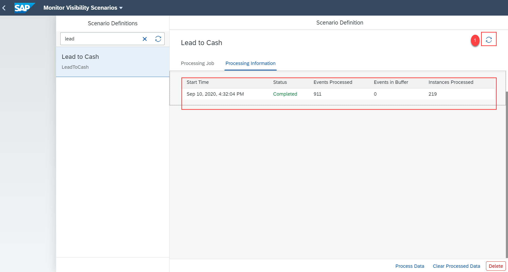
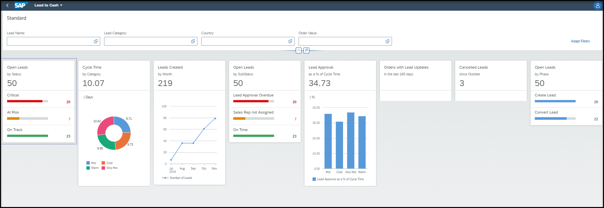

## Prerequisites
Set up the Workflow Management service. For more information, see the [Set Up Workflow Management in Cloud Cockpit](cp-starter-ibpm-employeeonboarding-1-setup) tutorial.

## Details
### You will learn
- How to import a sample lead-to-cash business scenario
- How to import the events for sample lead-to-cash business process
- How to gain visibility on the lead-to-cash business process
- How to quickly get started with the process visibility service capability using a sample lead-to-cash business process

Lead-to-cash is a business process that provides sales insights, eliminates process inefficiencies, and ensures accurate reporting on business performance and future trends.

In this tutorial, you can learn how to gain visibility on a sample lead-to-cash business process using SAP Process Visibility service. You are provided with JSON files with events and zip files that contain the business scenario using which you can easily try out the capabilities of the service.

[ACCORDION-BEGIN [Step 1: ](Download files from GitHub)]
1. Use the following link to access [GitHub](https://github.com/SAP-samples/cloud-process-visibility/releases).

2. Choose the `LeadToCashEvents.json` file.

      

    >This downloads the `LeadToCashEvents.json` file to your local system.

3. Now, from the GitHub, choose the `LeadToCash.zip` file.

    

    >This downloads the `LeadToCash.zip` file to your local system.

    You now have the two downloaded files in your local system with the events and business scenario relevant to lead-to-cash process.

[DONE]
[ACCORDION-END]

[ACCORDION-BEGIN [Step 2: ](Import events)]
In this step, you will import the `LeadToCashEvents.json` to the Event Acquisition application.

1. Log onto the **Event Acquisition** tile using the Workflow Management home screen.

    !

2. Choose the **Import** icon.

    !

3. In the **Import From File** dialog, browse for the `LeadToCashEvents.json` that is in your local file system.

    !

4. Choose **Import**.  

    !

5. Check if the events are imported successfully, by choosing the **View Filter Settings** icon.

    !

    Choose the **Process Definition ID** option. Provide the value as **`L2C`** and choose **OK**.

      !

     You can view a list of events imported for this process definition ID.

      !

[DONE]
[ACCORDION-END]

[ACCORDION-BEGIN [Step 3: ](Import the business scenario)]

In this step, you will import the `LeadtoCash.zip` file to the Configure Visibility Scenarios application.

1. Log onto the **Configure Visibility Scenarios** tile using the Workflow Management home screen.

    !

2. Choose the **Import Scenario** icon.

    !

3. In the **Import Scenario** dialog, browse for the `LeadtoCash.zip` file from your local system. Then choose **Import**.

    !

    You can now see the imported business scenario as shown.

    !

4. Choose the **Lead to Cash** business scenario.

    !

      Choose **Activate**.

      !

    > You will see a message upon successful activation of the scenario.

[DONE]
[ACCORDION-END]

[ACCORDION-BEGIN [Step 4: ](Process the data)]

In this step, you can process the data of the activated business scenarios using the Monitor Visibility Scenarios application.

1. Click the **Monitor Visibility Scenarios** tile by navigating to the home screen.

      !

2. Choose the **Lead to Cash** scenario definition, then choose **Process Data**.

      !

3. On successful processing of data, choose the refresh icon to view the processing information listed out under **Processing Information**.

      !

[DONE]
[ACCORDION-END]

[ACCORDION-BEGIN [Step 5: ](Track business scenario)]

In this step, you will be able to track the progress of the sample scenario using the visual representation of the Process Workspace application.

1. Click the **Process Workspace** tile by navigating to the home screen.

    !

2. Choose the **Lead to Cash** business scenario.

    !

    You can view the overview page for the **Lead to Cash** business scenario as shown below. You can view information such as open orders, cycle time, open orders by product category, and so on.

    !

    >You can customize the cards displayed on the overview page by modifying the business scenario in the **Configure Visibility Scenarios** application. For more information, see [SAP Help](https://help.sap.com/viewer/62fd39fa3eae4046b23dba285e84bfd4/Cloud/en-US/df284fd12073454392c5db8913f82d81.html).

[VALIDATE_1]
[ACCORDION-END]

---
