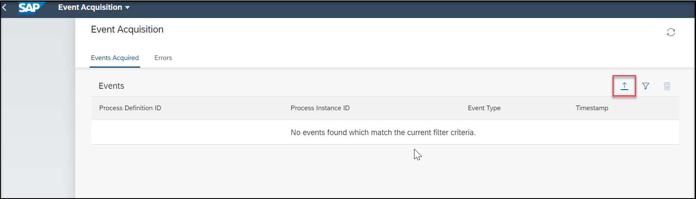
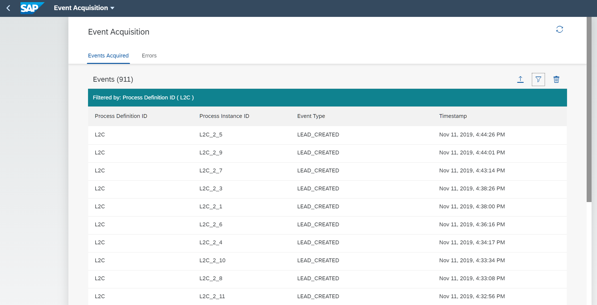
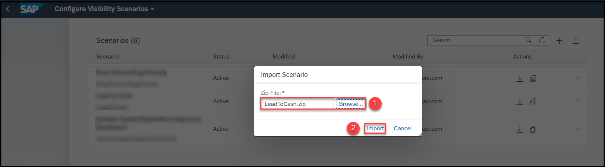
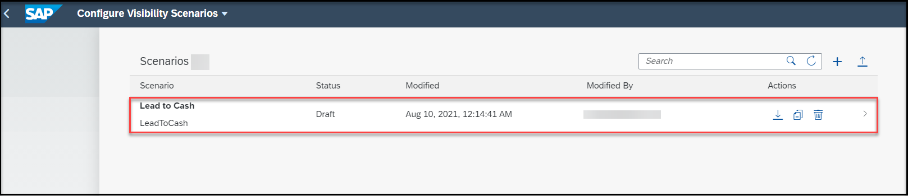
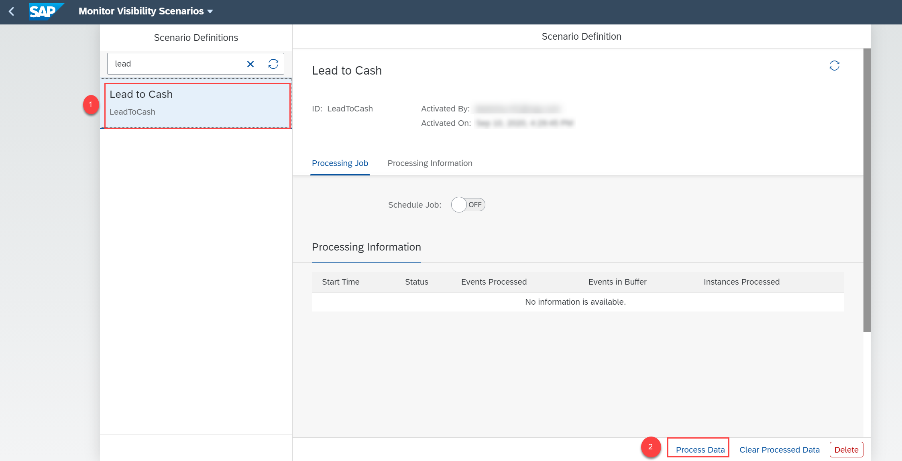
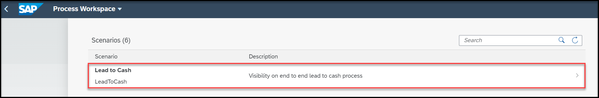

## Prerequisites
Set up **SAP Workflow Management** service. For more information, see the [Set Up Workflow Management in Cloud Cockpit](cp-starter-ibpm-employeeonboarding-1-setup) tutorial.

## Details
### You will learn
- How to import a sample Lead-to-Cash visibility scenario
- How to import the events for sample Lead-to-Cash business process
- How to gain visibility on the Lead-to-Cash business process
- How to quickly get started with the process visibility capability using a sample Lead-to-Cash business process

Lead-to-Cash is a business process that provides sales insights, eliminates process inefficiencies, and ensures accurate reporting on business performance and future trends.

In this tutorial, you can learn how to gain visibility on a sample Lead-to-Cash business process using the process visibility capability. You are provided with a JSON file containing events and a zip file that contain the visibility scenario using which you can easily try out the capabilities of process visibility.

[ACCORDION-BEGIN [Step 1: ](Download files from GitHub)]

1. Use the following link to access [GitHub](https://github.com/SAP-samples/cloud-process-visibility/releases).

2. Choose the `LeadToCashEvents.json` file.

    

    >This downloads the `LeadToCashEvents.json` file to your local system.

3. Now, from the GitHub, choose the `LeadToCash.zip` file.

    

    >This downloads the `LeadToCash.zip` file to your local system.

    You now have the two downloaded files in your local system with events and visibility scenario relevant to Lead-to-Cash business process.

[DONE]
[ACCORDION-END]

[ACCORDION-BEGIN [Step 2: ](Import events)]
In this step, you will import the `LeadToCashEvents.json` file to the **Event Acquisition** application.

1. Open the **Event Acquisition** tile from the **Workflow Management** dashboard.

    !

2. Choose the **Import** icon.

    !

3. In the **Import From File** dialog, browse for the `LeadToCashEvents.json` file present in your local file system.

    !

4. Choose **Import**.  

    !

5. Check if the events are imported successfully, by choosing the **View Filter Settings** icon.

    !

6. Choose the **Process Definition ID** option to filter the events. In this tutorial, for the Lead-to-Cash business process, provide the value as **`L2C`** and choose **OK**.

    !

    You can view the list of events imported for the **`L2C`** process definition ID.

    !

[DONE]
[ACCORDION-END]

[ACCORDION-BEGIN [Step 3: ](Import the visibility scenario)]

In this step, you will import the `LeadtoCash.zip` file to the **Configure Visibility Scenarios** application.

1. Open the **Configure Visibility Scenarios** tile from the **Workflow Management** dashboard.

    !

2. Choose the **Import Scenario** icon.

    !

3. In the **Import Scenario** dialog, browse for the `LeadtoCash.zip` file present in your local system and choose **Import**.

    !

    You can now see the visibility scenario imported for a Lead-to-Cash business process as shown.

    !

4. Choose the **Lead to Cash** visibility scenario from the list and choose **Activate**.

    !

    >You will see a message upon successful activation of the scenario.

[DONE]
[ACCORDION-END]

[ACCORDION-BEGIN [Step 4: ](Process the data)]

In this step, you can process the data of the activated visibility scenarios using the **Monitor Visibility Scenarios** application.

1. Choose the **Monitor Visibility Scenarios** tile from the **Workflow Management** dashboard.

    !

2. Choose the **Lead to Cash** scenario definition, then choose **Process Data**.

    !

3. On successful processing of data, choose the refresh icon to view the processing information listed out under **Processing Information**.

    !

[DONE]
[ACCORDION-END]

[ACCORDION-BEGIN [Step 5: ](Track the visibility scenario)]

In this step, you will be able to track the progress of the visibility scenario using the visual representation in the **Process Workspace** application.

1. Choose the **Process Workspace** tile from the **Workflow Management** dashboard.

    !

2. Choose the **Lead to Cash** visibility scenario.

    !

    You can view the overview page for the **Lead to Cash** visibility scenario as shown below. You can view information such as open orders, cycle time, open orders by product category, and so on.

    !

    >You can customize the cards displayed on the overview page by modifying the visibility scenario in the **Configure Visibility Scenarios** application. For more information on creating and enhancing a scenario, see [Create a Scenario](https://help.sap.com/viewer/62fd39fa3eae4046b23dba285e84bfd4/Cloud/en-US/df284fd12073454392c5db8913f82d81.html) documentation.

[VALIDATE_1]
[ACCORDION-END]

---
