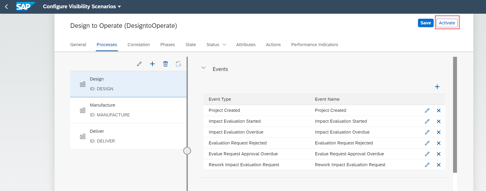
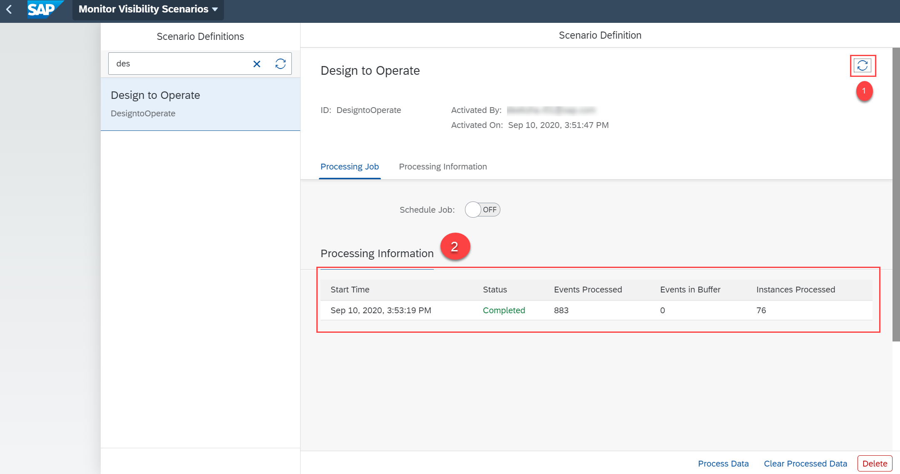
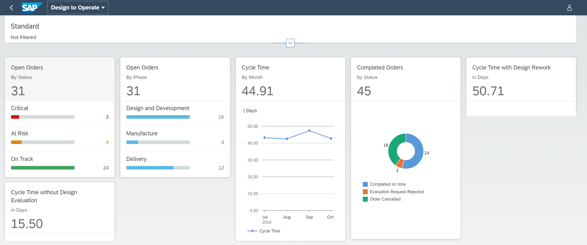

# Set Up a Sample Design-to-Operate Business Process
<!-- description --> Set up a pre-configured Design-to-Operate business process to experience the Process Visibility capability.

## Prerequisites
 you have set up **SAP Workflow Management** service. For more information, see the [Set Up Workflow Management in Cloud Cockpit](cp-starter-ibpm-employeeonboarding-1-setup) tutorial.

## You will learn
  - How to import a Design-to-Operate visibility scenario
  - How to import the events for sample Design-to-Operate business process
  - How to gain visibility on sample Design-to-Operate business process
  - How to quickly get started with the process visibility capability using the sample Design-to-Operate business process

## Intro
Design-to-Operate is a supply chain centric business process that enables companies to connect digitally to perfect reality across their product and asset lifecycle. This end-to-end business process consists of stages from design, planning, manufacturing, logistics, and operations.

In this tutorial, you can learn how to gain visibility on a sample Design-to-Operate business process using the process visibility capability. You are provided with a JSON file containing events and a zip file that contain the visibility scenario for Design-To-Operate business process using which you can easily try out the capabilities of process visibility.

### Download files from GitHub

In this step, you will download the sample Design-to-Operate visibility scenario and the respective events from GitHub to your local file system.

1. Use the following link to access [GitHub](https://github.com/SAP-samples/cloud-process-visibility/releases).

2. Choose the `DesignToOperateEvents.json` file.

    

    >This downloads the `DesignToOperateEvents.json` file to your local system.

3. Now, from the GitHub, choose the `DesigntoOperate.zip` file.

    

    >This downloads the `DesigntoOperate.zip` file to your local system.

    You now have the two downloaded files in your local system with events and a scenario relevant to Design-to-Operate business process.

### Import events

In this step, you will import the `DesignToOperateEvents.json` to the **Event Acquisition** application.

1. Open the **Event Acquisition** tile from the **Workflow Management** dashboard.

    

2. Choose the **Import** icon.

    

3. In the **Import From File** dialog, browse for the `DesignToOperateEvents.json` file present in your local file system.

    

4. Choose **Import**.  

    

5. Check if the events are imported successfully, by choosing the **View Filter Settings** icon.

    

6. Choose the **Process Definition ID** option. In this tutorial, for the Design-To-Operate business process, provide the value as **`DESIGN`** and choose **OK**.

    

    You can view a list of events imported for this process definition ID.

    

    >Similarly, you can search for other process definition IDs such as **`DELIVER`** and **`MANUFACTURE`**. You will be able to view the list of events imported for the respective process definition IDs.

### Import the visibility scenario

In this step, you will import the `DesigntoOperate.zip` file to the **Configure Visibility Scenarios** application.

1. Open the **Configure Visibility Scenarios** tile from the **Workflow Management** dashboard.

    <!-- border -->

2. Choose the **Import Scenario** icon.

    <!-- border -->

3. In the **Import Scenario** dialog, browse for the `DesigntoOperate.zip` file from your local system and choose **Import**.

    <!-- border -->

    You can now see the imported visibility scenario as shown.

    <!-- border -->

4. Choose the **Design to Operate** visibility scenario from the list and choose **Activate**.

    <!-- border -->

    >You will see a message upon successful activation of the scenario.

### Process the data

In this step, you can process the data of the activated visibility scenario using the **Monitor Visibility Scenarios** application.

1. Open the **Monitor Visibility Scenarios** tile from the **Workflow Management** dashboard.

    <!-- border -->

2. Choose the **Design to Operate** scenario definition, then choose **Process Data**.

    <!-- border -->

3. On successful processing of data, choose the refresh icon to view the processing information listed out under **Processing Information**.

    <!-- border -->

### Track the visibility scenario

In this step, you will be able to track the progress of the sample Design-To-Operate visibility scenario using the visual representation in the **Process Workspace** application.

1. Open the **Process Workspace** tile from the **Workflow Management** dashboard.

    <!-- border -->

2. Choose the **Design to Operate** visibility scenario.

    <!-- border -->

    You can view the overview page for the **Design to Operate** visibility scenario as shown below. You can view information such as open orders, cycle time, open orders by product category, and so on.

    <!-- border -->

    >You can customize the cards displayed on the overview page by modifying the visibility scenario in the **Configure Visibility Scenarios** application. For more information on creating and enhancing a scenario, see [Create a Scenario](https://help.sap.com/viewer/62fd39fa3eae4046b23dba285e84bfd4/Cloud/en-US/df284fd12073454392c5db8913f82d81.html) documentation.

---
