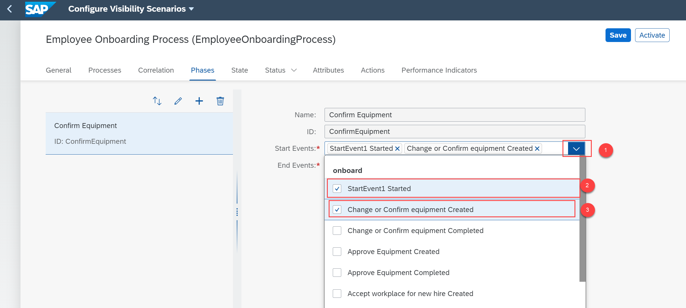
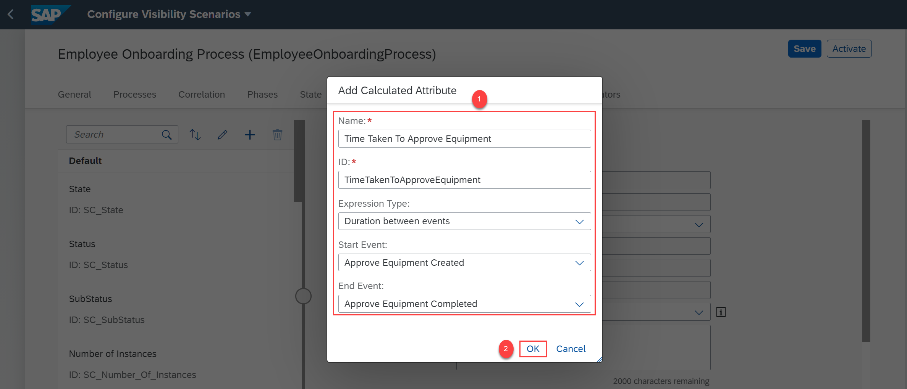
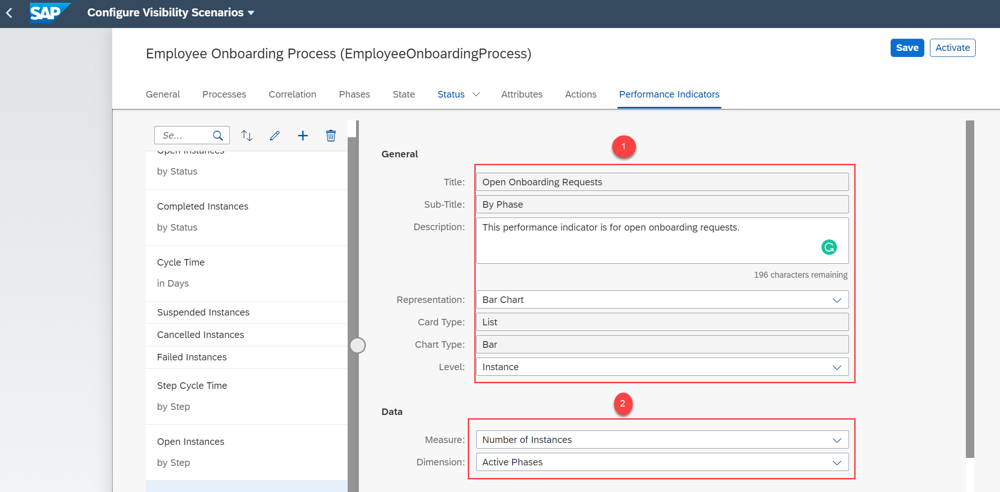
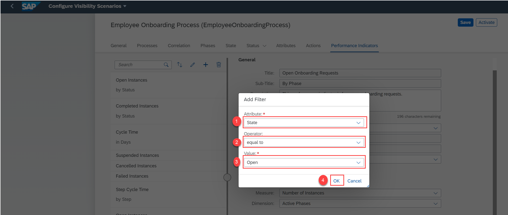

## Prerequisites
- Setup the Workflow Management service. For more information, see the [Set Up Workflow Management in Cloud Cockpit](cp-starter-ibpm-employeeonboarding-1-setup) tutorial.

## Details
### You will learn
-	How to enhance your scenario by adding phases, attributes, and performance indicators
-	How to activate the scenario

By default, a set of performance indicators are generated when you add a Workflow from SAP Workflow service as a participant. You can view the default status, attributes, actions, and performance indicators using various tabs of the Configure Visibility Scenarios application. You can choose to activate the scenario without enhancing it. Alternatively, you can further enhance the scenario by adding phases, status, calculated attributes, and performance indicators.

[ACCORDION-BEGIN [Step 1: ](Create phases)]
1. Navigate to the **Phases** tab and choose the **+** icon.

    !

2. Provide the following details to add the phase and click **OK**.

    !

3. In the **Start Events** drop down, select **StartEvent1 Started** and **Change or Confirm equipment Created**.

    !

4. In the **End Events** drop down, select **Change or Confirm equipment Completed**.

    !

5. Similarly, create another phase named **Approve Equipment**. Then, select the **Approve Equipment Created** option from the **Start Events** dropdown and **Approve Equipment Completed** option from the **End Events** dropdown. Then save the changes.

    !

[DONE]
[ACCORDION-END]

[ACCORDION-BEGIN [Step 2: ](Configure the target)]
1. Navigate to the **Status** tab.

    !

2. Under the **Target** section, provide the following details and save the changes:

    !

[DONE]
[ACCORDION-END]

[ACCORDION-BEGIN [Step 3: ](Add visibility scenario attributes)]
1. Choose the **Attributes** tab, where you can view a set of default attributes.

    !

2. Add a calculated attribute by choosing the **+** icon.

    !

    Add the following properties in the **Add Calculated Attribute** dialog.

    !

3. **Save** the changes.

[DONE]
[ACCORDION-END]

[ACCORDION-BEGIN [Step 4: ](Configure performance indicators)]
1. Navigate to the **Performance Indicators** tab and choose the **+** icon to add a performance indicator.

    !

    In the **Add Performance Indicator** dialog, provide the following details and choose **OK**:

    !

2. Choose the following options as shown in the **General** and **Data** section of the **Performance Indicators** tab:

    !

4. Choose the **+** icon under the **Filters** section of **Performance Indicators** to add a filter.

    !

    In the **Add Filter** dialog, provide the following details:

    !

6. **Save** the changes.

[DONE]
[ACCORDION-END]

[ACCORDION-BEGIN [Step 5: ](Activate the scenario)]
1. Save the scenario and then choose **Activate**.

    !

2. Once the scenario is successfully activated, navigate back to the **Configure Visibility Scenarios** tile to view status of the scenario is now in **Active**.

    !

[VALIDATE_1]
[ACCORDION-END]

---
